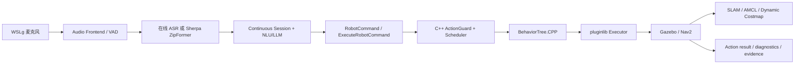

# Embodied Voice Agent for ROS 2

面向 ROS 2/C++ 求职展示的语音具身智能项目。系统同时提供在线与离线 Agent，打通：

```text
麦克风 → VAD/ASR → 会话与轻量 NLU/LLM → typed ROS 2 Action
→ ActionGuard → BehaviorTree.CPP/pluginlib → Gazebo/Nav2/SLAM
```

当前主场景完全运行在仿真平台：自动 frontier 建图、地图保存、AMCL 定位、Nav2 语义目标导航、动态障碍重规划。UART/SPI 仅保留接口或 mock，不宣称已完成真实硬件验收。

## 已完成能力

- 在线 Agent：云 ASR/LLM/TTS Adapter、连续会话、记忆与动作回调。
- 离线 Agent：Sherpa-ONNX ZipFormer、llama.cpp Qwen3-0.6B Q8、Sherpa-TTS；SummerTTS 为可选 ROS 服务组件。
- 连续语音：一次唤醒后持续接收命令，多命令 NLU、FIFO 队列、TTL、重复/filler 过滤、急停抢占。
- ROS 2 控制：自定义 msg/action、Lifecycle、C++ ActionGuard/ActionScheduler、反馈/取消/超时。
- 仿真执行：BehaviorTree.CPP 编排、pluginlib executor、Gazebo 运动与最终零速度保护。
- SLAM/Nav2：Explore Lite frontier 探索、slam_toolbox、map saver、AMCL、NavigateToPose/FollowWaypoints。
- 算法证据：Ceres/GTSAM 后端、回环候选与 scan-overlap、动态障碍关联/预测/代价层消融。

## 核心架构



关键原则：Agent 负责意图，ActionGuard 负责安全策略，executor 负责副作用；所有长动作使用 typed Action 关联 `command_id`，不再使用 JSON 控制协议。

## 目录

| 路径 | 作用 |
| --- | --- |
| `src/embodied_agent_interfaces` | 自定义 msg/action/service |
| `src/embodied_agent_core` | 会话、NLU、队列、参数与公共运行时 |
| `src/embodied_online_agent` | 在线 Agent Lifecycle 节点 |
| `src/embodied_offline_agent` | 离线 ASR/llama.cpp/TTS Agent |
| `src/embodied_agent_cpp` | C++ ActionGuard、调度、音频与硬件 seam |
| `src/embodied_simulation` | BT、pluginlib、Gazebo/Nav2 executor 与场景 |
| `src/embodied_slam*` | SLAM 后端、回环、自动建图会话与证据 |
| `src/embodied_navigation` | 动态障碍跟踪、预测和 Nav2 costmap plugin |
| `scripts` | 稳定部署、主演示和 smoke runner |
| `tools/acceptance` | 验收模式注册表与领域 handler |
| `tools/evaluation` | 数据集、SLAM、回环、LoRA/Q8 与消融工具 |
| `tests` | repository、voice/control/slam_nav integration、evaluation |

## 环境与部署

推荐环境：WSL Ubuntu 24.04、ROS 2 Jazzy、Python 3.12、Gazebo Harmonic。仓库默认路径为 `/home/ubuntu/embodied_agent_ws`，脚本也支持 Git worktree。

```bash
git clone git@github.com:Edddddddddy/embodied_agent_ws.git
cd embodied_agent_ws
bash scripts/bootstrap.sh
source scripts/activate.sh
```

离线模型和可选第三方运行时：

```bash
bash scripts/setup_offline_runtime.sh
bash scripts/setup_frontier_exploration.sh
bash scripts/acceptance_test.sh offline-runtime-versions
```

在线模式在 `.env` 配置 `DASHSCOPE_API_KEY`。密钥、模型、build/install/log 不提交 Git。

## 推荐演示

### 1. 无麦克风完整 SLAM → 导航门禁

```bash
bash scripts/acceptance_test.sh slam-nav-e2e
```

该命令必须从本次会话新建地图，不读取旧演示地图。通过标准：

- Explore Lite 产生至少一个 frontier goal，机器人产生建图位移；
- map saver 生成本次会话 YAML/PGM，并记录 SHA256 与时间戳；
- mapping 进程完全关闭后启动 map_server、AMCL 和 Nav2；
- `map→odom`、AMCL pose 和 Nav2 lifecycle active；
- 至少 3 个语义地点任务成功；
- 可见动态障碍移动、被跟踪并写入预测代价层，Nav2 发生重规划；
- 最终报告 `passed=true`，`/cmd_vel` 为 0。

证据位于 `logs/acceptance/slam_nav/<session_id>/slam_nav_e2e_report.json` 和 `runtime.log`。

### 2. 真实语音自动建图与导航

```bash
bash scripts/acceptance_test.sh voice-slam-workplace-demo offline
# 或
bash scripts/acceptance_test.sh voice-slam-workplace-demo online
```

推荐话术：`小智，开始自动巡检建图`。紧急停止：`停下` 或 `取消自动任务`。

### 3. 长时间连续语音控制

```bash
bash scripts/acceptance_test.sh continuous-offline
bash scripts/acceptance_test.sh continuous-online
```

推荐序列：`小智` → `向前走一秒` → `左转九十度` → `去入口` → `巡检厨房和办公室` → `停下` → `退出控制`。

## 测试与验收

稳定公开入口只有 7 个：

```bash
bash scripts/acceptance_test.sh --help
bash scripts/acceptance_test.sh core
bash scripts/acceptance_test.sh continuous-offline
bash scripts/acceptance_test.sh continuous-online
bash scripts/acceptance_test.sh gazebo
bash scripts/acceptance_test.sh nav2-stage
bash scripts/acceptance_test.sh slam-nav-e2e
bash scripts/acceptance_test.sh robotics-gate
```

`--help-all` 仅用于维护内部回归和实验模式。测试分层与人工验收细则见 [TESTING_AND_ACCEPTANCE.md](docs/TESTING_AND_ACCEPTANCE.md)。

典型自动门禁：

```bash
pytest -q tests/repository tests/evaluation
bash scripts/acceptance_test.sh core
bash scripts/acceptance_test.sh robotics-gate
```

`robotics-gate` 生成 `logs/robotics_acceptance_report.json`；兼容的 release/demo gate 分别生成 `logs/acceptance_report.json`、`logs/demo_acceptance_report.json`。自动 gate 不替代真实麦克风和 Gazebo/RViz 现场证据。

## 语音校准与离线延迟

若真实麦克风出现截断或误触发：

```bash
bash scripts/acceptance_test.sh wsl-microphone-preflight
bash scripts/acceptance_test.sh voice-calibration-report
APPLY_VOICE_CALIBRATION=true bash scripts/acceptance_test.sh continuous-offline
```

校准产物包括 `logs/audio_calibration.json`、`logs/voice_calibration_report.json` 和可 source 的环境文件。连续样本可通过 `CONTINUOUS_SAMPLE_LOG` 留存。

离线组件门禁：

```bash
bash scripts/acceptance_test.sh offline-latency
bash scripts/acceptance_test.sh offline-voice-e2e-report
```

当前门禁阈值为 LLM 首 token `≤ 1000ms`、短句完整 TTS 合成 `≤ 600ms`；二者不等同于真实整链路延迟。SummerTTS 命令行 provider 的实测边界和默认 Sherpa-TTS 选择见验收文档。

## 文档

- [项目文档索引](docs/README.md)
- [架构与模块职责](docs/ARCHITECTURE_AND_KNOWLEDGE.md)
- [测试与验收](docs/TESTING_AND_ACCEPTANCE.md)
- [学习笔记与关键代码](docs/LEARNING_NOTES.md)
- [15 分钟汇报](docs/PROJECT_PRESENTATION_15MIN.md)
- [语音到仿真代码走读](docs/VOICE_TO_SIMULATION_CODE_WALKTHROUGH.md)
- [最终架构图](docs/FINAL_ARCHITECTURE_DIAGRAMS.md)
- [SLAM/Nav2 工程说明](docs/SLAM_NAVIGATION_ENGINEERING.md)
- [离线模型 Benchmark 与展示报告](docs/OFFLINE_BENCHMARK_REPORT.md)

## 事实边界

- 当前验收平台是仿真，不把 UART/SPI seam 写成真实硬件交付。
- LoRA 数据、Q8 转换和对比工具已具备；没有真实报告时不宣称 85% 指令精度或固定压缩率。
- 延迟数据必须引用本机报告；mock、dry-run、公开 bag、Gazebo 和真实麦克风证据相互区分。
- SummerTTS 已组件化接入，但默认低延迟离线链路仍以 Sherpa-TTS 为主。

许可证与第三方依赖遵循各子项目声明。
