# Embodied Voice Agent for ROS 2

[](https://github.com/Edddddddddy/embodied_agent_ws/actions/workflows/ros2-ci.yml)

这是一个面向 ROS 2 / C++ 求职展示的具身智能语音交互项目。项目目标是打通：

```text
真实/模拟语音输入 → ASR → 在线/离线 Agent → 动作解析 → ActionGuard → ROS 2 Action → Gazebo/TurtleBot3 仿真控制
```

当前项目以 Gazebo 仿真为主要验收平台，真实 UART/SPI 硬件控制保留为 mock/预留接口，不宣称已完成真实硬件闭环。

## 当前能力

- 在线 Agent：接入 DashScope/Qwen 兼容链路，支持在线 ASR、LLM、TTS 和流式响应。
- 离线 Agent：预留 Sherpa-onnx ZipFormer ASR、llama.cpp、Sherpa-TTS 链路，支持 mock 和真实模型验收入口。
- 连续语音控制：一次“小智”唤醒后，可连续说多条命令；命令排队执行，`停下/急停` 可抢占。
- 识别鲁棒性：支持唤醒词别名、模糊命令归一化、短命令补全、重复 ASR final 过滤、语气词过滤、会话超时。
- ROS 2 工程化：自定义 msg/action、C++ ActionGuard、typed action bridge、Lifecycle、BehaviorTree.CPP、pluginlib executor。
- 仿真动作：前进、后退、左转、右转、停止、原地转圈、绕圈、走正方形、演示动作序列。
- 验收脚本：提供 mock、在线、离线、Gazebo、真实麦克风连续控制等多层验收入口。

## 系统链路

```mermaid
flowchart LR
  Mic["麦克风 / mock 文本"] --> Audio["C++ audio_frontend\nVAD / endpoint / clean_pcm"]
  Audio --> ASR["在线 Qwen ASR\n或离线 Sherpa ASR"]
  ASR --> Gate["Wake / Session Gate\n去重、语气词过滤、超时"]
  Gate --> Queue["连续命令队列\n普通命令 FIFO\n急停抢占"]
  Queue --> Agent["在线/离线 Agent\nLLM + fallback parser\n短命令补全"]
  Agent --> Guard["C++ ActionGuard\nJSON 校验、限幅、强类型转换"]
  Guard --> Bridge["Typed Action Bridge\nRobotCommand → ROS 2 Action"]
  Bridge --> Sim["Simulation Executor\nBT + pluginlib + /cmd_vel"]
  Sim --> Gazebo["Gazebo / TurtleBot3"]
```



## 项目结构

```text
embodied_agent_ws/
├── src/
│   ├── embodied_agent_interfaces/   # RobotCommand.msg 与 ExecuteRobotCommand.action
│   ├── embodied_agent_cpp/          # C++ 音频前端、ActionGuard、Action bridge、硬件 mock
│   ├── embodied_online_agent/       # 在线 Agent、Qwen ASR/LLM/TTS、连续语音控制
│   ├── embodied_offline_agent/      # 离线 Agent、Sherpa/llama.cpp/Sherpa-TTS 适配
│   └── embodied_simulation/         # Gazebo/TurtleBot3 执行器、BehaviorTree、pluginlib
├── scripts/                         # 一键验收、连续语音、校准、smoke test
├── tests/                           # repository / integration 测试
├── docs/
│   ├── ARCHITECTURE_AND_KNOWLEDGE.md
│   ├── TESTING_AND_ACCEPTANCE.md
│   ├── LEARNING_NOTES.md
│   └── CHANGELOG_AND_ROADMAP.md
└── README.md
```

## 环境准备

项目默认运行在 WSL Ubuntu 24.04 + ROS 2 环境中。

```bash
cd /home/ubuntu/embodied_agent_ws
source scripts/activate.sh
colcon build --symlink-install
source install/setup.bash
```

如果是第一次部署，建议先运行 bootstrap：

```bash
bash scripts/bootstrap.sh
```

在线模式需要配置 DashScope API Key：

```bash
cp .env.example .env
# 编辑 .env，填入 DASHSCOPE_API_KEY
```

离线真实模型模式需要额外准备 Sherpa-onnx、llama.cpp server、Sherpa-TTS 模型。无模型时仍可使用 mock/offline smoke 验证工程链路。

```bash
bash scripts/setup_offline_runtime.sh
```

## 五分钟跑通主链路

无密钥、无麦克风、无真实模型的主链路验收：

```bash
bash scripts/acceptance_test.sh mock
```

Gazebo 仿真链路：

```bash
bash scripts/acceptance_test.sh gazebo
```

在线接口最小 token 验证：

```bash
bash scripts/acceptance_test.sh online
```

离线真实模型链路：

```bash
bash scripts/acceptance_test.sh offline
```

查看所有验收模式：

```bash
bash scripts/acceptance_test.sh --help
```

## 真实麦克风连续语音控制

离线优先，适合现场演示：

```bash
bash scripts/acceptance_test.sh continuous-offline
```

在线模式：

```bash
bash scripts/acceptance_test.sh continuous-online
```

推荐话术：

```text
小智
向前走一秒
左转九十度
后退一秒
绕圈
走正方形
停下
退出控制
```

另开一个终端做人工验收统计：

```bash
bash scripts/acceptance_test.sh continuous-live-check offline
# 或
bash scripts/acceptance_test.sh continuous-live-check online
```

通过标准：

- 终端持续打印 `[session] / [asr] / [queue] / [exec] / [action] / [result]`。
- 一次唤醒后能连续识别多条命令。
- 机器人在 Gazebo 中连续执行动作。
- busy 时后续命令进入队列，而不是静默丢失。
- `停下/急停` 能抢占并清队列。
- `退出控制` 后 session 进入 sleeping。
- 最终 `/cmd_vel` 归零。

## 语音识别调参

连续语音默认偏向“完整优先”，减少“左转90度”只识别成“左转”的尾部漏识别：

- `SPEECH_END_SILENCE_S`：VAD 判定一句话结束前等待的静音时长。
- `ASR_COMMIT_DELAY_MS`：收到 `/audio/speech_ended` 后，Agent 再延迟提交 ASR final 的时间。
- `VOICE_CONTROL_PROFILE`：`quiet`、`normal`、`noisy_room` 三种预设。

示例：

```bash
VOICE_CONTROL_PROFILE=noisy_room bash scripts/acceptance_test.sh continuous-offline
ASR_COMMIT_DELAY_MS=500 bash scripts/acceptance_test.sh continuous-offline
```

如果 ASR 仍然只输出“左转/前进”，命令补全层会按演示默认语义执行：

- `前进 / 向前 / 往前` → `前进一秒`
- `后退 / 向后 / 往后` → `后退一秒`
- `左转 / 向左转` → `左转九十度`
- `右转 / 向右转` → `右转九十度`

## 常用验收命令

```bash
# 仓库结构与 CLI 入口
pytest -q tests/repository
bash tests/integration/test_acceptance_cli.sh

# 连续语音 mock / endpoint / queue
bash scripts/acceptance_test.sh continuous-endpoint
bash scripts/acceptance_test.sh continuous-mock
bash scripts/acceptance_test.sh continuous-queue-full
bash scripts/acceptance_test.sh voice-readiness

# Gazebo 语音到仿真运动
bash scripts/acceptance_test.sh gazebo-voice
bash scripts/acceptance_test.sh gazebo-voice-online
```

完整 release gate：

```bash
bash scripts/acceptance_test.sh all
```

`all` 不包含需要人工说话的 microphone/continuous interactive 模式。

## 常见问题

### ASR 没输出

先检查麦克风和 VAD：

```bash
bash scripts/acceptance_test.sh voice-readiness
python scripts/audio_frontend_calibration.py --duration 6
```

如果环境噪声大，尝试：

```bash
VOICE_CONTROL_PROFILE=noisy_room bash scripts/acceptance_test.sh continuous-offline
```

### 识别到“左转/前进”但漏掉数字

优先调大：

```bash
SPEECH_END_SILENCE_S=0.85 ASR_COMMIT_DELAY_MS=500 bash scripts/acceptance_test.sh continuous-offline
```

同时观察 monitor 是否出现 `completed_missing_slot`，出现则说明短命令补全已生效。

### 正确 ASR 后没有动作

观察这些 topic：

```bash
ros2 topic echo /agent/action_candidate
ros2 topic echo /robot/action_command_typed
ros2 topic echo /robot/action_result
ros2 topic echo /cmd_vel
```

如果 `/agent/action_candidate` 有输出但 `/robot/action_result` 没有，重点检查 ActionGuard、typed action bridge 和 simulation executor 是否已启动。

### 在线模式失败

检查 `.env`：

```bash
grep DASHSCOPE_API_KEY .env
bash scripts/acceptance_test.sh online
```

在线真实麦克风受网络、云端 ASR 波动影响更大；现场演示优先使用 `continuous-offline`。

## 文档索引

- [架构与模块说明](docs/ARCHITECTURE_AND_KNOWLEDGE.md)
- [测试与验收手册](docs/TESTING_AND_ACCEPTANCE.md)
- [学习笔记：关键技术点与设计取舍](docs/LEARNING_NOTES.md)
- [版本记录与路线图](docs/CHANGELOG_AND_ROADMAP.md)

## 当前边界

- 当前验收平台是 Gazebo/TurtleBot3 仿真，不是实体机器人。
- 离线 LoRA 训练数据集和真实训练流程有接口与说明，训练本身不是当前主线交付内容。
- openWakeWord、LiveKit WakeWord、Silero VAD 保留 seam/preflight/smoke，默认链路仍以 energy VAD + 当前 ASR 为主。
- 复杂导航、地图构建、目标点规划不是本阶段目标；当前重点是语音到动作到仿真控制的端到端链路。
