# Embodied Voice Agent for ROS 2

面向 ROS 2/C++ 求职展示的语音具身智能项目。系统同时提供在线与离线 Agent，并打通：

```text
麦克风 → VAD/ASR → 会话与 NLU/LLM → typed ROS 2 Action
→ C++ ActionGuard/调度 → BehaviorTree.CPP/pluginlib → Gazebo/Nav2/SLAM
```

项目当前以 TurtleBot3 仿真为主；UART/SPI 只保留 Adapter/mock，不宣称已完成实体硬件验收。

## 能力概览

- 在线/离线 Agent：云端 provider，以及 Sherpa-ONNX ZipFormer、llama.cpp、Sherpa-TTS；SummerTTS 是可选 ROS 服务组件。
- 部署型 RAG：控制命令零检索，知识问答使用有界本地稀疏检索、source_id 引用和统一 Prompt seam。
- 连续语音：一次唤醒后持续接收，多命令 NLU、FIFO、TTL、重复/filler 过滤和急停抢占。
- ROS 2/C++ 控制：自定义 msg/action、Lifecycle、ActionGuard、ActionScheduler、反馈/取消/超时。
- 仿真执行：BehaviorTree.CPP 编排、pluginlib executor、Gazebo 运动和最终零速度保护。
- SLAM/Nav2：frontier 探索、SLAM Toolbox、地图保存、AMCL、Nav2 目标导航与动态障碍重规划。
- 算法证据：Ceres/GTSAM 后端、LiDAR 回环 shadow pipeline、动态障碍关联/预测/costmap 消融。

当前 schema v4 session `20260725T120302Z-145519-3ec3df78` 已完成 unknown-world 探索、动态起点返航、本次地图定位、
3 个运行时目标与动态重规划；关键指标及 truth 仅供验收后 evaluator 复核，详见证据索引。

## 核心架构

```mermaid
flowchart LR
    MIC["WSLg 麦克风"] --> FE["Audio Frontend / VAD"]
    FE --> ASR["在线 ASR / Sherpa ZipFormer"]
    ASR --> AGENT["Session + NLU/LLM"]
    AGENT --> CMD["RobotCommand"]
    CMD --> GUARD["C++ ActionGuard + Scheduler"]
    GUARD --> ACTION["ExecuteRobotCommand Action"]
    ACTION --> BT["BehaviorTree.CPP"]
    BT --> EXEC["pluginlib RobotExecutor"]
    EXEC --> GZEXEC["GazeboRobotExecutor"]
    EXEC --> NAVEXEC["Nav2RobotExecutor"]
    GZEXEC --> GAZEBO["Gazebo"]
    NAVEXEC --> NAV2["Nav2 Action servers"]
    GAZEBO --> SENSOR["Gazebo sensors / scan / odom / TF"]
    SENSOR --> SLAM["SLAM Toolbox / frontier policy"]
    SLAM --> MAP["本次会话地图"]
    MAP --> AMCL["map_server + AMCL"]
    AMCL --> NAV2
```



关键原则：Agent 负责意图，ActionGuard 负责 primitive 动作安全，executor 负责副作用；Unknown-world 目标经
known-free 预筛和 `ComputePathToPose` 准入。在线策略只读 scan/odom/TF/map，静态真值只允许进入评分器。

## 目录

| 路径 | 作用 |
| --- | --- |
| `src/embodied_agent_interfaces` | 自定义 msg/action/service schema |
| `src/embodied_agent_core` | 会话、NLU、队列、记忆与共享运行时 |
| `src/embodied_agent_bringup` | 公共 launch 参数和 Lifecycle 拓扑 |
| `src/embodied_voice_frontend` | VAD、KWS、声纹等输入 Adapter |
| `src/embodied_online_agent` / `src/embodied_offline_agent` | 在线/离线 provider Adapter |
| `src/embodied_agent_cpp` | C++ 音频、安全、调度和硬件 seam |
| `src/embodied_simulation` | BT、pluginlib、Gazebo/Nav2 executor 与场景 |
| `src/embodied_slam_tools` | 自动建图任务、证据状态与阶段进程 |
| `src/embodied_slam` / `src/embodied_navigation` | SLAM 后端/回环与动态障碍算法 |
| `Dockerfile` / `compose.yaml` / `docker` | 多阶段构建、容器测试门禁与运行镜像入口 |
| `tools/acceptance` | 验收注册表、session、probe、evaluator 与报告判定 |
| `tests` | pytest/GTest、仓库契约和确定性 evaluation |

## 部署

推荐环境：WSL Ubuntu 24.04、ROS 2 Jazzy、Python 3.12、Gazebo Harmonic。

```bash
git clone git@github.com:Edddddddddy/embodied_agent_ws.git
cd embodied_agent_ws
bash scripts/bootstrap.sh
source scripts/activate.sh
```

先安装离线运行时与固定版本 Explore Lite，再用内部诊断入口核对版本。该诊断 mode 只在
`--help-all` 展示，不属于面向使用者的公开验收接口：

```bash
bash scripts/setup_offline_runtime.sh
bash scripts/setup_frontier_exploration.sh
bash scripts/acceptance_test.sh offline-runtime-versions
```

在线模式在 `.env` 配置 `DASHSCOPE_API_KEY`。密钥、模型、`build/install/log` 不提交 Git。

部署 preflight 同样是内部诊断入口；默认不下载模型、不推理、不调用付费 API。资产清单与 VAD 降级边界见
[语音运行时部署](docs/deployment/VOICE_RUNTIME.md)：

```bash
bash scripts/acceptance_test.sh voice-runtime-preflight offline-edge --contract-only
bash scripts/acceptance_test.sh voice-runtime-preflight offline-edge
```

### Docker 构建与可追溯交付

```bash
docker compose build test && docker compose run --rm test
docker compose build runtime-smoke && docker compose run --rm runtime-smoke
```

PR 和 `dev/main` push 执行相同容器门禁；稳定 SemVer 标签才允许发布带 digest、Git revision、OCI labels
和 manifest 的 GHCR 镜像。详见 [Docker 与交付流程](docs/deployment/CONTAINER_DELIVERY.md)。

本阶段扩展了 `SlamSessionState`、`SlamMappingCompletionEvidence` 等 SLAM 证据接口；ROS 2 接口
type hash 已变化。切换分支后须全量重建依赖包，旧 overlay 或旧 rosbag 不能作为当前证据。

```bash
# 重新配置全部自有包；不在文档里提供可能误删其他 worktree 的递归删除命令。
MAKEFLAGS="-j2 -l2" colcon build \
  --symlink-install --cmake-clean-cache --executor sequential
source install/setup.bash
embodied_workspace_doctor true
```

重型验收会隔离外部 Nav2 overlay，并在 manifest 记录包来源。linked worktree 可复用 Git 主工作区的
llama/GGUF/VAD/校准资产；自定义位置用 `EMBODIED_RUNTIME_ROOT` 覆盖。

## 推荐验收

面向使用者只保留一个稳定入口。它按 profile 调用底层测试并生成统一 JSON 报告：

```bash
# 查看入口
bash scripts/acceptance_test.sh --help

# 分模块验收；均不要求真人麦克风
bash scripts/acceptance_test.sh verify core
bash scripts/acceptance_test.sh verify voice
bash scripts/acceptance_test.sh verify control
bash scripts/acceptance_test.sh verify gazebo
```

`voice` 使用 mock endpoint 和 Sherpa-TTS 生成的确定性 PCM，覆盖在线/离线 Agent、多命令队列以及
Sherpa ASR → llama.cpp → typed Action → TTS；不会持续监听真人语音，也不会调用在线付费 API。
缺少本地模型时可先运行：

```bash
bash scripts/acceptance_test.sh verify voice --skip-local-models
```

### Unknown-world SLAM/Nav2 可视闭环

```bash
CLEANUP_CONFIRM=true bash scripts/cleanup_simulation_processes.sh

HEADLESS=true USE_RVIZ=true \
SLAM_NAV_PROGRESS_HEARTBEAT_S=10 \
  bash scripts/acceptance_test.sh verify slam-nav
```

该 profile 验证未知世界探索、动态起点返航、本次地图保存、AMCL、运行时目标、Nav2 动态重规划和最终
零速。WSL 内存不足时会自动采用 RViz-only；Gazebo server、雷达和物理仍在后台运行。正式 PASS 以
`unknown_world_slam_e2e_report.json` 的 schema v4 checks 为准，GUI 只作为补充观察。

需要一次跑完全部模块：

```bash
HEADLESS=true USE_RVIZ=true \
  bash scripts/acceptance_test.sh verify all
```

这会包含完整 SLAM/Nav2 长时验收，通常需要二十分钟以上。统一报告保存在
`logs/acceptance/project_verification/<session_id>/report.json`。

旧 mode 仍可在 `--help-all` 中找到，供定位单个 probe 和兼容既有命令；它们不再作为 README 主路径。
真人语音 `continuous-offline/online` 属于可选交互验收，本阶段不纳入自动关键门禁。完整阈值和排障见
[TESTING.md](docs/TESTING.md)。

## 文档

从 [文档阅读地图](docs/README.md) 开始：先用本页完成项目定位、最短部署和公开入口，再按目标进入
[系统架构](docs/ARCHITECTURE.md)、[测试手册](docs/TESTING.md)、学习笔记、证据或
[15 分钟汇报](docs/PRESENTATION_15MIN.md)。开发日志和历史记录不作为当前功能事实。

## 事实边界

- 仿真证据不等于实体硬件证据；mock、真人语音、Gazebo 和公开 bag 也不能相互替代。
- LoRA/Q8、延迟和识别准确率只引用对应报告，不从 fixture 或单次 smoke 外推。
- SummerTTS 已组件化接入；默认低延迟离线链路仍以 Sherpa-TTS 为主。
- 历史 PASS 不自动继承到新接口、新地图或新验收 schema。

许可证与第三方依赖遵循各子项目声明。
