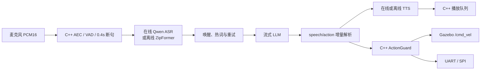

# Embodied Voice Agent for ROS 2

面向 TurtleBot3 与端侧机器人的在线/离线语音控制系统：从麦克风、流式 ASR、LLM
动作解析，一直到 C++ 安全仲裁、Gazebo 仿真或 UART/SPI 硬件输出。

> 当前定位是“可复现的工程原型”：优先保证 `move / turn / stop` 的完整链路，
> 不追求复杂导航行为。目标环境为 Ubuntu 24.04、ROS 2 Jazzy、Python 3.12、C++17。

## 能做什么

- 在线链路：Qwen 实时 ASR、流式 LLM、实时 TTS，支持预热、记忆和延迟指标。
- 离线链路：sherpa-onnx ZipFormer、Qwen3-0.6B Q8/llama.cpp、Sherpa-TTS。
- 声学前端：C++ PortAudio、NLMS AEC、VAD、0.4 秒静音断句。
- 识别恢复：热词偏置、唤醒别名、失败反馈和持续重试。
- 动作安全：结构化动作、C++ schema 校验、限幅、急停和 watchdog。
- 生命周期：Guard 与仿真执行器采用 C++ LifecycleNode，由 Nav2 manager 有序激活。
- 控制后端：TurtleBot3 Gazebo、UART、SPI 和无硬件 mock。
- 自动验收：单元测试、ROS 冒烟、云模型、离线模型和 Gazebo 物理位移验证。

## 数据流



Python 负责模型 SDK、文本协议和对话编排；C++ 负责实时音频、动作安全、仿真控制
和硬件传输。两侧只通过 ROS 2 话题连接。

## 五分钟运行

```bash
cd /home/ubuntu/embodied_agent_ws
bash scripts/bootstrap.sh
source scripts/activate.sh

# 无密钥、无麦克风验证主链路
bash scripts/smoke_test.sh

# mock Agent 驱动 Gazebo（无需麦克风和模型）
ros2 launch embodied_simulation voice_turtlebot3.launch.py \
  provider_mode:=mock microphone_enabled:=false speaker_enabled:=false
```

真实麦克风控制仿真：

```bash
# 离线；首次需执行 scripts/setup_offline_runtime.sh
bash scripts/accept_voice_simulation_microphone.sh offline

# 在线；先按 .env.example 配置 DashScope
bash scripts/accept_voice_simulation_microphone.sh online
```

识别失败时终端会显示重试次数并继续监听，不需要重新启动节点。启用唤醒词验收：

```bash
WAKE_WORD_ENABLED=true \
  bash scripts/accept_voice_simulation_microphone.sh offline
```

## 验收入口

```bash
bash scripts/acceptance_test.sh mock     # 61 项测试及无模型链路
bash scripts/acceptance_test.sh online   # 少量云 API 调用
bash scripts/acceptance_test.sh offline  # 本地模型、语音和性能
bash scripts/acceptance_test.sh gazebo   # Gazebo 可信动作与里程计
```

性能数字是验收目标而不是硬编码承诺。当前实测、限制和复现方法见
[测试与验收](docs/TESTING_AND_ACCEPTANCE.md)。

仿真 launch 默认使用新的强类型 ROS 2 Action 链：

```bash
ros2 launch embodied_simulation voice_turtlebot3.launch.py \
  provider_mode:=mock use_typed_actions:=true
```

排查兼容问题时可临时传入 `use_typed_actions:=false` 回到旧 JSON topic 执行路径。
launch 默认 `lifecycle_autostart:=true`；调试启动顺序时可设为 `false`，再使用
`ros2 lifecycle set /<node> configure|activate` 手工转换状态。

## 项目结构

```text
src/
  embodied_agent_interfaces/ ROS 2 强类型 RobotCommand 与 ExecuteRobotCommand Action
  embodied_agent_cpp/       C++ 音频、ActionGuard、UART/SPI
  embodied_online_agent/    在线 ASR/LLM/TTS 与公共对话模块
  embodied_offline_agent/   ZipFormer、llama.cpp、Sherpa-TTS、双缓冲
  embodied_simulation/      TurtleBot3 控制、雷达安全和 Gazebo launch
scripts/                    安装、启动、基准和分层验收入口
training/                   LoRA 种子数据与 LLaMA-Factory 配置（尚未训练）
docs/                       三份维护文档
```

## 文档

- [架构与知识笔记](docs/ARCHITECTURE_AND_KNOWLEDGE.md)：模块、关键代码、话题和设计原理。
- [测试与验收](docs/TESTING_AND_ACCEPTANCE.md)：命令、测试矩阵、指标和故障定位。
- [版本记录与路线图](docs/CHANGELOG_AND_ROADMAP.md)：迭代历史、完成度、竞品对比和下一步。

## 当前边界

- LoRA 配置和数据已准备，但尚未训练，不能宣称 85% 模型指令遵循率。
- Q8 相对 FP16 通常约压缩一半，不能写成“压缩至 25%”而没有实测基线。
- 合成语音下短唤醒词仍可能误识别；生产环境应接 sherpa-onnx 独立 KWS。
- AEC、P95 延迟和 UART/SPI 仍需在目标机器人硬件上验收。

项目使用 Apache-2.0 风格的包许可声明；公开推广前应在仓库根目录补齐正式
`LICENSE`、贡献指南、CI 和演示视频。
