# Embodied Voice Agent for ROS 2

面向 ROS 2/C++ 求职展示的语音具身智能项目。系统同时提供在线与离线 Agent，并打通：

```text
麦克风 → VAD/ASR → 会话与 NLU/LLM → typed ROS 2 Action
→ C++ ActionGuard/调度 → BehaviorTree.CPP/pluginlib → Gazebo/Nav2/SLAM
```

项目当前以 TurtleBot3 仿真为主；UART/SPI 只保留 Adapter/mock，不宣称已完成实体硬件验收。

## 能力概览

- 在线/离线 Agent：云端 provider，以及 Sherpa-ONNX ZipFormer、llama.cpp、Sherpa-TTS；SummerTTS
  是可选 ROS 服务组件。
- 连续语音：一次唤醒后持续接收，多命令 NLU、FIFO、TTL、重复/filler 过滤和急停抢占。
- ROS 2/C++ 控制：自定义 msg/action、Lifecycle、ActionGuard、ActionScheduler、反馈/取消/超时。
- 仿真执行：BehaviorTree.CPP 编排、pluginlib executor、Gazebo 运动和最终零速度保护。
- SLAM/Nav2：frontier 探索、SLAM Toolbox、地图保存、AMCL、Nav2 目标导航与动态障碍重规划。
- 算法证据：Ceres/GTSAM 后端、LiDAR 回环 shadow pipeline、动态障碍关联/预测/costmap 消融。

当前修订版已取得 fresh schema v4 Gazebo PASS：session
`20260720T031306Z-1114546-814430c3` 完成未知场景探索、本次地图定位、3 个运行时采样目标导航、动态障碍
重规划与安全停车。可达自由区覆盖率为 `99.67%`，AMCL 位置误差 P95 为 `0.154m`，3/3 目标全部成功。
known-world 演示继续作为稳定回归；历史 PASS、历史 FAIL 与当前 fresh PASS 均保留原始 session 边界，不互相继承。

## 核心架构

```mermaid
flowchart LR
    MIC["WSLg 麦克风"] --> FE["Audio Frontend / VAD"]
    FE --> ASR["在线 ASR / Sherpa ZipFormer"]
    ASR --> AGENT["Session + NLU/LLM"]
    AGENT --> CMD["RobotCommand"]
    CMD --> GUARD["C++ ActionGuard + Scheduler"]
    GUARD --> ACTION["ExecuteRobotCommand Action"]
    ACTION --> BT["BehaviorTree.CPP"]
    BT --> EXEC["pluginlib RobotExecutor"]
    EXEC --> GZEXEC["GazeboRobotExecutor"]
    EXEC --> NAVEXEC["Nav2RobotExecutor"]
    GZEXEC --> GAZEBO["Gazebo"]
    NAVEXEC --> NAV2["Nav2 Action servers"]
    GAZEBO --> SENSOR["Gazebo sensors / scan / odom / TF"]
    SENSOR --> SLAM["SLAM Toolbox / frontier policy"]
    SLAM --> MAP["本次会话地图"]
    MAP --> AMCL["map_server + AMCL"]
    AMCL --> NAV2
```



关键原则：Agent 负责意图，ActionGuard 负责 primitive 动作安全，executor 负责副作用。初始/恢复扫描
与安全 STOP 复用 Agent → Guard → BT；Unknown-world 的运行时采样目标则由任务编排器完成 known-free
预筛和 `ComputePathToPose` 准入后，直接调用 typed Nav2 Action，避免把地图坐标重新翻译成自然语言。
探索与采样策略只能读取在线 scan/odom/TF/map；静态真值和场地区域只允许进入评分器。

## 目录

| 路径 | 作用 |
| --- | --- |
| `src/embodied_agent_interfaces` | 自定义 msg/action/service schema |
| `src/embodied_agent_core` | 会话、NLU、队列、记忆与共享运行时 |
| `src/embodied_agent_bringup` | 公共 launch 参数和 Lifecycle 拓扑 |
| `src/embodied_voice_frontend` | VAD、KWS、声纹等输入 Adapter |
| `src/embodied_online_agent` / `src/embodied_offline_agent` | 在线/离线 provider Adapter |
| `src/embodied_agent_cpp` | C++ 音频、安全、调度和硬件 seam |
| `src/embodied_simulation` | BT、pluginlib、Gazebo/Nav2 executor 与场景 |
| `src/embodied_slam_tools` | 自动建图任务、证据状态与阶段进程 |
| `src/embodied_slam` / `src/embodied_navigation` | SLAM 后端/回环与动态障碍算法 |
| `tools/acceptance` | 验收注册表、session、probe、evaluator 与报告判定 |
| `tests` | pytest/GTest、仓库契约和确定性 evaluation |

## 部署

推荐环境：WSL Ubuntu 24.04、ROS 2 Jazzy、Python 3.12、Gazebo Harmonic。

```bash
git clone git@github.com:Edddddddddy/embodied_agent_ws.git
cd embodied_agent_ws
bash scripts/bootstrap.sh
source scripts/activate.sh
```

离线模型和固定版本 Explore Lite：

```bash
bash scripts/setup_offline_runtime.sh
bash scripts/setup_frontier_exploration.sh
bash scripts/acceptance_test.sh offline-runtime-versions
```

在线模式在 `.env` 配置 `DASHSCOPE_API_KEY`。密钥、模型、`build/install/log` 不提交 Git。

> 本阶段新增了 `FrontierExplorationEvidence`、`SlamNavigationGoalEvidence`，并扩展
> `SlamSessionState`。ROS 2 接口 type hash 已变化；切换到本分支后必须全量重建依赖包，不能复用旧
> overlay 或旧 rosbag 作为当前接口证据。

```bash
# 重新配置全部自有包；不在文档里提供可能误删其他 worktree 的递归删除命令。
colcon build --symlink-install --cmake-clean-cache --executor sequential
source install/setup.bash
embodied_workspace_doctor true
```

## 推荐演示

### 1. Unknown-world 正式自主闭环

```bash
HEADLESS=false USE_RVIZ=true \
  bash scripts/acceptance_test.sh unknown-world-slam-e2e
```

机器人运行时不读取真值地图、bootstrap 路线或预生成语义坐标。验收要求本次地图覆盖可达自由空间、
frontier 完整终止、AMCL 与 Gazebo evaluator-only truth 对齐、从本次已知自由区采样至少 3 个目标并
成功导航、动态障碍重规划以及最终零速度。证据写入：

探索器使用 `0.33 m` 可逃逸连通域、基于真实位移的 progress watchdog 和 terminal 后恢复熔断。Burger
profile 将 frontier 观测容差设为 `0.40 m`（上游通用默认仍为 `0.30 m`），且只在最新地图仍证明目标安全时记录
reached；真实逃离上次卡点会打断“连续静止超时”计数，避免将有效绕行误熔断。Nav2 实际生效的
`0.10 m / 30 s` SimpleProgressChecker 会写入 session 参数文件留档。这些策略不包含房间坐标或预设建图路线。

```text
logs/acceptance/unknown_world_slam_nav/<session_id>/unknown_world_slam_e2e_report.json
logs/acceptance/unknown_world_slam_nav/<session_id>/runtime.log
logs/acceptance/unknown_world_slam_nav/<session_id>/acceptance_session.json
```

报告必须是 schema v4、`evidence_kind=unknown_world_slam_nav_dynamic_replan` 且所有 checks 为 true。
当前发布候选证据为 `20260720T031306Z-1114546-814430c3`；完整门槛、全部实测值和历史失败链见
[TESTING.md](docs/TESTING.md) 与 [Navigation 证据索引](docs/evidence/navigation/README.md)。

### 2. Known-world 稳定回归与语音交互

```bash
bash scripts/acceptance_test.sh slam-nav-e2e
bash scripts/acceptance_test.sh voice-slam-workplace-demo offline
# 或 online
```

`slam-nav-e2e` 保留已知场景的确定性集成回归，语音 demo 验证真人触发和阶段交互。它们可能使用场景
bootstrap/语义地点，不能作为“机器人面对未知环境自主完成探索”的证据。

### 3. 连续语音控制

```bash
bash scripts/acceptance_test.sh continuous-offline
bash scripts/acceptance_test.sh continuous-online
```

推荐序列：`小智` → `向前走一秒` → `左转九十度` → `向右转，然后向前走一秒` → `停下` →
`退出控制`。该入口验证语音、队列和基础仿真控制，不代替 SLAM/Nav2 E2E。

## 测试与验收

公开入口共 8 个，实际列表以脚本帮助和注册表为准：

```bash
bash scripts/acceptance_test.sh --help
bash scripts/acceptance_test.sh core
bash scripts/acceptance_test.sh continuous-offline
bash scripts/acceptance_test.sh continuous-online
bash scripts/acceptance_test.sh gazebo
bash scripts/acceptance_test.sh nav2-stage
bash scripts/acceptance_test.sh slam-nav-e2e
bash scripts/acceptance_test.sh unknown-world-slam-e2e
bash scripts/acceptance_test.sh robotics-gate
```

`--help-all` 仅用于维护内部回归和实验模式。分层测试、严格阈值和故障排查见
[TESTING.md](docs/TESTING.md)。

常用补充证据：

```bash
bash scripts/acceptance_test.sh offline-latency
bash scripts/acceptance_test.sh offline-voice-e2e-report
bash scripts/acceptance_test.sh release-gate
```

`offline-latency` 的组件目标为 LLM 首 token `≤ 1000ms`、短句完整 TTS 合成 `≤ 600ms`，不等于
真人语音整链路。release/demo gate 产物分别为 `logs/acceptance_report.json`、
`logs/demo_acceptance_report.json`。麦克风异常先运行 `wsl-microphone-preflight` 和
`voice-calibration-report`，再用
`APPLY_VOICE_CALIBRATION=true bash scripts/acceptance_test.sh continuous-offline` 应用建议；产物为
`logs/audio_calibration.json`、`logs/voice_calibration_report.json` 与 `logs/voice_calibration.env`。
需要留存连续识别样本时设置 `CONTINUOUS_SAMPLE_LOG=<path>`。

## 文档

- [系统架构与调用关系](docs/ARCHITECTURE.md)
- [测试与验收契约](docs/TESTING.md)
- [SLAM/Nav2 学习笔记](docs/learning/SLAM_NAV2.md)
- [语音 Agent 学习笔记](docs/learning/VOICE_AGENT.md)
- [ROS 2/C++ 控制学习笔记](docs/learning/ROS2_CPP_CONTROL.md)
- [Unknown-world 开发 Goal](docs/development/UNKNOWN_WORLD_SLAM_GOAL.md)
- [15 分钟汇报](docs/PRESENTATION_15MIN.md)

## 事实边界

- 仿真证据不等于实体硬件证据；mock、真人语音、Gazebo 和公开 bag 也不能相互替代。
- LoRA/Q8、延迟和识别准确率只引用对应报告，不从 fixture 或单次 smoke 外推。
- SummerTTS 已组件化接入；默认低延迟离线链路仍以 Sherpa-TTS 为主。
- 历史 PASS 不自动继承到新接口、新地图或新验收 schema。

许可证与第三方依赖遵循各子项目声明。
