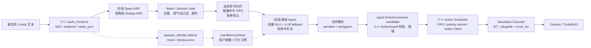

# Embodied Voice Agent for ROS 2

[](https://github.com/Edddddddddy/embodied_agent_ws/actions/workflows/ros2-ci.yml)

这是一个面向 ROS 2 / C++ 求职展示的具身智能语音交互项目。项目目标是打通：

```text
真实/模拟语音输入 → ASR → 在线/离线 Agent → 动作解析 → ActionGuard → ROS 2 Action → Gazebo/TurtleBot3 仿真控制
```

当前项目以 Gazebo 仿真为主要验收平台，真实 UART/SPI 硬件控制保留为 mock/预留接口，不宣称已完成真实硬件闭环。

## 当前能力

- 在线 Agent：接入 DashScope/Qwen 兼容链路，支持在线 ASR、LLM、TTS 和流式响应。
- 离线 Agent：预留 Sherpa-onnx ZipFormer ASR、llama.cpp、Sherpa-TTS/SummerTTS 链路，支持 mock 和真实模型验收入口。
- 连续语音控制：一次“小智”唤醒后，可连续说多条命令；命令排队执行，`停下/急停` 可抢占。
- 识别鲁棒性：支持唤醒词别名、轻量 NLU 多命令识别及速度/距离/角度/时长/地点槽位、模糊命令归一化、短命令补全、重复 ASR final 过滤、语气词过滤、会话超时。
- ROS 2 工程化：在线/离线 provider 共用无 ROS 依赖的 `AgentControlPlane`，ROS 发布由独立 Adapter 统一 topic/QoS；唤醒、识别反馈、NLU、队列、执行和动作 feedback/result 均使用自定义 msg/action；C++ ActionGuard 用有界 TTL outbox 覆盖 DDS 启动发现窗口，ActionScheduler 负责 FIFO、Action Client、优先取消、watchdog 和 diagnostics，并配合 Lifecycle、BehaviorTree.CPP 与 pluginlib executor。
- 中间件契约：音频指标、VAD/KWS、仿真状态、动作 ACK 和 BehaviorTree 状态也使用自定义消息；JSON 只保留在离线报告/JSONL 证据文件中，不作为 ROS 2 进程间协议。
- 仿真动作：前进、后退、左转、右转、停止、原地转圈、绕圈、走正方形、演示动作序列。
- 语音导航：支持“去门口/前往书桌/回到起点”等语义目标点导航，以及“依次去门口、书桌、起点/开始巡航”等多目标点巡航命令；执行中说“取消导航”会绕过 FIFO，抢占当前 Nav2 goal。
- 用户记忆：声纹身份、录入请求和录入状态使用 typed msg；在线/离线 Agent 共用 `MemoryCommandService`，按用户保存本地偏好/行为习惯并在推理前注入用户画像；可语音查询、修改、按项删除或清空偏好，含行为明细 TTL；声纹 sidecar 已实跑 Sherpa-ONNX 3D-Speaker embedding、真实相似度与 top-1 margin 歧义保护。
- 验收脚本：提供 mock、在线、离线、Gazebo、真实麦克风连续控制等多层验收入口。

说明：当前导航能力分三层验收：`navigation-demo` 用 mock/Gazebo executor 做可观测运动；
`nav2-bridge` 用 fake Nav2 action server 证明语义地点已经能转换为真实 Nav2
`NavigateToPose / FollowWaypoints` goal；`nav2-turtlebot3` 启动官方 Nav2 TurtleBot3
仿真做重型端到端验收。日常开发优先跑前两层，演示前再跑完整 Nav2。

## 系统链路



## 项目结构

```text
embodied_agent_ws/
├── src/
│   ├── embodied_agent_interfaces/   # 全部跨节点 msg/srv/action 契约的唯一来源
│   ├── embodied_agent_middleware/   # C++ QoS 与 ROS 2 中间件语义契约
│   ├── embodied_agent_cpp/          # C++ 音频前端、ActionGuard、Action scheduler/client、硬件 mock
│   ├── embodied_online_agent/       # 在线 Agent、Qwen ASR/LLM/TTS、连续语音控制、用户记忆/声纹 sidecar
│   ├── embodied_offline_agent/      # 离线 Agent、Sherpa/llama.cpp/Sherpa-TTS/SummerTTS 适配
│   └── embodied_simulation/         # Gazebo/TurtleBot3 执行器、BehaviorTree、pluginlib
├── scripts/                         # 一键验收、连续语音、校准、smoke test
├── tests/                           # repository / integration 测试
├── docs/
│   ├── ARCHITECTURE_AND_KNOWLEDGE.md
│   ├── FINAL_ARCHITECTURE_DIAGRAMS.md
│   ├── VOICE_TO_SIMULATION_CODE_WALKTHROUGH.md
│   ├── TESTING_AND_ACCEPTANCE.md
│   ├── PROJECT_PRESENTATION_15MIN.md
│   ├── INTERVIEW_QA.md
│   ├── LEARNING_NOTES.md
│   ├── PROJECT_GAPS_AND_OPTIMIZATION.md
│   ├── OFFLINE_BENCHMARK_REPORT.md
│   ├── OFFLINE_RUNTIME_VERSIONS.md
│   └── CHANGELOG_AND_ROADMAP.md
└── README.md
```

## 环境准备

项目默认运行在 WSL Ubuntu 24.04 + ROS 2 环境中。

```bash
cd /home/ubuntu/embodied_agent_ws
source scripts/activate.sh
colcon build --symlink-install
source install/setup.bash
```

如果是第一次部署，建议先运行 bootstrap：

```bash
bash scripts/bootstrap.sh
```

在线模式需要配置 DashScope API Key：

```bash
cp .env.example .env
# 编辑 .env，填入 DASHSCOPE_API_KEY
```

离线真实模型模式需要额外准备 Sherpa-onnx、llama.cpp server、Sherpa-TTS 或 SummerTTS 模型。无模型时仍可使用 mock/offline smoke 验证工程链路。

```bash
bash scripts/setup_offline_runtime.sh
```

`setup_offline_runtime.sh` 会准备 `third_party/llama.cpp`、`third_party/SummerTTS`
以及 `models/` 下的 Sherpa/Qwen 模型文件。SummerTTS 使用开源仓库
[huakunyang/SummerTTS](https://github.com/huakunyang/SummerTTS)，本项目默认仍用
Sherpa-TTS 作为稳定 fallback，需要时可通过 `tts_provider:=summer` 切换。
当前离线运行时固定版本见 [docs/OFFLINE_RUNTIME_VERSIONS.md](docs/OFFLINE_RUNTIME_VERSIONS.md)。

LoRA → GGUF → Q8_0 可复现流水线：

```bash
bash scripts/setup_lora_toolchain.sh --dry-run
bash scripts/acceptance_test.sh lora-q8-pipeline
# 完成数据审核并准备训练算力后才执行：
bash scripts/setup_lora_toolchain.sh
bash scripts/build_qwen_lora_q8.sh --execute
```

当前报告为 `pipeline_ready_not_executed`：配置与转换/量化入口已闭环，但 8 条 seed
只验证格式，尚无本项目 LoRA adapter/F16/Q8 训练产物，不能宣称微调准确率或压缩比例。
边界与产物规则见 [training/README.md](training/README.md)。

可选真实声纹运行时：

```bash
bash scripts/setup_sherpa_speaker_runtime.sh
bash scripts/acceptance_test.sh speaker-runtime
# 证据：logs/speaker_runtime_report.json
#       logs/speaker_identity_ros_report.json
```

该验收使用真实 Sherpa 模型和 ROS PCM sidecar，但默认样本是同一录音的注册/查询，
只证明运行时与接口闭环，不代表多人准确率。真人使用前仍需通过“注册声纹”采集每位用户多段样本，
再单独评估 FAR/FRR 和环境鲁棒性。

llama.cpp 推理层可以先单独验收，避免把 ASR、TTS、Gazebo 的问题混在一起排查：

```bash
bash scripts/acceptance_test.sh llama-cpp-preflight
bash scripts/acceptance_test.sh llama-cpp-smoke
bash scripts/acceptance_test.sh llama-decode-benchmark
bash scripts/acceptance_test.sh instruction-following-eval
bash scripts/acceptance_test.sh pseudo-tts
bash scripts/acceptance_test.sh offline-runtime-versions
bash scripts/acceptance_test.sh offline-showcase-report
bash scripts/acceptance_test.sh offline-evidence-audit
bash scripts/acceptance_test.sh offline-latency
bash scripts/acceptance_test.sh offline-voice-e2e-report
```

`llama-cpp-preflight` 会检查 `llama-server` binary、Q8 GGUF 模型、`/health` 和 `/v1/models`；
`llama-cpp-smoke` 会额外发送一次低 token 流式 chat 请求；`llama-decode-benchmark`
调用 llama.cpp 自带 `llama-bench`，把 CPU decode tokens/s 写入
`logs/llama_decode_benchmark.json`；`instruction-following-eval` 会真实调用 llama.cpp，
评估离线 LLM 是否按 `<speech>/<action>` 协议输出动作，报告写入
`logs/instruction_following_report.json`；`pseudo-tts` 不依赖真实 Sherpa/SummerTTS 模型，
用假 PCM 验证“LLM token 流 -> 短句切分 -> 伪流式 TTS 双缓冲 -> 音频块发布”的工程链路。
`offline-evidence-audit` 会读取 `logs/offline_showcase_report.json`，输出
`logs/offline_evidence_audit.json`。报告中的 `claim_evidence` 会逐项标记 Q8 模型资产、
deterministic parser、首 token、伪流式首音频、tokens/s、LoRA 训练等证据状态，明确哪些指标
已有证据、哪些只能作为后续计划，避免把 LoRA/真实延迟/ASR-TTS benchmark 等未复现项说成已完成。
报告中的 `benchmark_gap_plan` 会把缺失证据转换成下一条可执行补证命令。

2026-07-11 本机阶段实测（i5-14400F、Qwen3-0.6B Q8_0、CPU）如下；这些是报告值，
不是简历目标值：

| 指标 | 实测 |
| --- | ---: |
| warm Agent turn 首 token 中位数 / P95 | `≈536 / 560 ms` |
| Agent API completion decode 估算中位数 | `≈28.9 tokens/s` |
| `llama-bench` 独立 decode | `≈37.2 tokens/s` |
| Sherpa 短句整句合成 | `≈199 ms` |
| Sherpa ASR / TTS realtime factor | `≈0.036 / 0.414` |
| speech endpoint → 第一块 TTS PCM | `≈861 ms` |
| 离线 LLM 严格协议 / 工程出口动作分数 | `0.375 / 1.0` |

`offline-latency` 会写出 `logs/offline_latency_report.json`。冷 prompt prefill 在节点 ready
前由 warmup 承担，不混入 warm turn P95；`llama-bench` 是纯 decode 证据，Agent API decode
则根据服务端返回的 completion token usage 估算，两者测量范围不同。
演示前如需把 tokens/s 直接写进离线展示报告，可运行：

```bash
OFFLINE_SHOWCASE_RUN_LLAMA_BENCH=true bash scripts/acceptance_test.sh offline-showcase-report
OFFLINE_EVIDENCE_REQUIRE_LLAMA_BENCH=1 bash scripts/acceptance_test.sh offline-evidence-audit
```

演示前如需把离线 LLM 指令遵循准确率也写进离线展示报告，可运行：

```bash
bash scripts/acceptance_test.sh instruction-following-eval
OFFLINE_SHOWCASE_RUN_INSTRUCTION_FOLLOWING=true OFFLINE_SHOWCASE_INSTRUCTION_FOLLOWING_INPUT=logs/instruction_following_report.json bash scripts/acceptance_test.sh offline-showcase-report
OFFLINE_EVIDENCE_REQUIRE_INSTRUCTION_FOLLOWING=1 bash scripts/acceptance_test.sh offline-evidence-audit
```

把真实 ZipFormer→llama.cpp→伪流式 Sherpa-TTS 指标写进统一报告：

```bash
bash scripts/acceptance_test.sh offline-voice-e2e-report
OFFLINE_SHOWCASE_RUN_VOICE_E2E=true OFFLINE_SHOWCASE_VOICE_E2E_INPUT=logs/offline_voice_e2e_report.json bash scripts/acceptance_test.sh offline-showcase-report
OFFLINE_EVIDENCE_REQUIRE_VOICE_E2E=1 bash scripts/acceptance_test.sh offline-evidence-audit
```

常用调参环境变量：

```bash
LLAMA_THREADS=8 LLAMA_CONTEXT=2048 bash scripts/start_llama_server.sh
LLAMA_PARALLEL=1 bash scripts/acceptance_test.sh llama-cpp-smoke
LLAMA_DECODE_MIN_TOKENS_PER_S=8.0 LLAMA_BENCH_NO_WARMUP=1 bash scripts/acceptance_test.sh llama-decode-benchmark
INSTRUCTION_FOLLOWING_MINIMUM=0.70 INSTRUCTION_FOLLOWING_EFFECTIVE_MINIMUM=0.85 bash scripts/acceptance_test.sh instruction-following-eval
```

SummerTTS 可以单独部署和验收：

```bash
bash scripts/setup_summer_tts_runtime.sh
bash scripts/acceptance_test.sh summer-tts-preflight
bash scripts/acceptance_test.sh summer-tts-smoke
bash scripts/acceptance_test.sh summer-pseudo-tts
bash scripts/acceptance_test.sh summer-tts-service
bash scripts/acceptance_test.sh summer-tts-cache-audit
```

`summer-pseudo-tts` 会使用真实 SummerTTS C++ 二进制合成短文本，再通过项目的
`PseudoStreamingTtsPipeline` 分块发布，验证“开源 C++ TTS 后端 + 双缓冲伪流式”的嵌入链路。
`summer-tts-service` 会启动常驻 C++ ROS service，模型在节点启动时加载，后续请求通过
`/tts/synthesize` 合成，不再每句启动命令行进程；短文本反馈默认启用缓存，重复请求会在
probe 输出中显示 `cache_hit=true`。该验收会强制要求重复短文本命中缓存，避免只验证
“能合成”而没有证明缓存优化真正生效。
如果已保存 `summer_tts_service_probe.py` 的 JSON 输出，`summer-tts-cache-audit` 会进一步审计
缓存命中后的 roundtrip 是否满足短反馈语低延迟目标，并在报告中明确禁止把整句 SummerTTS
生成过度宣称为默认 `<300ms` TTS。

使用常驻 SummerTTS ROS 后端：

```bash
ros2 launch embodied_offline_agent offline_agent.launch.py \
  mode:=offline \
  tts_provider:=summer_ros
```

低延迟验收：

```bash
bash scripts/acceptance_test.sh offline-latency
```

当前低延迟默认路径为 `llama.cpp + Sherpa-TTS`：独立门禁要求 LLM 首 token ≤ 1000ms、
Sherpa 短反馈整句合成 ≤ 600ms；真实首音频由 `offline-voice-e2e-report` 测量伪流式管线
第一块 PCM，不能用整句 `synthesize()` 返回时间冒充。SummerTTS 目前通过命令行二进制接入，每句会重新启动进程并加载模型，
适合展示 C++ 离线 TTS runtime，但不作为 `<300ms` 低延迟默认 TTS。`summer_ros`
已经把 SummerTTS 做成常驻 C++ ROS 组件，消除了进程/模型重复加载，并对“好的/收到/正在执行”
这类短文本做请求级缓存；未命中的长句瓶颈仍主要是 SummerTTS CPU infer 本身，后续若要继续冲
`<300ms`，需要模型量化、真正流式合成或更快声码器等进一步优化。

如果只想先部署和验证 Sherpa-ONNX ZipFormer ASR，可运行更轻量的 ASR-only 入口：

```bash
bash scripts/setup_sherpa_asr_runtime.sh
bash scripts/acceptance_test.sh sherpa-asr-smoke
```

## 用户声纹与本地记忆

当前版本把“声纹识别”和“用户记忆”解耦：

- `speaker_identity` sidecar 订阅 `/audio/clean_pcm`、`/audio/speech_ended`，发布 `/agent/speaker_identity`。
- 录入声纹时，Agent 发布 `/agent/speaker_enroll_request`，sidecar 收集后续 3 句语音为 wav 样本并维护 `speakers.txt`。
- 在线/离线 Agent 订阅 `/agent/speaker_identity`，把当前用户画像从 `~/.ros/embodied_agent/users/` 加载进 prompt。
- 支持语音/文本命令：“记住我，我是小李”“我喜欢慢一点”“我是谁”“清除我的记忆”。
- 个性化偏好只作为 Agent 上下文，动作仍必须经过 ActionGuard 限幅和 ROS 2 Action 执行。
- 低置信度或未注册声纹会被归为 `unknown`：Agent 可以继续执行普通控制命令，但不会把姓名、
  偏好或动作统计写入个人 profile，避免误识别时污染其他用户记忆。

mock 验收：

```bash
bash scripts/acceptance_test.sh speaker-memory-mock
bash scripts/acceptance_test.sh speaker-enroll
bash scripts/acceptance_test.sh speaker-runtime
```

真实 sherpa-onnx 声纹接入需要准备 speaker embedding 模型和注册样本文件，然后启动时开启：

```bash
ros2 launch embodied_online_agent online_agent.launch.py \
  speaker_identity_enabled:=true \
  speaker_identity_mode:=sherpa \
  speaker_identity_sherpa_model:=/path/to/speaker_model.onnx \
  speaker_identity_sherpa_file:=/path/to/speakers.txt
```

`speakers.txt` 每行格式为：

```text
lcy /path/to/lcy_enroll.wav
```

## 五分钟跑通主链路

无密钥、无麦克风、无真实模型的主链路验收：

```bash
bash scripts/acceptance_test.sh mock
```

Gazebo 仿真链路：

```bash
bash scripts/acceptance_test.sh gazebo
```

语音目标点导航与多目标点巡航 mock 验收：

```bash
bash scripts/acceptance_test.sh navigation-demo
```

连续语音会话中的目标点导航/多目标点巡航队列验收：

```bash
bash scripts/acceptance_test.sh continuous-navigation
```

Nav2 action bridge 验收（无需完整地图，用 fake Nav2 action server）：

```bash
bash scripts/acceptance_test.sh nav2-bridge
# 证据：logs/nav2_bridge_report.json（目标点、巡航、底层 cancel request）
```

Nav2/TurtleBot3 完整 bringup 前置检查：

```bash
bash scripts/acceptance_test.sh nav2-preflight
bash scripts/acceptance_test.sh nav2-assets
```

`nav2-assets` 会审计 `places.yaml`、`voice_nav2_turtlebot3.launch.py`、项目本地
`voice_demo.yaml` / `voice_demo.sdf.xacro`、RViz 展示配置和重型验收脚本。当前默认
Nav2 bringup 仍复用官方 TurtleBot3 导航栈，但 map/world/RViz 入口已经由本项目维护，
适合在汇报中稳定展示 TF、map、scan、odom、global plan 和语音目标点导航链路。

语音导航阶段门禁（推荐提交前跑；不启动重型 Gazebo/Nav2）：

```bash
bash scripts/acceptance_test.sh nav2-stage
```

Nav2/TurtleBot3 真实仿真重型验收（会启动 Gazebo/Nav2，耗时数分钟）：

```bash
bash scripts/acceptance_test.sh nav2-turtlebot3
bash scripts/acceptance_test.sh nav2-resilience
```

该模式会先发布 AMCL `/initialpose`，并使用较长的 `nav_action_timeout_s` 等待真实
Nav2 action result，避免按普通短动作提前取消导航。
其中 `nav2-resilience` 会在机器人开始导航后，通过 `ros_gz_sim create` 把 0.2m 方块
插入当前全局路径的前方 inflation 区，要求新路径净空增加且最终到达；随后发送地图外
测试点“封闭区”，要求 Nav2 返回带 error code 的失败并使 `/cmd_vel` 归零。证据写入
`logs/nav2_resilience_report.json`。

在线接口最小 token 验证：

```bash
bash scripts/acceptance_test.sh online
```

离线真实模型链路：

```bash
bash scripts/acceptance_test.sh llama-cpp-preflight
bash scripts/acceptance_test.sh llama-cpp-smoke
bash scripts/acceptance_test.sh pseudo-tts
bash scripts/acceptance_test.sh offline
```

离线 Agent 的 `/offline_agent/metrics` 会包含 `llm_provider` 字段，用于查看 llama.cpp
首 token 延迟、token 数和 tokens/s；同时包含 `tts_pipeline` 字段，用于查看伪流式
TTS 的文本块数、合成调用次数、音频块数和首文本到首音频耗时。如果失败信息指向 `cannot connect to llama-server`，
先单独运行上面的 `llama-cpp-preflight/smoke`。

Sherpa-ONNX 语音模型参与的 typed Action 仿真控制闭环：

```bash
bash scripts/acceptance_test.sh offline-sherpa-typed
```

查看所有验收模式：

```bash
bash scripts/acceptance_test.sh --help
```

日常开发最小回归：

```bash
bash scripts/acceptance_test.sh core
```

`core` 只跑仓库结构检查、Python Agent 单元测试和 C++/仿真 GTest；`mock`
会进一步启动依赖 mock 的 ROS smoke 链路，更适合提交前验收。

## 真实麦克风连续语音控制

离线优先，适合现场演示：

```bash
bash scripts/acceptance_test.sh continuous-offline
```

在线模式：

```bash
bash scripts/acceptance_test.sh continuous-online
```

`continuous-offline/online` 是长期控制服务，只会在 `Ctrl+C` 后退出，不会因为运行了
180 秒自动停止。如果要从“能演示”升级为可量化的 3 分钟/10 命令证据，推荐直接使用
单终端一键入口：

```bash
bash scripts/acceptance_test.sh continuous-voice-evidence offline
# 在线链路改为 online
```

它会自动启动控制链路、显示180秒倒计时、生成报告、关闭后台 ROS/Gazebo 进程并退出。
如果需要让控制服务在计分结束后继续运行，才使用双终端方式：

```bash
# 终端1：常驻，结束时手动 Ctrl+C
bash scripts/acceptance_test.sh continuous-offline
# 终端2：自动计时并退出
bash scripts/acceptance_test.sh continuous-voice-benchmark offline
```

它会生成 `logs/continuous_voice_offline_live_report.json` 与
`logs/voice_benchmark_report.json`，统计命令识别率、动作序列准确率、动作成功率、
多余 candidate 误触发率、`/agent/metrics` 首包延迟、ASR final→Action result 端到端
延迟的中位数/P95、会话状态和最终停车。
即使指标不足，两个 JSON 文件也会写出，命令随后以非零状态退出并提示把报告交给 Codex。
这项必须真人对麦克风实测；单元测试只验证统计器，不能替代现场证据。

Nav2/TurtleBot3 目标点导航连续语音演示：

```bash
bash scripts/acceptance_test.sh continuous-nav2-offline
# 或
bash scripts/acceptance_test.sh continuous-nav2-online
```

推荐话术：

```text
小智
去门口
前往书桌
依次去门口、书桌、起点
停止巡航
退出控制
```

辅助计分终端：

```bash
CONTINUOUS_LIVE_CHECK_DURATION=240 bash scripts/acceptance_test.sh continuous-nav2-live-check offline
```

更推荐的一终端留证方式：

```bash
CONTINUOUS_LIVE_CHECK_REPORT=logs/nav2-live-check.json \
  CONTINUOUS_LIVE_CHECK_DURATION=240 \
  bash scripts/acceptance_test.sh continuous-nav2-evidence offline
```

它会自动启动连续 Nav2 语音控制、运行现场计分、保存证据报告，并在结束时清理
Gazebo/Nav2/Agent 进程。两终端方式仍适合调试 topic 和日志。
正式占用麦克风和 Gazebo 前，也可以先 dry-run 检查参数：

```bash
CONTINUOUS_NAV2_EVIDENCE_DRY_RUN=true \
  CONTINUOUS_LIVE_CHECK_REPORT=logs/nav2-live-check.json \
  bash scripts/acceptance_test.sh continuous-nav2-evidence offline
```

该计分脚本会要求现场至少出现一次 `navigate_to` 和一次 `follow_waypoints`，
避免只看到普通动作 result 就误判为 Nav2 导航演示通过。
如果 Nav2 action 返回失败，保存的报告会在 `navigation_failure_reasons` 中提取
`aborted/canceled`、`target/waypoints`、`error_code/error_msg`、`missed_waypoints`
等字段，并额外给出稳定的 `failure_class` 和 `retry_hint`。常见分类包括
`planner_failed`、`controller_failed`、`localization_lost`、`waypoint_missed`、
`timeout` 和 `canceled`，便于复盘是目标不可达、局部控制失败、定位丢失还是巡航点未到达。
如需保存现场证据：

```bash
CONTINUOUS_LIVE_CHECK_REPORT=logs/nav2-live-check.json \
  CONTINUOUS_LIVE_CHECK_DURATION=240 \
  bash scripts/acceptance_test.sh continuous-nav2-live-check offline
```

保存后可离线复核这份证据，不需要重新启动仿真或麦克风：

```bash
bash scripts/acceptance_test.sh continuous-nav2-live-report logs/nav2-live-check.json
```

推荐话术：

```text
小智
向前走一秒
左转九十度
后退一秒
绕圈
走正方形
停下
退出控制
```

如果想把真实 ASR 错词、漏字、多命令粘连样本沉淀成后续 NLU 回归数据，可以打开 JSONL 采样：

```bash
CONTINUOUS_SAMPLE_LOG=logs/asr_nlu_samples.jsonl \
  bash scripts/acceptance_test.sh continuous-offline
```

该文件会记录 `/agent/asr_final`、归一化/补全/NLU feedback、动作候选和 result。
演示后先转成待审核候选集，再挑选失败样本补进 `training/robot_instruction_eval.jsonl`：

```bash
ASR_NLU_SAMPLES_SYNTHETIC=false \
  ASR_NLU_SAMPLE_LOG=logs/asr_nlu_samples.jsonl \
  bash scripts/acceptance_test.sh asr-nlu-samples-to-eval
```

输出 `logs/asr_nlu_eval_candidates.jsonl`。其中的 `suggested_eval_case` 已接近
`training/robot_instruction_eval.jsonl` schema，但仍建议人工检查动作是否符合真实意图后再合入。
合入前可以先对候选集跑一次临时 parser 回归：

```bash
ASR_NLU_CANDIDATE_SYNTHETIC=false \
  ASR_NLU_CANDIDATE_INPUT=logs/asr_nlu_eval_candidates.jsonl \
  bash scripts/acceptance_test.sh asr-nlu-candidate-eval
```

候选评估报告会输出 `failure_analysis`，把失败样本分成 `no_action_produced`、
`multi_command_count_mismatch`、`action_name_mismatch`、`action_argument_mismatch`
等类型，并给出下一步应补归一化词表、slot 解析、多命令样本还是人工审核评估集。

另开一个终端做人工验收统计：

```bash
bash scripts/acceptance_test.sh continuous-live-check offline
# 或
bash scripts/acceptance_test.sh continuous-live-check online
```

通过标准：

- 终端持续打印 `[session] / [asr] / [queue] / [exec] / [action] / [result]`。
- 一次唤醒后能连续识别多条命令。
- 机器人在 Gazebo 中连续执行动作。
- busy 时后续命令进入队列，而不是静默丢失。
- `停下/急停` 能抢占并清队列。
- `退出控制` 后 session 进入 sleeping。
- 最终 `/cmd_vel` 归零。

## 语音识别调参

连续语音默认偏向“完整优先”，减少“左转90度”只识别成“左转”的尾部漏识别：

- `VAD_PROVIDER`：默认 `auto`，启动前优先检测 Silero VAD；不可用时尝试轻量 WebRTC VAD；
  两者都不可用时自动降级到 energy VAD 并打印原因。
- `VAD_SPEECH_START_MS`：Silero/WebRTC 需要连续人声达到该时长才发布 `speech_started`，默认
  `96ms`，用于过滤键盘声、碰麦克风等单帧噪声；
- `SILERO_VAD_END_THRESHOLD`：Silero 进入语音段后使用的较低结束阈值，默认 `0.35`，与
  默认起始阈值 `0.5` 形成滞回，减少临界概率抖动导致的错误断句；
- `SPEECH_END_SILENCE_S`：VAD 判定一句话结束前等待的静音时长。
- `ASR_COMMIT_DELAY_MS`：收到 `/audio/speech_ended` 后，Agent 再延迟提交 ASR final 的时间。
- `ASR_PARTIAL_MERGE_ENABLED`：默认开启；final 是最新 partial 的严格前缀时，只补回
  时间、角度、次数、颜色、地点等安全控制槽位，不覆盖普通聊天。
- `ASR_PARTIAL_MAX_AGE_S`：partial 可参与恢复的最大新鲜度，默认 `2.0s`。
- `VOICE_CONTROL_PROFILE`：`normal`、`quiet`、`low_gain`、`noisy_room` 四种预设。
  - `low_gain` 用于 WSL/笔记本麦克风输入很低的场景，例如 `rms≈0.002`、`peak<300` 且 `speech=False`。

示例：

```bash
VOICE_CONTROL_PROFILE=noisy_room bash scripts/acceptance_test.sh continuous-offline
VOICE_CONTROL_PROFILE=low_gain bash scripts/acceptance_test.sh continuous-offline
VAD_PROVIDER=silero bash scripts/acceptance_test.sh continuous-offline
ASR_COMMIT_DELAY_MS=500 bash scripts/acceptance_test.sh continuous-offline
```

发生安全恢复时 monitor 会打印 `[asr-recover] 把灯 -> 把灯设成蓝色`，真人留证报告中的
`asr_final_recovery_count` 会记录次数；没有可信 partial 时仍进入缺槽位重试，不猜测动作。

如果 ASR 仍然只输出“左转/前进”，命令补全层会按演示默认语义执行：

- `前进 / 向前 / 往前` → `前进一秒`
- `后退 / 向后 / 往后` → `后退一秒`
- `左转 / 向左转` → `左转九十度`
- `右转 / 向右转` → `右转九十度`

## 常用验收命令

```bash
# 仓库结构与 CLI 入口
pytest -q tests/repository
bash tests/integration/test_acceptance_cli.sh

# 连续语音 mock / endpoint / queue
bash scripts/acceptance_test.sh continuous-endpoint
bash scripts/acceptance_test.sh continuous-mock
bash scripts/acceptance_test.sh continuous-multi-command
bash scripts/acceptance_test.sh continuous-queue-full
bash scripts/acceptance_test.sh voice-readiness

# 声纹身份事件 + 用户行为记忆 mock 验收
bash scripts/acceptance_test.sh speaker-memory-mock
bash scripts/acceptance_test.sh speaker-enroll

# 语音导航 / 多目标点巡航
bash scripts/acceptance_test.sh nav2-stage
bash scripts/acceptance_test.sh navigation-demo
bash scripts/acceptance_test.sh nav2-bridge
bash scripts/acceptance_test.sh nav2-preflight
bash scripts/acceptance_test.sh nav2-turtlebot3
# 重型证据：logs/nav2_turtlebot3_voice_report.json
# 包含 map 元数据、scan 计数、AMCL map→base_link、Nav2 result、odom 位移
bash scripts/acceptance_test.sh continuous-nav2-offline

# Gazebo 语音到仿真运动
bash scripts/acceptance_test.sh gazebo-voice
bash scripts/acceptance_test.sh gazebo-voice-online

# C++ ROS 2 Action 生命周期：成功、feedback、取消、服务端超时
bash scripts/acceptance_test.sh cpp-action-client
# 结构化证据：logs/cpp_action_lifecycle_report.json

# C++ 调度层：FIFO、急停取消、结果关联、/diagnostics
bash scripts/acceptance_test.sh cpp-action-scheduler

# LoRA/合并/GGUF/Q8 流水线 dry-run 与证据边界
bash scripts/acceptance_test.sh lora-q8-pipeline
```

完整 release gate：

```bash
bash scripts/acceptance_test.sh all
```

`all` 不包含需要人工说话的 microphone/continuous interactive 模式。

求职展示版推荐把验收分成三层：

- 日常开发 gate：`bash scripts/acceptance_test.sh core`，速度快，适合频繁本地检查。
- 发布 gate：`bash scripts/acceptance_test.sh release-gate`，固定 5 条聚合命令，覆盖 Python/Agent 单测、
  CLI/指令解析、连续语音队列、语音导航 demo、离线延迟/SummerTTS/C++ ROS 单测。
- 演示 gate：`bash scripts/acceptance_test.sh demo-gate`，更贴近 15 分钟展示前留证，覆盖 provider preflight、
  声纹/记忆偏好闭环、连续多命令、语音导航 mock 和离线展示报告。

发布 gate 会输出统一报告：

```bash
bash scripts/acceptance_test.sh release-gate
# 默认报告：logs/acceptance_report.json
```

报告中的每条命令都会带 `evidence_kind`，用于区分：

- `ci_compatible`：纯仓库/单测/解析证据，适合 CI。
- `mock_ros`：ROS/mock 链路证据，不代表真实麦克风或 Gazebo 图形实测。
- `local_preflight` / `local_runtime`：依赖本机 provider、模型或 ROS2 runtime 的本地证据。
- `cpp_ros`：C++/ROS2 组件测试证据。

顶层 `evidence_policy.manual_followups` 会列出还需要人工确认的真实演示项，例如
`continuous-offline`、`gazebo`、`nav2-turtlebot3`。也就是说，自动 gate 是发布/演示前的
可复查证据，不会把 mock 结果包装成真实麦克风或 Nav2 重型验收。

演示前建议再跑一遍自动证据 gate：

```bash
bash scripts/acceptance_test.sh demo-gate
# 默认报告：logs/demo_acceptance_report.json
```

真实麦克风、Gazebo/RViz 和 Nav2 仍然需要人工现场证据。演示前后可以用 checklist
把自动 gate、成熟 VAD 稳定性预检、live-check、Nav2 live-check、录屏和截图汇总成一份报告：

```bash
bash scripts/acceptance_test.sh demo-evidence-checklist
# 默认输出：
#   logs/demo_evidence_checklist.json
#   logs/demo_evidence_checklist.md
```

默认模式只汇总缺口，不会因为尚未录屏或尚未跑真实麦克风而失败。演示前可以打开严格模式：

```bash
DEMO_EVIDENCE_STRICT=true \
DEMO_EVIDENCE_REQUIRE_NAV2=true \
DEMO_EVIDENCE_REQUIRE_VISUAL=true \
  bash scripts/acceptance_test.sh demo-evidence-checklist
```

如果要查看或运行更完整的本地门禁，可直接调用 full profile：

```bash
python3 scripts/showcase_release_gate.py --profile full
python3 scripts/showcase_release_gate.py --profile full --dry-run
python3 scripts/showcase_release_gate.py --profile demo --dry-run
```

## 常见问题

### ASR 没输出

先检查麦克风和 VAD：

```bash
bash scripts/acceptance_test.sh wsl-microphone-preflight
bash scripts/acceptance_test.sh voice-readiness
bash scripts/acceptance_test.sh voice-calibration-report
python scripts/audio_frontend_calibration.py --duration 6
python scripts/audio_frontend_calibration.py --duration 6 --json > logs/audio_calibration.json
```

`voice-calibration-report` 默认生成 `logs/voice_calibration_report.json/.md` 和
`logs/voice_calibration.env`，汇总 provider preflight、
audio calibration、KWS calibration 和下一条建议命令。真实现场如果已经启动连续语音或 audio frontend，
可采集实时 topic：

```bash
VOICE_CALIBRATION_COLLECT=true bash scripts/acceptance_test.sh voice-calibration-report
source logs/voice_calibration.env
bash scripts/acceptance_test.sh continuous-offline
```

如果 `VAD_PROVIDER=auto` 因缺少 Silero/WebRTC 依赖降级到 energy，报告里的
`provider_setup_commands` 和 Markdown 的 `Provider setup` 会直接给出安装命令，例如
`bash scripts/setup_voice_vad_runtime.sh webrtc`。这一步的目的，是把“真实语音不稳定”
从凭经验调阈值，推进到“先确认成熟 VAD 是否可用，再决定是否回退 energy”。

如果当前使用 `KWS_PROVIDER=openwakeword` 或 `KWS_PROVIDER=livekit`，并且采集到了
`/agent/kws_score`，`logs/voice_calibration.env` 还会写入推荐的
`OPENWAKEWORD_THRESHOLD` 或 `LIVEKIT_WAKEWORD_THRESHOLD`，用于下一轮唤醒词阈值复测。

连续语音脚本默认 `APPLY_VOICE_CALIBRATION=auto`：如果
`logs/voice_calibration.env` 存在，会在 profile 默认值计算前自动加载；如果你显式传了
`VOICE_CONTROL_PROFILE/SPEECH_START_THRESHOLD/VAD_PROVIDER` 等关键变量，显式值会优先。
需要强制加载或关闭时可以这样写：

```bash
APPLY_VOICE_CALIBRATION=true bash scripts/acceptance_test.sh continuous-offline
APPLY_VOICE_CALIBRATION=false bash scripts/acceptance_test.sh continuous-offline
```

`audio_frontend_calibration.py` 会输出更细的 `recommended_environment` 和 `next_command`。
如果它建议 `VOICE_CONTROL_PROFILE=low_gain` 或更低 `SPEECH_START_THRESHOLD`，
可以直接复制 `next_command` 重新启动连续语音验收。

如果希望 `VAD_PROVIDER=auto` 尽量使用成熟声学 VAD，而不是降级到 energy VAD，可以先运行
provider preflight。它会在缺少可选依赖时输出 `recommendations`，直接给出推荐安装命令：

```bash
VAD_PROVIDER=auto bash scripts/acceptance_test.sh provider-preflight
```

演示前如果要把“成熟声学 VAD 已启用”作为硬门槛，可以运行严格稳定性预检。
它要求 `VAD_PROVIDER=auto` 最终解析到 Silero 或 WebRTC；如果只能降级到 energy，
会失败并给出安装建议：

```bash
VAD_PROVIDER=auto bash scripts/acceptance_test.sh voice-stability-preflight
```

也可以先 dry-run 看安装脚本将执行哪些命令：

```bash
bash scripts/acceptance_test.sh voice-vad-runtime-dry-run
```

实际安装轻量 WebRTC VAD：

```bash
bash scripts/setup_voice_vad_runtime.sh webrtc
VAD_PROVIDER=auto bash scripts/acceptance_test.sh provider-preflight
bash scripts/acceptance_test.sh webrtc-vad-sidecar
```

安装纯 ONNX Silero VAD（固定 v6.2.1 模型和 SHA256，不安装 PyTorch）：

```bash
bash scripts/setup_voice_vad_runtime.sh silero
bash scripts/acceptance_test.sh silero-vad-runtime
```

验收会生成 `logs/silero_vad_runtime.json`，记录模型哈希、ONNX Runtime 版本、真实测试语音的
人声帧数以及单帧 mean/P95/max 推理耗时，并通过 ROS 2 sidecar 验证成对 endpoint 事件。

如需同时准备 Silero 和 WebRTC：

```bash
bash scripts/setup_voice_vad_runtime.sh all
```

如果希望唤醒不只依赖文本/模拟触发，可以准备声学 KWS 运行时。先 dry-run：

```bash
bash scripts/acceptance_test.sh voice-kws-runtime-dry-run
```

准备 openWakeWord：

```bash
bash scripts/setup_voice_kws_runtime.sh openwakeword
KWS_PROVIDER=openwakeword bash scripts/acceptance_test.sh provider-preflight
```

准备 sherpa-onnx KWS 路径和默认关键词文件：

```bash
bash scripts/setup_voice_kws_runtime.sh sherpa
source logs/sherpa_kws.env
KWS_PROVIDER=sherpa bash scripts/acceptance_test.sh provider-preflight
bash scripts/acceptance_test.sh sherpa-kws-sidecar
```

如果 `wsl-microphone-preflight` 的 `rms` 接近 `0.0000`、`peak` 只有个位数，说明
Windows/WSLg 没有把真实麦克风音频送进 WSL。此时优先检查 Windows 隐私设置里的麦克风权限、
默认输入设备、WSLg 音频 source，而不是继续调低 VAD。

如果 `wsl-microphone-preflight` 已经 PASS，但 `continuous-offline` 里的 `[audio]`
仍然长期接近 `rms=0.0000 peak=1`，说明 PortAudio/ALSA 默认输入没有路由到 WSLg
PulseAudio。脚本会在检测到 `PULSE_SERVER` 和 `parecord` 时自动启用
`pulse_audio_capture_bridge.py`，终端应显示：

```text
PULSE_CAPTURE_BRIDGE=auto（active=true）
enhancer=pulse_bridge
```

如需手动控制：

```bash
PULSE_CAPTURE_BRIDGE=true bash scripts/acceptance_test.sh continuous-offline
PULSE_CAPTURE_BRIDGE=false bash scripts/acceptance_test.sh continuous-offline
```

如果环境噪声大，尝试：

```bash
VOICE_CONTROL_PROFILE=noisy_room bash scripts/acceptance_test.sh continuous-offline
```

如果能看到 `[audio] rms/peak` 打印，但始终 `speech=False`，并且数值类似
`rms=0.0023 peak=180`，说明麦克风输入增益太低，默认 VAD 阈值过高。优先尝试：

```bash
VOICE_CONTROL_PROFILE=low_gain bash scripts/acceptance_test.sh continuous-offline
```

或按 readiness/calibration 输出的建议手动套阈值：

```bash
SPEECH_START_THRESHOLD=0.0012 AEC_ENABLED=false bash scripts/acceptance_test.sh continuous-offline
```

### 识别到“左转/前进”但漏掉数字

优先调大：

```bash
SPEECH_END_SILENCE_S=0.85 ASR_COMMIT_DELAY_MS=500 bash scripts/acceptance_test.sh continuous-offline
```

同时观察 monitor 是否出现 `completed_missing_slot`，出现则说明短命令补全已生效。

### 正确 ASR 后没有动作

观察这些 topic：

```bash
ros2 topic echo /agent/action_candidate
ros2 topic echo /robot/action_command_typed
ros2 topic echo /robot/action_result
ros2 topic echo /cmd_vel
```

如果 `/agent/action_candidate` 有输出但 `/robot/action_result` 没有，重点检查 ActionGuard、typed action bridge 和 simulation executor 是否已启动。

### continuous-online 启动后 Gazebo 里没有小车

先清理上一次残留的 Gazebo/ROS 仿真进程，再跑仿真自检：

```bash
CLEANUP_CONFIRM=true bash scripts/cleanup_simulation_processes.sh
bash scripts/acceptance_test.sh gazebo
```

`continuous-offline/online` 启动时会自动做 TurtleBot3 readiness check：必须看到
`/odom`、`/scan`、`/cmd_vel` 和 `/robot/execute_command`。如果你想让脚本启动前自动清理残留进程：

```bash
SIMULATION_CLEANUP_STALE=true bash scripts/acceptance_test.sh continuous-online
```

如果只想后台无界面演示，可以设置：

```bash
GUI_ENABLED=false bash scripts/acceptance_test.sh continuous-online
```

### FastDDS SHM 报 `fastrtps_port7000`

如果看到类似：

```text
RTPS_TRANSPORT_SHM Error ... Failed init_port fastrtps_port7000: open_and_lock_file failed
```

这是 WSL 中 FastDDS 共享内存传输的常见锁文件/残留进程问题。项目默认在
`scripts/activate.sh` 中设置：

```bash
FASTDDS_BUILTIN_TRANSPORTS=UDPv4
```

用于禁用 FastDDS SHM，真实麦克风/Gazebo 演示仍在本机 UDP 通信下运行。如果你确实要调试
FastDDS SHM，可临时恢复：

```bash
EMBODIED_ALLOW_FASTDDS_SHM=true bash scripts/acceptance_test.sh continuous-offline
```

### 在线模式失败

检查 `.env`：

```bash
grep DASHSCOPE_API_KEY .env
bash scripts/acceptance_test.sh online
```

在线真实麦克风受网络、云端 ASR 波动影响更大；现场演示优先使用 `continuous-offline`。

## 文档索引

- [架构与模块说明](docs/ARCHITECTURE_AND_KNOWLEDGE.md)
- [最终架构图与端到端数据流图](docs/FINAL_ARCHITECTURE_DIAGRAMS.md)
- [测试与验收手册](docs/TESTING_AND_ACCEPTANCE.md)
- [15 分钟汇报与代码走读稿](docs/PROJECT_PRESENTATION_15MIN.md)
- [面试问答：ROS 2 / C++ 项目追问](docs/INTERVIEW_QA.md)
- [项目不足与优化路线](docs/PROJECT_GAPS_AND_OPTIMIZATION.md)
- [Nav2 语音导航/巡航验收审计](docs/NAV2_VOICE_ACCEPTANCE_AUDIT.md)
- [学习笔记：关键技术点与设计取舍](docs/LEARNING_NOTES.md)
- [离线模型 Benchmark 与展示报告](docs/OFFLINE_BENCHMARK_REPORT.md)
- [版本记录与路线图](docs/CHANGELOG_AND_ROADMAP.md)
- [Codex WSL + PowerShell 开发 Skill](docs/CODEX_WSL_POWERSHELL_SKILL.md)

## 当前边界

- 当前验收平台是 Gazebo/TurtleBot3 仿真，不是实体机器人。
- 离线 LoRA 训练数据集和真实训练流程有接口与说明，训练本身不是当前主线交付内容。
- 连续语音默认 `VAD_PROVIDER=auto`：Silero VAD 可用时优先使用成熟声学 VAD，
  不可用时尝试轻量 WebRTC VAD，最后才降级 energy VAD；
  openWakeWord、LiveKit WakeWord、Sherpa KWS 仍是可选 seam/preflight/smoke，不是默认强依赖。
- 复杂导航、地图构建、目标点规划不是本阶段目标；当前重点是语音到动作到仿真控制的端到端链路。
