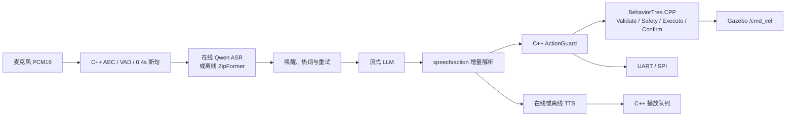

# Embodied Voice Agent for ROS 2

[](https://github.com/Edddddddddy/embodied_agent_ws/actions/workflows/ros2-ci.yml)

面向 TurtleBot3 与端侧机器人的在线/离线语音控制系统：从麦克风、流式 ASR、LLM
动作解析，一直到 C++ 安全仲裁、Gazebo 仿真或 UART/SPI 硬件输出。

> 当前定位是“可复现的工程原型”：优先保证 `move / turn / stop / arc` 的完整链路，
> 不追求复杂导航行为。目标环境为 Ubuntu 24.04、ROS 2 Jazzy、Python 3.12、C++17。

## 能做什么

- 在线链路：Qwen 实时 ASR、流式 LLM、实时 TTS，支持预热、记忆和延迟指标。
- 离线链路：sherpa-onnx ZipFormer、Qwen3-0.6B Q8/llama.cpp、Sherpa-TTS。
- 声学前端：C++ PortAudio、NLMS AEC、VAD、0.4 秒静音断句。
- VAD seam：AudioFrontend 发布 `/audio/speech_started` 与 `/audio/speech_ended`，
  仍兼容旧 `/audio/silence_timeout`；默认 provider 为 energy，可选 Silero sidecar。
- 音频增强 seam：`audio_enhancer:=nlms` 默认使用 NLMS AEC，预留 WebRTC AEC/NS/AGC adapter。
- 识别恢复：热词偏置、唤醒别名、命令错词归一化、失败反馈和持续重试。
- 唤醒 seam：默认 `TextWakeProvider` 发布 `/agent/wake_event` 与
  `/agent/session_state`；外部 KWS sidecar 可通过 `/agent/wake_event_input`
  注入 `wake/sleep` 事件；`keyword_wake` sidecar 已支持 `mock_text` 和可选
  `sherpa` KeywordSpotter adapter。
- 连续控制：一次“小智”唤醒后进入 60 秒会话，后续命令排队顺序执行，停下/急停抢占。
- 动作安全：结构化动作、C++ schema 校验、限幅、急停和 watchdog。
- 丰富演示：支持原地转一圈、绕圈/画圆、走正方形和“演示一下”组合动作。
- 生命周期：Guard 与仿真执行器采用 C++ LifecycleNode，由 Nav2 manager 有序激活。
- 行为编排：BehaviorTree.CPP XML 执行验证、安全检查、异步动作与结果确认。
- 执行插件：pluginlib 按参数切换 Gazebo 与无仿真的 mock executor。
- 组件化部署：同一 C++ 控制实现支持独立进程和 ROS 2 component container。
- 可观测性：标准 diagnostics 报告生命周期、执行后端、动作与安全停车状态。
- 多机器人隔离：执行链使用相对 ROS 名称，可整体放入 `namespace`。
- 控制后端：TurtleBot3 Gazebo、UART、SPI 和无硬件 mock。
- 自动验收：单元测试、ROS 冒烟、云模型、离线模型和 Gazebo 物理位移验证。

## 数据流



Python 负责模型 SDK、文本协议和对话编排；C++ 负责实时音频、动作安全、仿真控制
和硬件传输。两侧只通过 ROS 2 话题连接。

## 五分钟运行

```bash
cd /home/ubuntu/embodied_agent_ws
bash scripts/bootstrap.sh
source scripts/activate.sh

# 无密钥、无麦克风验证主链路
bash scripts/smoke_test.sh

# mock Agent 驱动 Gazebo（无需麦克风和模型）
ros2 launch embodied_simulation voice_turtlebot3.launch.py \
  provider_mode:=mock microphone_enabled:=false speaker_enabled:=false
```

真实麦克风控制仿真：

```bash
# 离线；首次需执行 scripts/setup_offline_runtime.sh
bash scripts/accept_voice_simulation_microphone.sh offline

# 在线；先按 .env.example 配置 DashScope
bash scripts/accept_voice_simulation_microphone.sh online
```

识别失败时终端会显示重试次数并继续监听，不需要重新启动节点。启用唤醒词验收：

```bash
WAKE_WORD_ENABLED=true \
  bash scripts/accept_voice_simulation_microphone.sh offline
```

长时间连续语音控制仿真：

```bash
# 一次“小智”唤醒后，可连续说多条命令；默认关闭扬声器以降低回声干扰
bash scripts/continuous_voice_control.sh offline
bash scripts/continuous_voice_control.sh online

# 嘈杂环境推荐先用 noisy_room，安静近讲可用 quiet；显式环境变量仍可覆盖 preset
VOICE_CONTROL_PROFILE=noisy_room bash scripts/continuous_voice_control.sh offline
```

演示前可先做无麦克风 dry-run，确认参数会怎样透传到 launch：

```bash
CONTINUOUS_PRINT_CONFIG=true \
  WAKE_WORD_ENABLED=true \
  AUDIO_ENHANCER=nlms \
  AEC_ENABLED=true \
  NOISE_SUPPRESSION_ENABLED=false \
  AUTO_GAIN_ENABLED=false \
  bash scripts/continuous_voice_control.sh offline
```

推荐话术：`小智`、`向前走一秒`、`左转九十度`、`后退一秒`、`绕圈`、`走正方形`、
`停下`、`退出控制`。连续模式不会在 Agent busy 时丢弃 ASR final，而是进入 FIFO 队列；
长时间开麦时常见的“嗯/啊/哦/呃”等短语气词会在会话层忽略，同一句 ASR final 在短窗口内
重复出现也会去重，并通过 monitor 输出 `[ignore] filler ...` 或
`[ignore] duplicate_command ...`，减少真实麦克风抖动造成的误排队；
`停下/急停` 会清空等待队列、取消正在等待结果的组合动作，并立即发布 `stop`。
普通命令若在队列中等待超过 `continuous_command_max_age_s`（默认 30 秒）会自动过期跳过，
避免长时间演示时执行已经失去上下文的旧命令；`停下/急停` 不会过期。过期事件会发布到
`/agent/command_queue`，monitor 显示为 `[queue] expired ...`。
队列容量默认是 8，可用 `CONTINUOUS_COMMAND_QUEUE_SIZE` 调整；现场演示建议保持较小，
这样误触发不会堆积太多旧命令，配合 `CONTINUOUS_COMMAND_MAX_AGE` 更容易复盘。
`VOICE_CONTROL_PROFILE` 提供 `normal`、`quiet`、`noisy_room` 三档现场预设：
`quiet` 更灵敏、会话窗口更长，适合安静近讲；`noisy_room` 会提高 VAD 起始阈值、
延长静音断句、缩短旧命令寿命并降低队列容量，适合嘈杂房间里避免误触发堆积。
显式设置的 `SPEECH_START_THRESHOLD`、`CONTINUOUS_COMMAND_QUEUE_SIZE` 等环境变量
优先级高于 preset。
`continuous_voice_control.sh` 默认在 launch 后运行一次 3 秒 readiness check，
采样 `/audio/frontend_metrics`（若使用 sherpa/openwakeword/livekit KWS 还会要求
`/agent/kws_score`），通过后打印 `系统已就绪，可以开始说：小智`；未完全通过只给出
warning 并继续运行。readiness 输出会包含 `recommended_voice_profile` 与
`quick_apply: export VOICE_CONTROL_PROFILE=...`，方便现场根据 blockers/warnings 调整
麦克风、VAD 或 KWS。
如需跳过启动等待，可设置 `CONTINUOUS_READINESS_ENABLED=false`；采样时长可用
`CONTINUOUS_READINESS_DURATION=5` 调整。
命令纠错默认开启，可通过 `COMMAND_NORMALIZATION_ENABLED=false` 临时关闭；现场发现新的
ASR 错词时，推荐复制默认错词表后用 `COMMAND_NORMALIZATION_PATH=/path/to/custom.yaml`
覆盖，并用 `COMMAND_NORMALIZATION_FUZZY_THRESHOLD=0.77` 微调模糊匹配阈值；
如果不希望演示终端打印“原文 -> 规范文本”，可设置
`COMMAND_NORMALIZATION_FEEDBACK_ENABLED=false`。
自动验收可用 `bash scripts/acceptance_test.sh continuous-ttl` 复现实例：先执行长组合动作，
再排入一条普通命令，确认它过期且没有发布动作候选。
`bash scripts/acceptance_test.sh continuous-timeout` 会验证会话窗口到期后，普通命令必须
重新带“小智”才能执行。
脚本会启动 `continuous_voice_monitor.py`，持续打印 `[session]`、`[asr]`、`[queue]`、
`[exec]`、`[action]`、`[feedback]`、`[result]`，便于现场演示链路；长动作执行期间
`[feedback]` 会显示 ROS Action 进度，避免误以为系统卡住。Ctrl-C 结束 monitor 时会输出
`[summary] wake=... sleep=... retry=... asr=... ignored=... enqueued=... succeeded=...`，
如果收到过 `/audio/frontend_metrics`，还会输出
`[summary-audio] samples=... profile=... reason=... mean_rms=... speech_ratio=...`，
用于复盘长时间语音演示中
到底是识别少、过滤多、队列阻塞、动作执行失败，还是麦克风/VAD 环境不稳。如需关闭可设置
`CONTINUOUS_MONITOR_ENABLED=false`。

真实麦克风体验不稳定时，先运行音频前端校准脚本，而不是直接调 ASR 或 LLM：

```bash
# 启用可选 provider 前先做无 ROS 预检，缺依赖/模型路径会提前报出
python3 scripts/voice_provider_preflight.py --mode offline --vad-provider energy --kws-provider none
python3 scripts/voice_provider_preflight.py --mode offline --vad-provider silero --kws-provider sherpa

# 另一个终端先启动 continuous_voice_control.sh 或任意包含 audio_frontend 的 launch
python3 scripts/audio_frontend_calibration.py --duration 8
# 根据输出的 quick apply 选择 normal/quiet/noisy_room，例如：
export VOICE_CONTROL_PROFILE=noisy_room

# 同时检查音频和声学 KWS；使用 openwakeword/livekit 时建议加 --require-kws
python3 scripts/voice_control_readiness_check.py --duration 8 --require-kws
```

脚本会订阅 `/audio/frontend_metrics`，根据 `rms/speech/dropped_*` 给出麦克风音量、
VAD 阈值、噪声和丢帧建议，并输出推荐的 energy VAD 阈值起点与
`recommended VOICE_CONTROL_PROFILE`。输入太弱或 VAD 太保守时建议 `quiet`，
持续 speech=true 或环境噪声较高时建议 `noisy_room`，指标均衡时建议 `normal`。
指标中还会显示
`audio_enhancer_requested/audio_enhancer_active` 和 `aec/ns/agc` 状态；如果请求
WebRTC、NS 或 AGC 但当前仍回退到 NLMS，校准脚本会明确给出 fallback warning。
人工脚本可通过 `AUDIO_ENHANCER`、`AEC_ENABLED`、`NOISE_SUPPRESSION_ENABLED`、
`AUTO_GAIN_ENABLED` 覆盖这些参数；当前真实可用的是 NLMS AEC，WebRTC enhancer
仍是后续扩展。
Energy VAD 端点也可以直接在连续控制脚本中调参，不必手改 YAML：

```bash
SPEECH_START_THRESHOLD=0.021 \
SPEECH_END_SILENCE_S=0.38 \
MIN_UTTERANCE_MS=240 \
MAX_UTTERANCE_S=7.5 \
  bash scripts/continuous_voice_control.sh offline
```

其中 `SPEECH_START_THRESHOLD` 会映射到底层 C++ `vad_rms_threshold`，其余三个参数直接
控制 `/audio/speech_started`、`/audio/speech_ended` 的端点行为。
如果启用 Silero VAD，模型路径和阈值也可直接从脚本传入，并会同步覆盖 preflight 与
ROS launch：

```bash
VAD_PROVIDER=silero \
SILERO_VAD_MODEL_PATH=/models/vad/silero_vad.onnx \
SILERO_VAD_USE_ONNX=true \
SILERO_VAD_THRESHOLD=0.61 \
  bash scripts/continuous_voice_control.sh offline
```

`continuous_voice_control.sh` 默认会在启动前运行 `voice_provider_preflight.py`；
如只想打印配置可用 `CONTINUOUS_PRINT_CONFIG=true`，如需临时跳过预检可设置
`CONTINUOUS_PREFLIGHT_ENABLED=false`。
真实 KWS provider 的模型路径也可以直接用环境变量传入，脚本会同时透传给预检和 ROS
launch：

```bash
# sherpa-onnx KeywordSpotter
KWS_PROVIDER=sherpa \
SHERPA_KWS_TOKENS=/models/kws/tokens.txt \
SHERPA_KWS_ENCODER=/models/kws/encoder.onnx \
SHERPA_KWS_DECODER=/models/kws/decoder.onnx \
SHERPA_KWS_JOINER=/models/kws/joiner.onnx \
SHERPA_KWS_KEYWORDS_FILE=/models/kws/keywords.txt \
  bash scripts/continuous_voice_control.sh offline

# openWakeWord，多个模型用逗号分隔
KWS_PROVIDER=openwakeword \
OPENWAKEWORD_MODELS=/models/kws/xiaozhi.onnx,/models/kws/nihaoxiaozhi.onnx \
OPENWAKEWORD_THRESHOLD=0.42 \
  bash scripts/continuous_voice_control.sh offline

# LiveKit WakeWord
KWS_PROVIDER=livekit \
LIVEKIT_WAKEWORD_MODELS=/models/kws/livekit-xiaozhi.onnx \
LIVEKIT_WAKEWORD_THRESHOLD=0.63 \
  bash scripts/continuous_voice_control.sh offline
```

## 验收入口

```bash
bash scripts/acceptance_test.sh mock     # 单元/结构测试及无模型全链
bash scripts/acceptance_test.sh online   # 少量云 API 调用
bash scripts/acceptance_test.sh offline  # 本地模型、语音和性能
bash scripts/acceptance_test.sh demo     # mock 仿真组合动作演示
bash scripts/acceptance_test.sh continuous-mock  # 连续会话与命令队列
bash scripts/acceptance_test.sh continuous-timeout  # 会话超时后要求重新唤醒
bash scripts/acceptance_test.sh continuous-kws-mock  # KWS sidecar 唤醒后执行动作
bash scripts/acceptance_test.sh provider-preflight  # 可选 VAD/KWS 依赖和模型配置预检
bash scripts/acceptance_test.sh gazebo   # Gazebo 可信动作与里程计
bash scripts/acceptance_test.sh gazebo-voice  # 离线语音模型直达 Gazebo
bash scripts/acceptance_test.sh all      # 全部自动 release gates（不含真人麦克风）
```

查看所有自动与交互式模式：`bash scripts/acceptance_test.sh --help`。真人麦克风验收也可
统一使用 `microphone-offline` 或 `microphone-online` 模式。

性能数字是验收目标而不是硬编码承诺。当前实测、限制和复现方法见
[测试与验收](docs/TESTING_AND_ACCEPTANCE.md)。

仿真 launch 默认使用新的强类型 ROS 2 Action 链：

```bash
ros2 launch embodied_simulation voice_turtlebot3.launch.py \
  provider_mode:=mock use_typed_actions:=true
```

排查兼容问题时可临时传入 `use_typed_actions:=false` 回到旧 JSON topic 执行路径。
launch 默认 `lifecycle_autostart:=true`；调试启动顺序时可设为 `false`，再使用
`ros2 lifecycle set /<node> configure|activate` 手工转换状态。

不启动 Gazebo 验证同一 Action/BT 链的 executor 插件切换：

```bash
bash scripts/smoke_test_mock_executor.sh
bash scripts/smoke_test_demo_sequence.sh
bash scripts/smoke_test_composed_executor.sh
bash scripts/smoke_test_namespaced_executor.sh
```

launch 参数 `executor_plugin` 默认为
`embodied_simulation/GazeboRobotExecutor`，也可选择
`embodied_simulation/MockRobotExecutor`。
`simulation_control.launch.py` 可通过 `use_composition:=true` 改为组件容器，通过
`namespace:=robot1` 隔离整条执行链；两者可同时使用。

## 当前自动验收结论

2026-07-02 在当前 WSL 环境完成了 mock、在线、离线、Gazebo，以及在线/离线语音→Gazebo 验收：
130 项 colcon 测试与 2 项仓库约束测试零失败；在线热启动 LLM 首 token 350–384 ms、
TTS 首音频 222–242 ms；离线
Q8 CPU decode 34.10 token/s、语音全链 2.313 s；typed Action/BT 驱动 Gazebo 位移
0.330 m，在线语音 typed 闭环位移 0.163 m。原始 0.6B 模型动作准确率仅 2/8，fallback 后为 7/8，因此 LoRA 仍明确标记为
未完成，不能用 fallback 成绩冒充模型成绩。完整证据见[测试与验收](docs/TESTING_AND_ACCEPTANCE.md)。

2026-07-03 新增 rich simulation demo 能力：`arc` 动作会在安全层规范化为 typed
`MOVE(linear_x, angular_z, duration_s)`，Gazebo/mock executor 可执行弧线速度；
“走正方形”和“演示一下”会在 Agent 层拆成有序 primitive action，并按
`/robot/action_result` 逐步推进，任一步失败会自动补发 `stop`。

2026-07-03 新增连续语音控制第一阶段：online/offline Agent 复用
`ContinuousVoiceSession` 与 `ContinuousCommandQueue`，支持一次唤醒后的多命令排队、
退出控制休眠、stop 优先级抢占。当前自动证据：166 项 colcon 测试通过，
`acceptance_test.sh continuous-mock` 分别验证 online/offline mock 的
`小智 -> move -> turn -> arc -> 退出控制` 链路，并刻意使用“钱进/作转/让圈/亭下”
等 ASR 错词验证命令归一化。

2026-07-03 新增 VAD endpoint seam：C++ AudioFrontend 将“是否有人声”和“何时结束一句话”
拆开，新增 `vad_provider`、`speech_end_silence_s`、`min_utterance_ms`、
`max_utterance_s` 参数和 `/audio/speech_started`、`/audio/speech_ended` topic。
online/offline Agent 已订阅 `speech_ended` 触发 ASR commit，并对旧
`silence_timeout` 做 50 ms 去重兼容。`vad_provider:=silero` 会启动可选 Python
sidecar，AudioFrontend 只发布 `/audio/clean_pcm`，由 sidecar 接管端点事件；默认配置
不强制安装 silero-vad/onnxruntime。AudioFrontend 同时发布 `/audio/frontend_metrics`
诊断 JSON，包含 `rms/peak/speech/dropped_*`，用于真实麦克风排查音量、VAD 阈值和丢帧。

2026-07-03 新增 WakeProvider seam：当前文本唤醒逻辑被包装为
`TextWakeProvider`，并发布 `/agent/wake_event` 与 `/agent/session_state`。连续控制测试
已验证 `wake -> continue -> sleep -> rejected` 事件链；sherpa-onnx KWS、openWakeWord
和 LiveKit WakeWord 可作为 `/agent/wake_event_input` 的外部 provider 接入。输入示例：
`{"kind":"wake","provider":"sherpa_kws"}` / `{"kind":"sleep","provider":"sherpa_kws"}`。

2026-07-03 新增 `keyword_wake` sidecar：`mock_text` 模式订阅 `/agent/kws_text_input`
并发布 `/agent/wake_event_input`，用于无模型验收 KWS 链路；`sherpa` 模式订阅
`/audio/clean_pcm`，按 sherpa-onnx 官方 `KeywordSpotter` API 进行流式关键词检测。
`openwakeword` 模式同样订阅 `/audio/clean_pcm`，按 openWakeWord `Model.predict()`
分数阈值触发 wake event，作为英文/通用唤醒词或自训练模型的可选 provider。
`livekit` 模式订阅同一音频 topic，按 LiveKit WakeWord `WakeWordModel.predict()`
触发 wake event，适合后续训练中文“小智”ONNX 唤醒词。
openWakeWord/LiveKit 会额外发布 `/agent/kws_score`，便于观察低于阈值的候选分数并调参。
可用 `python3 scripts/kws_score_calibration.py --duration 8` 自动汇总分数并给出阈值建议。
验收入口：

```bash
bash scripts/acceptance_test.sh kws-sidecar
bash scripts/acceptance_test.sh openwakeword-sidecar
bash scripts/acceptance_test.sh livekit-sidecar
bash scripts/acceptance_test.sh kws-calibration
bash scripts/acceptance_test.sh voice-readiness
bash scripts/acceptance_test.sh continuous-kws-mock
KWS_PROVIDER=mock_text bash scripts/continuous_voice_control.sh offline
# 安装可选依赖并配置 openwakeword_models 后，可切换为真实声学唤醒
pip install -e "src/embodied_online_agent[kws]"
KWS_PROVIDER=openwakeword \
OPENWAKEWORD_MODELS=/models/kws/xiaozhi.onnx \
  bash scripts/continuous_voice_control.sh offline
# 配置 livekit_wakeword_models 后，也可切换为 LiveKit WakeWord
pip install -e "src/embodied_online_agent[livekit-kws]"
KWS_PROVIDER=livekit \
LIVEKIT_WAKEWORD_MODELS=/models/kws/livekit-xiaozhi.onnx \
  bash scripts/continuous_voice_control.sh offline
```

2026-07-03 新增 CommandNormalizer：ASR final 在进入 wake/session/priority_stop 判定前会
先做命令归一化，当前覆盖“钱进→前进”“作转→左转”“亭下→停下”“让圈→绕圈”等常见
短控制词错识别；若安装 RapidFuzz 会自动用其相似度 scorer，否则使用内置错词表和
轻量匹配。归一化事件通过 `/agent/recognition_feedback` 发布，monitor 显示为
`[normalize] 原文 -> 规范文本`。默认会加载
`src/embodied_online_agent/config/command_normalization_zh.yaml`，也可通过
`command_normalization_path` 指向自己的错词表；离线 ASR 热词表位于
`src/embodied_offline_agent/config/hotwords_zh.txt`。

连续语音脚本也提供等价环境变量入口，方便演示现场不改 launch：

```bash
COMMAND_NORMALIZATION_PATH=/path/to/custom_normalization.yaml \
COMMAND_NORMALIZATION_FUZZY_THRESHOLD=0.77 \
COMMAND_NORMALIZATION_FEEDBACK_ENABLED=true \
  bash scripts/continuous_voice_control.sh offline
```

2026-07-03 新增 CommandExecutionTracker：online/offline 连续模式发布
`/agent/command_queue` 与 `/agent/command_execution`，用于观测真实队列长度、清队列、
命令开始和命令完成。monitor 不再靠本地计数猜 queue size。continuous mock 验收现在还会
覆盖“走正方形”被“急停”抢占，并确认最终 `/cmd_vel` 归零。

2026-07-03 新增 AudioEnhancer seam：AudioFrontend 不再直接依赖 `NlmsEchoCanceller`，
而是通过 `AudioEnhancer` interface 调用；默认 `NlmsAudioEnhancer` 支持
`audio_enhancer:=nlms`、`aec_enabled`、`noise_suppression_enabled`、
`auto_gain_enabled` 等参数。当前 WebRTC AEC/NS/AGC 仍未接入，非 nlms 参数会回退并告警。

## 项目结构

```text
src/
  embodied_agent_interfaces/ ROS 2 强类型 RobotCommand 与 ExecuteRobotCommand Action
  embodied_agent_cpp/       C++ 音频、ActionGuard、UART/SPI
  embodied_online_agent/    在线 ASR/LLM/TTS 与公共对话模块
  embodied_offline_agent/   ZipFormer、llama.cpp、Sherpa-TTS、双缓冲
  embodied_simulation/      TurtleBot3 控制、雷达安全和 Gazebo launch
scripts/                    安装、启动、基准和分层验收入口
tests/integration/          ROS graph 黑盒探针，由 smoke runner 启动
tests/repository/           仓库结构与交付约束
training/                   LoRA 种子数据与 LLaMA-Factory 配置（尚未训练）
docs/                       三份维护文档
```

## 文档

- [架构与知识笔记](docs/ARCHITECTURE_AND_KNOWLEDGE.md)：模块、关键代码、话题和设计原理。
- [测试与验收](docs/TESTING_AND_ACCEPTANCE.md)：命令、测试矩阵、指标和故障定位。
- [版本记录与路线图](docs/CHANGELOG_AND_ROADMAP.md)：迭代历史、完成度、竞品对比和下一步。
- [测试目录说明](tests/README.md)：单元、集成和仓库约束如何分层。
- [贡献指南](CONTRIBUTING.md)：修改原则、提交前检查和 executor 扩展要求。

## 当前边界

- LoRA 配置和数据已准备，但尚未训练，不能宣称 85% 模型指令遵循率。
- Q8 相对 FP16 通常约压缩一半，不能写成“压缩至 25%”而没有实测基线。
- 合成语音下短唤醒词仍可能误识别；生产环境应接 sherpa-onnx 独立 KWS。
- AEC、P95 延迟和 UART/SPI 仍需在目标机器人硬件上验收。

项目采用 [Apache License 2.0](LICENSE)，GitHub Actions 运行仓库约束及 ROS 2 Jazzy
build/test；本地 release gate 继续负责需要模型、云 API、Gazebo 与真人麦克风的链路。
