# Embodied Voice Agent for ROS 2

[](https://github.com/Edddddddddy/embodied_agent_ws/actions/workflows/ros2-ci.yml)

面向 ROS 2 / C++ 求职展示的智能语音机器人项目。系统同时提供在线与离线 Agent，打通真实
麦克风、ASR、NLU/LLM、动作安全、ROS 2 Action、Gazebo/TurtleBot3、建图定位和 Nav2 导航。

```text
语音 → VAD/ASR → 会话与命令队列 → NLU/LLM → typed RobotCommand
     → C++ ActionGuard → ROS 2 Action → BT/pluginlib Executor
     → Gazebo / SLAM / AMCL / Nav2
```

当前主要验收平台是仿真；UART/SPI 仅保留 Adapter/mock，不宣称已经完成真实硬件闭环。

## 已实现能力

- 在线 Agent：DashScope/Qwen 兼容 ASR、LLM、TTS，支持流式响应。
- 离线 Agent：Sherpa-ONNX ZipFormer、llama.cpp Qwen GGUF、Sherpa-TTS；SummerTTS 提供常驻
  C++ ROS 服务化 Adapter 与短反馈缓存。
- 连续语音：一次唤醒后连续接收命令，轻量 NLU 可从一句话识别多个动作；普通命令 FIFO，
  `停下/急停/取消导航` 可抢占并清理队列。
- 语音鲁棒性：VAD endpoint、延迟 commit、重复 final/语气词过滤、模糊词归一化、短命令
  补全、会话超时和可观测反馈。
- ROS 2 工程化：自定义 msg/srv/action、Lifecycle、统一 QoS、diagnostics、C++ ActionGuard、
  ActionScheduler、BehaviorTree.CPP、pluginlib Executor 和统一 launch contract。
- 仿真与导航：直行、转向、弧线、组合动作、语义地点、巡航、Nav2 goal 取消和失败归零。
- SLAM：可复现漂移注入、固定闭环、slam_toolbox 激光前端、Ceres/GTSAM 后端 A/B、鲁棒核与
  可切换回环约束、地图保存、AMCL 定位、Nav2 规划控制和 ATE/RPE/回环定量评估。
- 动态避障：C++ 最近邻跟踪、常速度预测和 Nav2 costmap plugin，验证预测占用、重规划和停车。
- 用户上下文：声纹身份、注册流程、分用户偏好/行为记忆；身份快照随命令入队，动作仍受
  ActionGuard 约束。

## 架构

```mermaid
flowchart LR
  Mic["麦克风 / 测试音频"] --> Frontend["C++ Audio Frontend\nAEC/VAD/Endpoint"]
  Frontend --> ASR["在线 ASR\n或 Sherpa ZipFormer"]
  ASR --> Session["Wake/Session\n去重与短命令补全"]
  Session --> Queue["NLU 多命令队列\nFIFO / priority stop"]
  Queue --> Agent["Online/Offline Agent\nLLM fallback + memory"]
  Agent --> Guard["C++ ActionGuard\ntyped command / 限幅"]
  Guard --> Scheduler["ROS 2 Action Scheduler\n取消 / feedback / watchdog"]
  Scheduler --> Executor["BT + pluginlib Executor"]
  Executor --> Gazebo["Gazebo / TurtleBot3"]
  Gazebo --> SLAM["SLAM → map → AMCL → Nav2"]
  SLAM --> Executor
```



核心包：

| 包 | 职责 |
| --- | --- |
| `embodied_agent_interfaces` | 跨节点 typed msg/srv/action 的唯一来源 |
| `embodied_agent_middleware` | C++ QoS 和中间件语义 |
| `embodied_agent_core` | 共享控制面、应用用例、队列、NLU、记忆、Lifecycle 与 ROS I/O |
| `embodied_agent_bringup` | launch 参数契约、Lifecycle 激活和部署拓扑 |
| `embodied_voice_frontend` | VAD/KWS/声纹 Provider Adapter |
| `embodied_agent_cpp` | 音频前端、ActionGuard、Action Client/Scheduler、硬件 mock |
| `embodied_online_agent` | 在线 ASR/LLM/TTS Provider 与全流式 turn Adapter |
| `embodied_offline_agent` | Sherpa、llama.cpp、双缓冲 TTS 与离线指标 Adapter |
| `embodied_simulation` | Gazebo、BT、pluginlib Executor、Nav2 bridge |
| `embodied_slam` | 漂移模型、闭环控制、GTSAM ScanSolver plugin |
| `embodied_navigation` | 动态目标跟踪、运动预测、Nav2 costmap plugin |

完整文件/函数调用关系见
[语音到仿真代码走读](docs/VOICE_TO_SIMULATION_CODE_WALKTHROUGH.md) 和
[最终架构图](docs/FINAL_ARCHITECTURE_DIAGRAMS.md)。

## 环境与构建

默认环境是 WSL Ubuntu 24.04 + ROS 2 Jazzy + Gazebo Sim。

```bash
cd /home/ubuntu/embodied_agent_ws
bash scripts/bootstrap.sh                 # 首次部署
source scripts/activate.sh
colcon build --symlink-install
source install/setup.bash
```

在线模式：

```bash
cp .env.example .env
# 在 .env 中填写 DASHSCOPE_API_KEY；不要提交密钥
bash scripts/acceptance_test.sh online
```

离线运行时：

```bash
bash scripts/setup_offline_runtime.sh
bash scripts/acceptance_test.sh sherpa-asr-smoke
bash scripts/acceptance_test.sh llama-cpp-smoke
bash scripts/acceptance_test.sh offline-latency
bash scripts/acceptance_test.sh offline-voice-e2e-report
```

版本和证据边界见 [离线运行时版本](docs/OFFLINE_RUNTIME_VERSIONS.md) 与
[离线模型 Benchmark 与展示报告](docs/OFFLINE_BENCHMARK_REPORT.md)。LoRA → GGUF → Q8_0
已完成 96 条合成训练集生成、LLaMA-Factory SFT、模型合并、GGUF/Q8 量化和 43 条独立
holdout 对照。仓库只提交配置与小型证据，不提交模型产物：

```bash
# 快速检查流水线与本地证据
bash scripts/acceptance_test.sh lora-q8-pipeline
# 重新启动两套独立 llama-server，做同口径真实推理对照
bash scripts/acceptance_test.sh lora-q8-comparison
```

本次 LoRA 将原始动作匹配从 30.23% 提升到 53.49%，但严格标签协议总分仍为 25.58%；
这说明动作语义有所改善，`<speech>/<action>` 协议稳定性仍需继续优化，不能宣称达到 85%。

## 快速演示

无密钥 mock：

```bash
bash scripts/acceptance_test.sh continuous-multi-command
bash scripts/acceptance_test.sh navigation-demo
```

真实麦克风连续控制（优先离线）：

```bash
bash scripts/acceptance_test.sh wsl-microphone-preflight
bash scripts/acceptance_test.sh continuous-offline
```

正式长稳留证使用 5 分钟入口，online/offline 分别写报告：

```bash
bash scripts/acceptance_test.sh continuous-voice-evidence offline
bash scripts/acceptance_test.sh continuous-voice-evidence online
bash scripts/acceptance_test.sh runtime-evidence-summary
```

报告把模型原始指令准确率、fallback 后系统有效率、queue reject、误触发和延迟 P50/P95
分开统计；测试失败也会保留 JSON，禁止用 fallback 后结果冒充模型原始能力。
当前哪些指标已经证明、哪些仍缺少真人留证，见
[运行时证据状态](docs/RUNTIME_EVIDENCE_STATUS.md)。

推荐话术：

```text
小智
向右转，然后向前走一秒
去门口
依次去书桌、门口、起点
停下
退出控制
```

完整 TurtleBot3/Nav2：

```bash
bash scripts/acceptance_test.sh nav2-preflight
bash scripts/acceptance_test.sh nav2-turtlebot3
```

## SLAM、定位和动态避障

### 仿真工程闭环

```bash
bash scripts/acceptance_test.sh mapping-stage          # 轻量编译/单测
bash scripts/acceptance_test.sh slam-benchmark         # Ceres 建图与地图保存
bash scripts/acceptance_test.sh slam-gtsam-benchmark   # 项目 GTSAM plugin
bash scripts/acceptance_test.sh slam-ab-benchmark      # 相同输入后端 A/B
bash scripts/acceptance_test.sh slam-navigation        # 保存地图 → AMCL → Nav2
bash scripts/acceptance_test.sh dynamic-obstacle-stage
bash scripts/acceptance_test.sh dynamic-obstacle-navigation
bash scripts/acceptance_test.sh dynamic-obstacle-navigation-ablation  # 四模型重型 A/B
```

阶段证据包括 5 cm 地图、原始/校正 ATE、闭环误差、`map→odom`、Nav2 result、动态障碍速度、
预测 cost、路径净空和最终 `/cmd_vel=0`。原理与实测表见
[SLAM 与导航工程笔记](docs/SLAM_NAVIGATION_ENGINEERING.md)。

`dynamic-obstacle-stage` 还会在完全相同的转向、停车、短遮挡输入上比较
`current_only / constant_velocity / Kalman / IMM` 的位置、速度、0.75 s 预测和遮挡 RMSE；
重型 `dynamic-obstacle-navigation-ablation` 则让四种模型分别跑完整 Gazebo/Nav2 横穿场景。
横穿检测由带 SHA256 的 `PoseArray` 场景契约确定，并校验地图和 Nav2 参数哈希；它验证完整
规划控制闭环，但障碍物不是 Gazebo 物理 actor。两类报告分开保存，避免用跟踪器 benchmark
冒充真实导航成功，也避免把合成感知输入表述成真实行人检测。

### OpenLORIS 公开数据回放

先跑不下载数据的确定性门禁：

```bash
bash scripts/acceptance_test.sh slam-evaluation-stage
```

评估器读取 TUM/OpenLORIS 格式
`timestamp tx ty tz qx qy qz qw`，完成时间插值、固定尺度的 SE(2) 对齐，并输出 ATE、yaw、
固定时间间隔 RPE、路径尺度比、终点漂移、最差时间窗和真值回访事件恢复率。固定尺度是刻意设计：
轮径或尺度误差不能靠对齐步骤被隐藏。

公开数据分成两类证据：office 使用独立 OptiTrack 真值，适合检查绝对精度，但现有短序列不足以
越过 Karto near-linked 排除边界；market/corridor 使用官方离线 LiDAR-SLAM 真值，独立性较弱，
但能提供长轨迹。真值排名最高的 `market1-3` 缺少 `/scan`，因此被 2D 传感器契约拒绝；正式目标
改为 `corridor1-1`，它约 272.5 秒、220.1 米，按 360° LiDAR 位置回访口径有 2 次至少相隔
60 秒的反向重访；`corridor1-2` 作为独立验证序列，约 116.0 秒、139.8 米，也有 2 次位置
回访。先在约 11 MB 的真值包上筛选，再用完整 bag 话题契约过滤：

```bash
bash scripts/acceptance_test.sh openloris-sequence-ranking
```

OpenLORIS 原始包是 ROS 1 bag。项目用可选 `rosbags` 流式读取 `/odom`、`/scan` 和
`/tf_static`，转换为隔离的 ROS 2 TF 树并发布 `/clock`；同一输入可分别驱动 Ceres/GTSAM，
无需安装整套 ROS 1。先跑小数据门禁：

```bash
pip install -r requirements-slam-eval.txt
bash scripts/acceptance_test.sh openloris-replay-stage
```

下载并解压官方 bag 后运行真实 A/B。Range 模式可按固定 tar 成员边界只取 `office1-1`
约 1.25 GB、`office1-7` 约 1.43 GB、`corridor1-1` 约 11.23 GB 或 `corridor1-2` 约 5.01 GB；tar range 与解出的 bag
都必须通过固定 SHA256：

```bash
# 快速接线序列。
OPENLORIS_RANGE_ONLY=true bash scripts/acceptance_test.sh openloris-rosbag-setup

# 短序列诊断：office1-7 的 accepted-edge 与 Karto 候选失败边界。
bash scripts/acceptance_test.sh openloris-loop-evidence

# 重型受控消融：一次性裁出 SLAM-only bag，再运行 6 组真实前端参数。
bash scripts/acceptance_test.sh openloris-loop-sweep

# 正式长回环证据：真值筛选 → 传感器契约 → 校验 corridor1-1 → GTSAM/frontend。
bash scripts/acceptance_test.sh openloris-long-loop-evidence

# 不重新回放 bag：在同一份固定图上比较 Gaussian/Huber/Cauchy 后端。
bash scripts/acceptance_test.sh openloris-robust-kernel-ablation

# 在同一固定图上增加无真值运行时依赖的非局部边几何一致性门控。
bash scripts/acceptance_test.sh openloris-loop-consistency-ablation

# 固定图增加每条回环独立 switch；默认不改变在线配置。
GTSAM_INCLUDE_SWITCHABLE_CONSTRAINTS=true \
  GTSAM_ABLATION_OUTPUT_DIR=logs/openloris/corridor1-1/switchable_constraint_ablation \
  bash scripts/run_gtsam_robust_kernel_ablation.sh

# 用原始 LaserScan + 静态 TF 为已接受约束补充重叠证据，并做双证据消融。
bash scripts/acceptance_test.sh openloris-scan-overlap-ablation

# 聚合 corridor1-1/1-2 两份独立固定图，给出是否允许默认启用的发布决策。
bash scripts/acceptance_test.sh openloris-scan-overlap-multisequence

# 原始 LaserScan 前端候选检索：环键 Top-K、循环偏航对齐和两序列 Recall/Precision。
bash scripts/acceptance_test.sh openloris-lidar-loop-candidates

# 同一批 Top-K 候选：单帧 ICP 与三帧局部子地图 ICP 的 shadow-only A/B。
bash scripts/acceptance_test.sh openloris-lidar-submap-ablation

# 同一 office1-7 前端输入下比较 Ceres/GTSAM。
OPENLORIS_SEQUENCE=office1-7 bash scripts/acceptance_test.sh openloris-slam-ab

# 最强来源验证：下载完整归档，校验固定大小和 SHA256（约 9.27 GB）。
bash scripts/acceptance_test.sh openloris-rosbag-setup
bash scripts/acceptance_test.sh openloris-bag-preflight
bash scripts/acceptance_test.sh openloris-slam-ab
```

`corridor1-1` 正式回放覆盖 272.5 秒 / 220.1 米真值轨迹；重复运行的 ATE 和 closure 数存在异步
前端波动，accepted-edge 长回访 recall 仍为 0，因此不宣称“回环检测已优化”。后端消融另外导出
1834 节点/2751 约束的固定图，四组各匹配 1828 个真值位姿：Cauchy 非局部边配置 ATE 为
1.2236 m，相比 Gaussian 的 1.8235 m 下降 32.90%。这只证明后端对已接受离群约束更稳，不代表
Karto 前端 precision 提升。

同一固定图再加入 2 m / π/4 非局部边一致性门控后，拒绝 23/2751 条明显不一致约束；
`Cauchy + gate` 的 ATE 为 1.1713 m，相比 Gaussian 下降 35.77%，相比单独 Cauchy 下降 4.28%。
门控只比较候选约束与优化前图估计，不读取真值，但严重累计漂移可能使真回环也不一致，因此
默认关闭，当前只作为可复现消融能力，不宣称前端回环 precision 已改善。

可切换约束进一步给每条非局部边增加由 GTSAM 联合优化的标量权重和 `s=1` 先验。两条独立固定图
使用相同 `prior sigma=1.0 / suppression threshold=0.5`：总计 2316 个匹配位姿、859 条非局部边，
80 条被压到阈值以下；`Switchable+Cauchy` 加权 ATE RMSE 为 0.9196 m，相比 Gaussian/Cauchy
分别下降 43.28%/15.57%。`corridor1-2` 唯一非局部边保持 `s=0.9976`，机制并非简单删除所有回环。
结果见 [多序列固定图证据](docs/evidence/gtsam_switchable_multisequence.md)。switch 仍是已接受边的
后端潜变量，不是前端真值标签；在线配置默认关闭，也不据此宣称新前端已改善地图。

进一步的扫描重叠实验将 11381 帧原始 `/scan` 按时间戳关联到固定图节点，并通过 `/tf_static`
统一到 `base_link`。858 条非局部边均得到无真值重叠证据。0.65 阈值下，仅按重叠率会删除
269 条边；“创新量 >1 m 且重叠率 <0.65”的双证据策略只额外拒绝 11 条，ATE 为 1.1521 m，
较单独一致性门控再下降 1.64%。但重叠阈值对单一走廊序列敏感，且不能识别“几何相似但地点
错误”的感知混淆。`corridor1-2` 的 488 节点/491 约束固定图只有 1 条非局部边，重叠率
0.8546，四组 ATE 都为 0.1484 m；因此它证明实现跨序列可运行，却没有提供门控收益证据。
跨序列发布规则不会用平均值掩盖单条序列：两条图必须逐条改善 ATE、P95 不明显退化且少删边。
当前决策为 `keep_disabled_collect_more_sequences`，功能继续默认关闭。

针对“已接受边复核无法找回漏检候选”的缺口，项目新增无位姿输入的 C++ 2D LiDAR 极坐标描述子。
原始扫描按 0.5 秒确定性采样；径向环键完成 60 秒历史隔离后的 Top-K 检索，完整占用矩阵循环移位
只提供相似度和偏航初值。`corridor1-1/1-2` 的 Recall@10 分别为 33.51%/62.75%，两条序列的
4/4 真值事件均有候选命中；Precision@10 只有 2.79%/5.77%，所以当前只允许进入 shadow
scan-matcher 集成，禁止直接插入位姿图。完整相似度重排在两条序列都比环键排序差，这个反例被
保留在报告中，而不是通过更换口径隐藏。

shadow 层现已实现 C++17 粗到细 trimmed ICP：同时尝试描述子偏航、半周对称、零平移与质心初值，
计算双向重叠、RMSE、可观测性，并用 `/odom` 偏航先验消除长走廊 0°/180° 歧义。两条固定序列的
accepted precision 为 8.41%/33.78%，conditional recall 为 26.67%/40.32%；偏航中位误差约
2.08°/1.89°，但平移中位误差仍为 0.69/1.44 m。多序列门因此保持
`shadow_only_improve_geometric_verification`，直接图边写入关闭。复现实验：

```bash
bash scripts/acceptance_test.sh openloris-lidar-shadow-matches
```

在完全相同的候选、真值与 ICP 门限上，三帧局部子地图把两序列 accepted precision 分别从
8.41%/33.78% 提高到 10.34%/36.49%，平移中位误差从 0.69/1.44 m 降到 0.42/0.82 m；但
`corridor1-1` recall 从 26.67% 降到 20.00%，跨序列平均 recall 下降 1.72 个百分点。因此它证明
局部几何上下文有价值，却仍不满足安全写图条件；发布状态为
`shadow_only_submap_quality_insufficient`，直接图边写入继续关闭。

在单 query 择优之后继续加入纯 C++ 多帧时序一致性门：要求查询时间单调，连续 4 次候选的查询
间隔、回访时间差和相对位姿变化均在固定阈值内。两条序列使用同一组参数，聚合 precision 从
13.21% 提高到 31.25%，但 conditional recall 从 12.57% 降到 2.99%；逐序列 precision 分别从
9.24%/25.00% 提高到 12.50%/50.00%。这证明连续确认能减少大量误约束，也暴露了明显的召回损失，
所以它仍是 shadow 安全门，而不是“真实回环已解决”。同一个
`openloris-lidar-submap-ablation` 入口会同时生成
`docs/evidence/lidar_temporal_ablation_multisequence.json`。

离线评测算法现已通过三个 C++ Lifecycle component 接到实时 `/scan + /slam/odom`：
`LiveLidarLoopDetector::ingest()` 在纯领域层执行采样、先查询后入库和 Top-K 检索，
`LidarLoopCandidateNode::on_scan()` 只负责 LaserScan 转点、生命周期与 typed message 发布。
`LiveLidarLoopVerifier` 以精确时间戳维护有界扫描/里程计缓存，用中心帧前后短时邻帧构建
scan-to-submap 几何，再调用粗到细 trimmed ICP、双向重叠率、可观测性和歧义门限；结果中的
`query_submap_scans/candidate_submap_scans` 可证明实际贡献帧数。跨 topic 没有全序保证，因此
候选、查询扫描或里程计晚到都会进入有界 pending，数据齐全后恢复。第三层
`LidarLoopConstraintGate` 对 accepted geometry 再做质量门、单 query 择优、pair 去重、4 帧
时序一致性和 commit 限频，typed 决策会携带确认计数及时间差/位姿变化诊断。默认
`commit_enabled=false`，因此
`mapping_baseline.launch.py` 只运行可审计 shadow 链路，不会改变 slam_toolbox/Ceres/GTSAM 基线。
实验性 Karto Adapter 还会校验生命周期、时间戳、协方差和已处理扫描关联；只有同时显式设置
`enable_loop_constraint_commit:=true` 才可能写图。当前真实多序列 precision 门未达标，正式基线
不得开启该 flag。若数据流停止且输入仍不完整，steady-clock 超时会发布明确拒绝原因，不会无限
pending。运行时契约验收：

```bash
bash scripts/acceptance_test.sh lidar-loop-runtime
```

输出包含 bag 来源哈希、contract、两条 map-frame TUM 轨迹、ATE/RPE、直行/转弯退化分段、
launch 日志、实验 manifest 和不预设胜者的后端对比。`source.json` 会区分完整 SHA256 验证与
HTTPS Range 快速验证；动态遮挡只有提供人工复核时间区间才
单独统计；大型 bag 和实验结果不会伪装成 CI 证据。完整方法与限制见
[真实数据 SLAM 评估](docs/REAL_WORLD_SLAM_EVALUATION.md)。

当前 `office1-7` 实测覆盖 449 个估计位姿和 99.753% 真值时间窗；Ceres/GTSAM 的 ATE RMSE
分别为 9.996/9.989 cm，差值 0.077 mm，仍判为平局。真值 5 个回访采样点聚合为 2 次事件，
两条最终轨迹都保持了事件级几何闭合，但 GTSAM 约束日志中的 46 条边全部是相邻边，非局部
accepted loop 为 0。也就是说当前结果证明了“真实回访和轨迹恢复评价链路”，尚未证明前端成功
接受回环；这种区分避免用较低的最终 ATE 冒充回环 precision/recall。

`openloris-loop-sweep` 将 1.43 GB 原始 bag 无损裁为约 5 MB 的 `/odom + /scan + /tf_static`
子集，并在 `source.json` 中绑定原包 SHA256、消息数和时间范围。基线、短 chain、低响应阈值、
宽搜索、组合放宽以及诊断性极宽配置均得到 449 个匹配位姿；每轮 49～52 秒，但 46 条 accepted
graph edge 始终全是 ID 相邻边，非局部边和事件召回仍为 0。这个结果把故障边界定位在
slam_toolbox 回环候选生成/几何验证之前，而不是 GTSAM 后端。项目进一步用 C++ 生命周期节点旁路
记录 Karto 候选拓扑和原生 coarse/fine matcher callback；baseline 的 47 个图节点中，8 个处于
历史不足阶段，其余 39 个附近历史扫描全部已被 near-linked 集合排除，因此没有候选进入粗匹配。
极宽配置只用于诊断，不会自动成为生产参数。大型 bag 和 sweep 结果位于 `datasets/`、`logs/`，
不提交 Git，也不进入 CI。

## 测试与验收

典型门禁：

| 目的 | 命令 | 依赖 |
| --- | --- | --- |
| 仓库/单元测试 | `bash scripts/acceptance_test.sh core` | 无模型 |
| 连续语音队列 | `bash scripts/acceptance_test.sh continuous-mock` | ROS 2 |
| 多命令 NLU | `bash scripts/acceptance_test.sh continuous-multi-command` | ROS 2 |
| C++ Action 生命周期 | `bash scripts/acceptance_test.sh cpp-action-client` | ROS 2 |
| bridge Lifecycle/Component | `bash scripts/acceptance_test.sh cpp-action-bridge-lifecycle` | ROS 2 |
| Nav2 轻量门禁 | `bash scripts/acceptance_test.sh nav2-stage` | ROS 2 |
| SLAM 轨迹指标 | `bash scripts/acceptance_test.sh slam-evaluation-stage` | Python |
| OpenLORIS 回放适配器 | `bash scripts/acceptance_test.sh openloris-replay-stage` | ROS 2 + rosbags |
| LiDAR 回环候选多序列评测 | `bash scripts/acceptance_test.sh openloris-lidar-loop-candidates` | 已准备的两条真实 bag + GTSAM 图 |
| LiDAR 影子扫描匹配评测 | `bash scripts/acceptance_test.sh openloris-lidar-shadow-matches` | 上述候选证据 + C++ matcher |
| LiDAR 在线候选+子图验证+约束门控 | `bash scripts/acceptance_test.sh lidar-loop-runtime` | ROS 2；合成 LaserScan/Odometry，无 Gazebo |
| 机器人能力统一门禁 | `bash scripts/acceptance_test.sh robotics-gate` | ROS 2 + 本地构建 |
| 发布聚合报告 | `bash scripts/acceptance_test.sh release-gate` | 本地运行时 |
| 演示聚合报告 | `bash scripts/acceptance_test.sh demo-gate` | 本地运行时 |

`release-gate` 输出 `logs/acceptance_report.json`，`robotics-gate` 输出
`logs/robotics_acceptance_report.json`，`demo-gate` 输出
`logs/demo_acceptance_report.json`。自动 gate 会标注 `ci_compatible/mock_ros/local_runtime` 等
证据类型，并区分公开 bag、真实模型和 Gazebo 证据，不把 mock 结果包装成现场实测。

全部可用模式：

```bash
bash scripts/acceptance_test.sh --help
# 高级、诊断和兼容模式：
bash scripts/acceptance_test.sh --help-all
```

完整分层验收、预期 topic 和 PASS 判定见 [测试与验收手册](docs/TESTING_AND_ACCEPTANCE.md)。

## 真实语音校准

若 ASR 无输出、漏掉数字/量词或噪声误触发，先做采集和校准，不要直接改业务解析：

```bash
bash scripts/acceptance_test.sh wsl-microphone-preflight
bash scripts/acceptance_test.sh voice-calibration-report
# 输出 logs/audio_calibration.json、logs/voice_calibration_report.json
# 和可 source 的 logs/voice_calibration.env

APPLY_VOICE_CALIBRATION=true \
CONTINUOUS_SAMPLE_LOG=logs/asr_nlu_samples.jsonl \
  bash scripts/acceptance_test.sh continuous-offline
```

重点参数是 `VOICE_CONTROL_PROFILE`、`SPEECH_START_THRESHOLD`、`SPEECH_END_SILENCE_S` 和
`ASR_COMMIT_DELAY_MS`。当前门禁把 LLM 首 token 目标设为 `≤ 1000ms`，Sherpa 短反馈整句
合成目标为 `≤ 600ms`；真正的 endpoint→首块 PCM 由 `offline-voice-e2e-report` 单独测量，
不使用整句 TTS 时间冒充首音频延迟。

## 文档入口

- [15 分钟汇报与代码走读](docs/PROJECT_PRESENTATION_15MIN.md)
- [运行时证据状态](docs/RUNTIME_EVIDENCE_STATUS.md)
- [语音到仿真完整调用链](docs/VOICE_TO_SIMULATION_CODE_WALKTHROUGH.md)
- [最终架构图与时序图](docs/FINAL_ARCHITECTURE_DIAGRAMS.md)
- [架构与知识点](docs/ARCHITECTURE_AND_KNOWLEDGE.md)
- [SLAM、GTSAM、定位导航](docs/SLAM_NAVIGATION_ENGINEERING.md)
- [真实数据 SLAM 评估](docs/REAL_WORLD_SLAM_EVALUATION.md)
- [学习笔记](docs/LEARNING_NOTES.md)
- [测试与验收手册](docs/TESTING_AND_ACCEPTANCE.md)
- [项目不足与优化路线](docs/PROJECT_GAPS_AND_OPTIMIZATION.md)
- [版本记录与路线图](docs/CHANGELOG_AND_ROADMAP.md)
- [ROS 2 / C++ 简历稿](docs/interview/04-ros2-cpp-resume.md)
- [Codex WSL + PowerShell 开发 Skill](docs/CODEX_WSL_POWERSHELL_SKILL.md)

## 事实边界

- 已完成的是 Gazebo/TurtleBot3 的语音控制、建图、地图复用定位、规划和预测动态避障；实体
  机器人标定、网络抖动和 UART/SPI 硬件可靠性没有实测。
- Ceres/GTSAM 仿真 A/B 有可复查报告；真实场景的结论必须使用公开/自采 rosbag 和独立真值。
- OpenLORIS 接入提供 bag contract、ROS 1→ROS 2 实时回放、Ceres/GTSAM A/B 和指标工具；
  仓库不提交大型数据集，也不宣称尚未实跑的序列精度。
- LoRA/Q8 对照已在合成 holdout 上完成，但真实语音分布上的模型准确率、真实多人声纹
  FAR/FRR、复杂动态人群预测仍属于后续工作。
- JSON 仅用于离线报告和 JSONL 数据文件；运行时跨节点控制使用 typed ROS 2 接口。
