# 系统架构、接口与调用关系

本文是当前系统架构的权威说明。它回答三个问题：每个模块负责什么，数据通过什么 typed 接口流动，
失败由哪一层终止和报告。关键文件和函数分领域收录在 [三册学习笔记](learning/)，运行方法见
[测试与验收手册](TESTING.md)。

## 1. 设计目标与边界

项目同时提供在线、离线语音 Agent，并把自然语言动作安全地送到 Gazebo、SLAM 和 Nav2：

```text
麦克风 → VAD/ASR → 会话/NLU/LLM → typed command
       → C++ 安全与调度 → ROS 2 Action → BT/pluginlib
       → Gazebo / frontier SLAM / AMCL / Nav2
```

架构刻意区分以下边界：

- ASR 文本不等于可执行动作；必须经过 NLU/LLM 和安全校验。
- `/agent/action_candidate` 不等于已执行；`ExecuteRobotCommand` result 才是动作事实。
- frontier 探索、存图、定位和语义导航是四个阶段，必须有显式状态和失败语义。
- mock、Gazebo、公开 bag、真实麦克风和实体硬件是不同证据层级。
- ROS 2 控制面使用自定义 msg/action；JSON 只允许作为报告或磁盘证据格式。

当前主要平台是 WSL Ubuntu 24.04、ROS 2 Jazzy、Gazebo Sim 和 TurtleBot3。UART/SPI 仍是
Adapter/mock，不属于当前阶段的真实硬件验收。

## 2. 总体组件图

```mermaid
flowchart LR
  Mic["麦克风 / wav"] --> Audio["AudioFrontendNode\nAEC / VAD / Endpoint"]
  Audio --> ASR["Online ASR 或\nSherpa ZipFormer"]
  ASR --> App["AgentApplicationRuntime"]
  App --> Control["AgentControlPlane\nSession / NLU / Queue"]
  Control --> Turn["StreamingTurnRuntime\nLLM / TTS"]
  Control --> Candidate["/agent/action_candidate\nRobotCommand"]
  Candidate --> Guard["ActionGuardNode\n白名单 / 限幅 / TTL"]
  Guard --> Scheduler["ActionScheduler\nFIFO / stop 抢占 / 关联"]
  Scheduler --> Action["ExecuteRobotCommand Action"]
  Action --> BT["CommandBehaviorTree"]
  BT --> Plugin["pluginlib RobotExecutor"]
  Plugin --> GazeboExec["GazeboRobotExecutor"]
  Plugin --> Nav2Exec["Nav2RobotExecutor"]
  GazeboExec --> Gazebo["Gazebo"]
  Nav2Exec --> Nav2Stack["Nav2 Action servers\nplanner / controller / costmap"]
  Nav2Stack -->|/cmd_vel| Gazebo
  Gazebo --> Sensors["Gazebo sensors\n/scan / odom / tf"]
  Sensors --> Slam["SLAM Toolbox / GTSAM 实验"]
  Sensors --> Nav2Stack
  Slam --> Map["/map → map_saver"]
  Map --> Localization["map_server + AMCL"]
  Localization --> Nav2Stack
```



## 3. 包与所有权

| 包 | 拥有的职责 | 不负责 |
| --- | --- | --- |
| `embodied_agent_interfaces` | msg/srv/action 的唯一 schema 来源 | 业务逻辑、传输实现 |
| `embodied_agent_middleware` | QoS 与中间件语义 | Agent 或机器人决策 |
| `embodied_agent_core` | 会话、队列、NLU、记忆、共享应用运行时 | 云/本地 provider 细节 |
| `embodied_agent_bringup` | launch 参数契约、Lifecycle 启动顺序 | 算法实现 |
| `embodied_voice_frontend` | 可替换 VAD/KWS/声纹 provider | 动作生成 |
| `embodied_agent_cpp` | C++ 音频前端、ActionGuard、ActionScheduler | Nav2 规划算法 |
| `embodied_online_agent` | 在线 ASR/LLM/TTS provider Adapter | 安全执行策略 |
| `embodied_offline_agent` | Sherpa、llama.cpp、TTS 双缓冲 Adapter | 云服务 |
| `embodied_simulation` | BT、pluginlib 执行器、Gazebo/Nav2 bridge | ASR 和用户会话 |
| `embodied_slam` | 漂移、回环、Ceres/GTSAM 后端实验 | 自动任务编排 |
| `embodied_navigation` | 动态障碍跟踪、预测、costmap plugin | 语音解析 |
| `embodied_slam_tools` | 任务配置、建图/存图/定位/巡检状态机与进程编排 | SLAM 后端内部优化 |

这种所有权让替换在线/离线 provider 时不改 C++ 安全层，替换 Gazebo/Nav2 executor 时也不改
Agent。代价是接口和状态更多，因此用 typed schema、统一事件和验收脚本约束它们。

## 4. 主控制链：语音到机器人动作

| 层 | 输入 | 关键文件与符号 | 关键处理 | 输出 / 下游 | 失败语义 |
| --- | --- | --- | --- | --- | --- |
| 音频 | PCM | `src/embodied_agent_cpp/src/audio_frontend_node.cpp`：`AudioFrontendNode` | AEC、能量/VAD、静音 endpoint | `/audio/clean_pcm`、`/audio/speech_ended` | readiness/VAD 状态说明未听到或未成句 |
| 在线 Agent | clean audio | `online_agent_node.py`：`_on_speech_ended()`、`_accept_transcript()` | provider commit、流式 ASR | `AgentApplicationRuntime.accept_transcript()` | provider error/retry，不生成假动作 |
| 离线 Agent | clean audio | `offline_agent_node.py`：`_on_audio()`、`_on_speech_ended()`、`_accept_transcript()` | ZipFormer stream、延迟 commit | 同一共享应用层 | 模型/资产错误写 readiness |
| 应用层 | transcript | `agent_application_runtime.py`：`accept_transcript()`、`_run_preparsed_turn()` | 串起会话、队列、NLU 与 turn | 控制面 decision 或 LLM turn | 过滤、拒绝、重试均发布原因 |
| 控制面 | 文本 | `agent_control_plane.py`：`accept_transcript()`、`enqueue_command()` | wake/session、去重、TTL、批次入队 | `CommandNLU.parse()`、执行队列 | queue full/expired/duplicate 可观测 |
| NLU | 一句文本 | `command_nlu.py`：`CommandNLU.parse()` | 多命令、槽位、否定句、短命令补全 | 一组 `NluCommand` | 低置信度交给 LLM；危险句拒绝 |
| LLM/TTS | fallback 文本 | `streaming_turn.py`：`StreamingTurnRuntime` | tagged stream、动作选择、分句 TTS | speech chunk 和动作 candidate | 动作仍必须进入 Guard |
| 安全层 | `RobotCommand` | `action_guard_node.cpp`：`ActionGuardNode::on_candidate()`；`action_validator.cpp` | 白名单、速度/时长/目标限制、TTL | guarded command/outbox | rejected ACK，不下发 Action |
| 调度层 | guarded command | `action_scheduler.cpp`：`ActionScheduler::enqueue()` | FIFO、stop 抢占、command_id/result 关联 | Action goal/cancel | 失败可清队列，最终请求停车 |
| 执行层 | `ExecuteRobotCommand` goal | `robot_command_policy.cpp`：`is_executable_robot_command()`；`command_behavior_tree.cpp`：`CommandBehaviorTree::tick()` | 统一执行契约→safety→execute→result | pluginlib `RobotExecutor` | 非法命令、cancel、watchdog、haltTree |
| 仿真/Nav2 | command | `gazebo_robot_executor.cpp` 或 `nav2_robot_executor.cpp` | `/cmd_vel` 或 Nav2 Action | odom/result/feedback | cancel 后零速；Nav2 失败回传 |

### 4.1 为什么使用 typed msg/action

`RobotCommand` 把动作类型、速度、持续时间、语义目标、waypoints、`command_id` 等字段放进编译期
schema；`ExecuteRobotCommand.action` 提供 feedback、result 和 cancel。与字符串或 JSON 话题相比：

- 编译阶段发现字段漂移，而不是运行时解析失败；
- DDS 可按字段序列化，rosbag、`ros2 interface show` 和工具链可直接理解；
- 长动作具备取消、反馈和结果，调度器不会用“收到话题”冒充“完成动作”。

### 4.2 为什么 NLU 与 LLM 并存

高频机器人命令用 `CommandNLU` 确定性解析，时延低、可单测；表达超出规则覆盖时才走 LLM。
纯规则难以覆盖开放对话，纯 LLM 又会引入网络/采样波动和不可预测动作。二者输出最终都进入同一
ActionGuard，因此 fallback 不会绕过安全边界。

### 4.3 为什么队列与 Action result 关联

同一句“右转，然后前进”会生成同一 `batch_id` 下的多个 `command_id`；执行期间到达的新命令进入
FIFO。只有当前 command_id 的 Action result 才释放下一项，避免旧 result 或重复消息误唤醒队列。
stop/急停是例外：立即取消活动 goal、清空普通队列并发零速。

## 5. 自动建图导航链

自动任务由 `embodied_slam_tools` 编排，不把 shell 进程切换散落在 Agent 内：

节点初始化只执行一次，先冻结配置和装配模块，再由 worker 启动 mapping stage：

```text
SessionOrchestratorNode.__init__()
→ MissionConfiguration.load()       # YAML/默认值/阈值一次性收紧
→ 装配 ProcessManager / Evidence / FrontierMonitor / MissionExecutor
→ _worker.start()
→ _worker_loop()
→ _start_mapping()                  # 启动 SLAM/建图并等待 readiness
```

命令事务发生在 mapping ready 之后，ASR 或 Action 只负责提交请求，专用 worker 顺序执行：

```text
SessionOrchestratorNode._on_asr_final()
→ parse_session_command()
→ _enqueue()
→ _worker_loop() 取出 CommandRequest
→ _execute_request()
→ AutomaticMissionExecutor.run()
→ AgentActionGateway.run()          # bootstrap 语义动作与 typed result 关联
→ StageProcessManager.start_explorer()
→ FrontierExplorationMonitor.wait()
→ StageProcessManager.save_map()
→ StageProcessManager.start("navigation")
→ AgentActionGateway.run()          # NavigateToPose/FollowWaypoints
```

| 阶段 | 方法与输入 | 关键技术 | 输出 / 下一阶段 | 终止条件 |
| --- | --- | --- | --- | --- |
| `STARTING` | 启动 Gazebo、SLAM Toolbox、Nav2 SLAM 模式 | lifecycle/readiness、同一场景坐标契约 | `/scan`、`/tf`、`/map` | 必要 topic/action 未就绪即失败 |
| `EXPLORING` | bootstrap 完成后调用 `StageProcessManager.start_explorer()` | 初始脱角使用可审计 move/turn；未知区域使用 Explore Lite frontier、信息增益/路径代价、Nav2 goal | 已知栅格持续增长 | 无可达 frontier 或 plateau；超时失败 |
| `SAVING` | `StageProcessManager.save_map()` | `map_saver_cli`、YAML/PGM 原子证据检查 | 保存地图路径 | 文件缺失/空文件失败 |
| `LOCALIZING` | `StageProcessManager.start("navigation")` | 有序关闭 SLAM，map_server + AMCL，`map→odom` | Nav2 定位栈 ready | 生命周期/TF/Action 未就绪失败 |
| `PATROLLING` | `AgentActionGateway.run()` | 语义地点转 typed navigate/patrol command | NavigateToPose/FollowWaypoints result | 任一步失败停止后续巡检 |
| `COMPLETED` | 汇总状态与报告 | map 指标、Action result、最终速度 | JSON 证据 | 最终 `/cmd_vel` 必须为零 |

frontier 目标由 Explore Lite 直接交给 Nav2，不经 LLM ActionGuard；它仍受 Nav2 global/local
costmap、planner、controller 和 recovery 安全约束。存图后的“去入口、巡检厨房和办公室”重新进入
Agent→ActionGuard→Action 主链。这个区别必须在汇报中说清楚。

### 5.1 取消与故障恢复

- “停下/急停/取消自动任务”映射为优先请求，设置取消事件并停止 explorer/Nav2 goal。
- `StageProcessManager` 负责进程组终止，避免只杀父进程留下 Gazebo/Nav2 子进程。
- 每个阶段先检查 readiness，再推进状态；不能用固定 `sleep` 假设组件已经就绪。
- 自动探索失败时可用 `mapping/save/navigation` 分阶段定位，但 `navigation` 只接受本次保存地图；
  分阶段成功不算自动探索完整通过。

## 6. ROS 2 接口与通信语义

### 6.1 核心 typed 接口

| 接口 | 作用 | 主要生产者 | 主要消费者 |
| --- | --- | --- | --- |
| `RobotCommand.msg` | 统一动作载荷 | Agent/NLU | ActionGuard、Adapter |
| `ExecuteRobotCommand.action` | 可取消动作执行 | Action bridge/client | BT Action server |
| `ManageSlamSession.action` | save/start-nav/auto mission/stop | 会话客户端 | `SessionOrchestratorNode` |
| `SlamSessionState.msg` | 自动任务阶段和说明 | SLAM orchestrator | monitor/验收探针 |
| `CommandQueueEvent.msg` | queued/rejected/expired | AgentControlPlane | monitor/evidence |
| `CommandExecutionEvent.msg` | start/success/failure | execution runtime | monitor/evidence |
| `RecognitionFeedback.msg` | 补全、过滤、重试原因 | ASR/control plane | 终端 monitor |

### 6.2 QoS

`embodied_agent_middleware` 集中定义 command/event/status QoS，避免每个节点各写一份。命令和
Action 关注可靠、有限队列；高频传感器关注及时性；状态类消息允许 late joiner 获得最新快照。
WSL 默认通过 `scripts/ros_dds_env.sh` 使用 Fast DDS UDPv4，规避共享内存端口锁错误。

### 6.3 Lifecycle

Agent bridge、安全节点和关键机器人组件按 configure→activate→deactivate→cleanup 管理。configure
只创建资源，activate 才允许命令流动；inactive 收到命令必须拒绝。这样 launch manager 可以按依赖
顺序启动，也能在切换 SLAM/AMCL 时明确停用旧阶段。

## 7. 仿真、SLAM 与动态障碍扩展

- `GazeboRobotExecutor` 把 move/turn/arc 转为 `/cmd_vel`，watchdog 到期归零。
- `Nav2RobotExecutor::send_navigate_goal()` 和 `send_follow_goal()` 把语义地点加载为 Nav2 goal。
- `evaluate_follow_waypoints_result()` 将 Nav2 协议终态转换为业务终态：只有 Action 成功、
  `error_code=0` 且 `missed_waypoints=0` 才算巡检完成，避免“Action 结束但漏点”的假阳性。
- `CommandBehaviorTree` 把校验、安全、执行和停止组织为可观察阶段；pluginlib 让同一 Action server
  不依赖具体执行后端。
- `is_executable_robot_command()` 是 Action goal 与 BT `ValidateCommandNode` 共享的执行契约；
  `use_behavior_tree` 只改变编排方式，不能改变哪些命令可执行。候选层 `ARC` 必须先经
  ActionGuard 规范化为 `MOVE`，不能绕过 Guard 直达执行器。
- `embodied_slam` 的回环、Ceres/GTSAM A/B 属于算法证据，不替代自动探索状态机。
- 自动探索终止按 `no_frontiers / coverage_plateau / time_budget_coverage` 三种可审计原因处理；
  时间预算到期只有覆盖阈值已达标才允许进入 map saver。
- corner-start 场景先由 `parse_mapping_bootstrap_route()` 校验 move/turn-only 路线，
  `AgentActionGateway.run()` 复用 Agent→Guard→Action 自动驶入中央门洞，再启动 Explore Lite；
  路线只解决脱离充电角，后续未知区域目标仍由 frontier 决定。
- `embodied_navigation` 的 CV/Kalman/IMM、数据关联和 costmap plugin 属于动态避障增强，不改变
  Agent→Action 安全边界。

## 8. 日志、诊断与证据

端到端日志不是单个 print，而是多层事实：

```text
/agent/asr_final
→ /agent/nlu_parse
→ /agent/command_queue
→ /agent/action_candidate
→ /robot/action_feedback + /robot/action_result
→ /slam/session_state
→ /cmd_vel + /odom + /map
```

`scripts/acceptance_test.sh` 只负责组织验收；真正 PASS 条件由测试探针读取 topic、Action result、地图
文件和最终速度。报告通常写入 `logs/`。mock 报告证明控制逻辑，Gazebo 报告证明仿真闭环，真人
麦克风报告证明当前声学环境；三者不可互换。

重型门禁把高频 ROS 输出写入 `runtime.log`，由 `tools/acceptance/progress.py` 的
`AcceptanceProgress` 向终端发布低频心跳和阶段里程碑。`SessionProbe._on_state()` 将
`SlamSessionState` 映射为 6 个演示阶段；完整 JSON 留在证据文件，终端只打印摘要。这样既避免
数万行 ROS 日志淹没关键信息，也避免长等待看起来像进程卡死。

`tools/acceptance/slam_nav_evidence.py` 是 E2E PASS 的单一事实源：ROS 探针只把 Path、track、
地图和 Action result 转成普通值对象，`evaluate_dynamic_navigation()` 与
`build_automatic_mission_report()` 统一判断新地图时效、frontier、AMCL/Nav2、完整 waypoint、
动态净空和最终零速度。证据模块不导入 rclpy/nav_msgs，因此阈值与失败语义可以在 CI 中快速单测。

## 9. 部署一致性

所有公共入口先调用 `scripts/lifecycle_utils.sh:embodied_resolve_workspace()`，从入口脚本自身推导当前
repo/worktree 并 export `WORKSPACE`。`scripts/activate.sh` 再加载同一目录的 `.venv`、`install` 和
`.env`，并恢复调用 shell 的 `errexit/nounset/allexport` 状态。

同一共享脚本的 `embodied_workspace_doctor()` 检查：

1. 源码和 install 布局存在；
2. `embodied_agent_interfaces`、`embodied_slam_tools` prefix 属于当前 install；
3. 生成的 Action 包含 `RUN_AUTOMATIC_MISSION`；
4. 自动主演示需要的 `explore_lite` 也属于同一 install。

这解决了“feature worktree 中看新源码、实际却运行主工作区旧 install”的静默漂移问题。

## 10. 设计取舍摘要

| 选择 | 采用原因 | 未采用方案及差异 |
| --- | --- | --- |
| typed ROS 2 Action | 编译期 schema、反馈、取消、结果 | JSON/String 简单但运行期脆弱 |
| 确定性 NLU + LLM fallback | 高频命令稳定，开放表达可扩展 | 纯规则覆盖差；纯 LLM 不稳定 |
| C++ Guard/Scheduler | 安全路径低延迟、易与 ROS 生命周期结合 | 全 Python 原型快但安全边界弱 |
| BT + pluginlib | 编排与执行后端解耦，可测试 | 大量 if/else 难扩展、难观察 |
| frontier + Nav2 | 真正根据未知区域自主选点 | 固定路线只能做回归，不能算自动探索 |
| 阶段进程编排 | SLAM→AMCL 资源和 TF 所有权清楚 | 同时运行两套定位易冲突 |
| 配置/证据深模块 | Node 只装配已验证值，探针只采样 ROS 事实 | 在巨型 Node/脚本中散落 YAML key 和 PASS 条件易漂移 |
| readiness/action result | 状态驱动、失败可解释 | 固定 sleep 在慢机器上易竞态 |

## 11. 阅读与验收入口

- 测试与验收：[TESTING.md](TESTING.md)
- 15 分钟演示：[PRESENTATION_15MIN.md](PRESENTATION_15MIN.md)
- 语音 Agent：[learning/VOICE_AGENT.md](learning/VOICE_AGENT.md)
- ROS 2/C++ 控制：[learning/ROS2_CPP_CONTROL.md](learning/ROS2_CPP_CONTROL.md)
- SLAM/Nav2：[learning/SLAM_NAV2.md](learning/SLAM_NAV2.md)
- 证据索引：[evidence/README.md](evidence/README.md)
