# 系统架构

本文只说明四件事：模块所有权、主数据流、信任边界和可扩展接口。技术原理与方案对比见
[SLAM/Nav2 学习笔记](learning/SLAM_NAV2.md)，运行和 PASS 口径见 [测试手册](TESTING.md)。易变的
包数量、验收模式和 CI 契约由 [生成证据索引](evidence/README.md) 统一维护，本文不手工复制计数。

## 1. 架构目标与边界

系统提供在线、离线语音 Agent，并把自然语言命令接入 Gazebo、SLAM Toolbox 与 Nav2：

```text
麦克风 → VAD/ASR → 会话/NLU/LLM → RobotCommand
       → C++ Guard/Scheduler → ROS 2 Action → BT/pluginlib
       → Gazebo / SLAM / AMCL / Nav2 → typed evidence → evaluator
```

架构遵守以下边界：

- ASR 文本和 LLM 输出只是候选；`ExecuteRobotCommand` result 才是动作完成事实。
- unknown-world 机器人策略只能读取在线 scan/odom/TF/map，不能读取静态真值、区域标签、固定路线或
  语义坐标。
- 保存图、AMCL 定位和 Nav2 导航使用同一 navigation generation，不能把上一阶段的 transient-local
  `/map` 或旧 AMCL pose 拼成新输入。
- 生产侧负责阻止危险路径，evaluator 独立复核；任一侧发现 unknown/occupied/map-outside 都失败。
- known-world 真人语音演示与 unknown-world 自主验收是两类证据，不能说成同一个 session。
- 当前交付对象是 Gazebo/TurtleBot3；UART/SPI 仅保留 Adapter seam，不宣称真实硬件验收。

## 2. 模块所有权

| 模块 | 拥有的职责 | 不负责 |
| --- | --- | --- |
| `embodied_agent_interfaces` | `RobotCommand`、Action、SLAM session 与 evidence schema | 决策和执行 |
| `embodied_agent_core` | 会话、连续命令队列、NLU、记忆和共享 Agent runtime | ROS/Gazebo 副作用 |
| `embodied_online_agent` / `embodied_offline_agent` | 在线或本地 ASR/LLM/TTS provider Adapter | 动作安全策略 |
| `embodied_agent_cpp` | 音频前端、ActionGuard、ActionScheduler | SLAM/Nav2 算法 |
| `embodied_simulation` | BT、pluginlib executor、Gazebo/Nav2 bridge | 语音理解 |
| `embodied_slam_tools` | unknown/known-world 任务事务、阶段切换、目标准入和 typed 生产证据 | 真值评分 |
| `embodied_slam` | 位姿图、GTSAM/Ceres 与回环实验 | 自动探索编排 |
| `embodied_navigation` | 动态障碍跟踪、预测和 costmap plugin | Agent 会话 |
| `tools/acceptance` | 独立 ROS 观察、会话资源、外部验收刺激、真值评分和报告 | 把真值或固定目标反向注入自主探索/采样策略 |

包之间按“领域决策 → ROS Adapter → 外部系统”单向依赖。替换 ASR provider 不改 C++ 安全层；替换
Gazebo executor 不改 Agent；调整 evaluator 阈值不把真值注入 robot policy。

## 3. 主数据流

```mermaid
flowchart LR
  Mic["麦克风"] --> Frontend["AudioFrontendNode\nAEC / VAD / endpoint"]
  Frontend --> Clean["/audio/clean_pcm"]
  Clean --> ASR["Online ASR / Sherpa ZipFormer"]
  ASR --> Runtime["AgentApplicationRuntime"]
  Runtime --> Control["AgentControlPlane\nsession / NLU / FIFO"]
  Control --> Guard["ActionGuardNode"]
  Guard --> Scheduler["ActionScheduler"]
  Scheduler --> Execute["ExecuteRobotCommand Action"]
  Execute --> BT["CommandBehaviorTree"]
  BT --> Executor["Nav2RobotExecutor\npluginlib RobotExecutor"]
  Executor --> Nav2["Nav2 Action servers"]
  Nav2 --> Gazebo["Gazebo physics"]
  Gazebo --> Sensors["Gazebo sensors\nscan / odom / TF / clock"]
  Sensors --> Mapping["SLAM Toolbox\ncanonical mapping"]
  Mapping --> Frontier["FrontierExplorationMonitor"]
  Mapping -. "离线实验，不接管在线地图" .-> Backend["Ceres / GTSAM\nexperimental evidence"]
  Mapping --> Saved["本会话保存图"]
  Saved --> Localization["map_server + AMCL"]
  Localization --> Admission["ComputePath 准入"]
  Admission --> Nav["NavigateToPose"]
  Nav --> Evidence["typed evidence"]
  Evidence --> Evaluator["独立 evaluator"]
```



图中的 `Nav2RobotExecutor` 是本项目的命令适配插件，`Nav2 Action servers` 才拥有规划与控制状态机；
executor 不直接接受候选层 `ARC`，而是把已通过 Guard 的 typed primitive 映射为 Nav2 或速度控制请求。
`SLAM Toolbox` 是当前在线建图事实源，Ceres/GTSAM 只生成可比较的实验后端证据。

这里刻意保留两条控制路径，而不是强行把所有动作塞进同一层：

- 初始/恢复扫描以及安全 `STOP` 是 primitive，走 Agent → C++ Guard/Scheduler → BT/pluginlib；这样限幅、
  抢占和执行终态沿用统一安全链。
- unknown-world 运行时采样目标先由 orchestrator 做本次地图 known-free 预筛和 `ComputePathToPose` 准入，
  再发 typed Nav2 Action；这样目标级导航保留 Nav2 的规划、取消和反馈语义，不被降级成速度脚本。

### 3.1 节点初始化

`SessionOrchestratorNode` 启动时先执行 `MissionConfiguration.load()`，把 profile、路径和硬门槛冻结为只读
配置，再创建 ROS clients/subscriptions；只有依赖就绪后才调用 `_start_mapping()`。这里不处理任何语音
命令，避免一次命令意外重建整套 SLAM/Nav2 资源。

### 3.2 命令事务

`SessionOrchestratorNode._on_asr_final()` 把已识别的“开始/取消自主建图”转换为显式 mission intent；
unknown-world 由 `UnknownWorldMissionExecutor.run()` 拥有建图、存图、定位、导航和清理的完整事务，
`AutomaticMissionExecutor` 只服务 known-world 演示。`AgentActionGateway` 负责 primitive Action 的
command/result 关联，不拥有语音回调或任务阶段。这样 callback、领域事务和 ROS Action 适配各有唯一 owner，
不会让一次语音回调直接操作 Gazebo 或拼接 launch 命令。

语音控制链的主要代码锚点：

- `audio_frontend_node.cpp:AudioFrontendNode`：PCM、增强、VAD 与 endpoint。
- `agent_application_runtime.py:accept_transcript()`、`agent_control_plane.py:accept_transcript()`：会话、
  去重、NLU 和排队。
- `command_nlu.py:CommandNLU.parse()`：确定性多命令与槽位；低置信度才交给 LLM。
- `action_guard_node.cpp:ActionGuardNode::on_candidate()`：白名单、限幅和 TTL。
- `action_scheduler.cpp:ActionScheduler::enqueue()`：FIFO、command_id 关联和 stop 抢占。
- `command_behavior_tree.cpp:CommandBehaviorTree::tick()`、`robot_executor.hpp:RobotExecutor`：编排与后端
  执行接口。

## 4. Unknown-world 自主建图导航事务

`UnknownWorldMissionExecutor.run()` 拥有建图→存图→定位→三点导航的事务顺序，
`SessionOrchestratorNode` 只把领域调用适配到 ROS。正式导航链是：

```text
save_map()
→ start_navigation() 清旧缓存并递增 navigation generation
→ 等待同代保存图 /map + AMCL pose
→ rank_mapped_goal_candidates() 生成过量、确定性、known-free 连通候选
→ SessionOrchestratorNode.select_mapped_navigation_goals()
→ _admit_goal_candidates()
→ ComputePathToPose 实时准入 + producer 路径 known-free 检查
→ NavigationGoalLedger.plan(3 goals) 原子登记完整批次
→ run_navigation_goal() 执行前再次 ComputePath preflight
→ NavigateToPose + 运行中 /plan 监控
→ typed goal terminal → evaluator 再检路径与 Action 终态
```

这一链路有五个关键不变量：

1. `start_navigation()` 在停止 mapping 后递增 `_navigation_input_generation`，清空旧 map/pose；
   `_on_map()` 与 `_on_amcl_pose()` 为新消息标记同代，准入层必须同时等到二者。
2. `rank_mapped_goal_candidates()` 只做轻量地图预筛：本次 known-free 连通域、`0.40 m` 目标净空；
   最终可达性由实时 Nav2 costmap 决定。`GridBased.allow_unknown=false`，目标间距至少 `1.50 m`。
3. ComputePath 错误 `204/206/208` 只淘汰尚未登记的候选；TF、start、planner、timeout 等错误是系统性
   fatal。只有凑齐 3 点后才一次 `ledger.plan()`，不会留下半批次证据。
4. 已被 NavigateToPose 接受的目标失败后必须保留失败终态，不能换点伪装“3/3 成功”。执行前
   preflight 解决准入到执行之间的时序变化，运行中 `/plan` 继续审计 TOCTOU 风险。
5. 取消已接受或迟到接受的 Nav2 goal 时，必须依次完成 `cancel → fresh typed priority STOP → Nav2
   terminal`，才能释放任务锁并发布 `MISSION_CANCELED`。pending goal response 也受独立安全预算约束；
   任一步无法证明终态时停止整个 stage，并以 `MISSION_FAILED` 收口，不能把“不知道是否还在运动”写成
   安全取消。

`mapped_goal_sampler.py:inspect_path_occupancy()` 在生产侧按半栅格加密路径；
`unknown_world_evidence.py:evaluate_sampled_navigation()` 从保存图独立重算，并核对 producer lifecycle、
Nav2 status/error、目标坐标和最小间距。

## 5. Frontier 完成契约

Explore Lite 选择 free/unknown 边界，SLAM Toolbox 只负责建图和定位。结束不能靠 timeout、地图平台期或
“黑名单被隐藏”推断，只接受两组 provider/mission 原因：

```text
no_frontiers + no_reachable_frontiers
frontier_attempts_exhausted_recoverable + frontier_attempts_exhausted_below_material_gain
frontier_attempts_exhausted_recoverable + frontier_attempts_exhausted_after_final_confirmation
```

第二组要求最后一次传感器驱动的 360° 确认扫描没有达到地图增益阈值；它不等价于 provider 声称
“没有 frontier”。第三组表示预算边界的恢复扫描显著扩图后，Explorer 在唯一一次 budget-neutral 确认
epoch 消费了 post-scan 地图，并再次给出 typed attempts exhaustion。三组都要求 available=0、active=0，
且 accepted goal 全部进入 succeeded/aborted/canceled 终态；`no_frontiers` 要求 blacklisted=0，typed
attempts exhaustion 只允许 `blacklisted<=detected`，再由独立地图质量门禁否决残缺地图。代码锚点是
`frontier_monitor.py:FrontierExplorationMonitor._unknown_world_reason()`、
`mission_executor.py:decide_epoch_recovery()` 与
`unknown_world_evidence.py:evaluate_frontier_completion()`。

all-blacklisted 先等待 `20 s` provider goal handoff；它本身不授权移动。只有 provider typed
`frontier_attempts_exhausted_recoverable`（以及独立 no-clearance typed 原因）、Action 总账排空且仍有预算，
任务层才执行碰撞检查 BackUp，并用 odom 位移验证换视角。final confirmation 使用独立且只创建一次的
`240 s` 时间盒，不再 BackUp/扫描；只接受 `no_frontiers` 或 typed attempts exhaustion，其余原因失败。
生产地图增益门槛保持 `40 cells + 0.2%`。

Explore 的运行安全还有一条独立恢复路径，它**不是完成原因**：

```text
frontier_progress_stalled_recoverable
  → 等当前 NavigateToPose terminal、accepted==terminal
  → typed STOP
  → 360° 恢复扫描
  → 有地图增益才开启新 epoch；无增益则任务失败
```

frontier traversal clearance 使用 `0.33 m`，会侵蚀探索器可走的整个连通域；unknown-world 的
`0.40 m` approach observation tolerance 只判断“是否已进入 LiDAR 可观测半径”，不是通路净空，也不是
Nav2 成功容差。三类参数必须分离，否则既可能切断窄门，也可能把“靠近但目标已变危险”误写成 visited。
因此进入 `0.40 m` 前还会用最新地图复核 approach 安全性。

探索进展由“目标距离创下新低”或“机器人相对 progress anchor 实际移动至少 `0.15 m`”任一条件刷新，
避免 U 型绕行被误判卡死。若一次最终 timeout 前累计有效逃逸达到 `2 × 0.15 m`，它会打断“连续静止”
timeout 计数，但这个失败 approach 仍写入局部失败记忆；只有连续两个真正静止且已收到 Nav2 terminal 的
timeout 才触发恢复。Nav2 自身的 `SimpleProgressChecker` 则使用 `0.10 m / 30 s`，由
`prepare_frontier_nav2_params.py` 写进本 session 留档 YAML，避免只改 launch 临时参数而让运行证据失真。

地图稳定使用“soft quiet + hard budget”双时钟：连续无地图增长达到 `map_settle_s` 才算安静；同时调用方
持有从进入等待起计算、不会被新增长重置的绝对 deadline。前者避免尾部更新未落盘，后者避免持续噪声或
增长让任务无限续期。超过 hard budget 必须失败，不能把 timeout 当成收敛。

## 6. 信任边界与证据流

```text
robot policy
  mission YAML + scan/odom/TF/live map + Nav2 costmap
                         │ typed state / plan / result（单向）
                         ▼
evaluator
  场景 regions + 静态 truth map + Gazebo truth pose + 报告阈值
```

`unknown_world_contract.py:validate_unknown_world_mission()` 递归拒绝 `bootstrap_route`、静态地图、places、
固定目标及同义先验。Gazebo world→map 变换由出生位姿定义，不用 AMCL 结果反向拟合真值。
`unknown_world_evidence.py:build_unknown_world_report()` 是 schema v4 PASS/FAIL 的唯一事实源；日志和心跳
只能帮助诊断，不能宣布成功。

重型 gate 在自主三点任务完成后，会由 `tools/acceptance/probes/slam_nav/dynamic_scenario.py` 注入固定的
动态 challenge goal/actor。它是 evaluator 驱动的外部测试刺激，只验证预测障碍与重规划；其坐标不进入
探索、建图或三点采样算法，也不计作“自主选择的导航目标”。这个边界允许测试可重复，同时避免用验收
脚本暗中告诉机器人未知场景的结构。

Strong typed evidence 由 `SlamSessionState.msg`、`FrontierExplorationEvidence.msg` 和
`SlamNavigationGoalEvidence.msg` 承载。`phase` 只描述 ROS 栈所在阶段，`mission_outcome` 独立描述任务
终态，防止“Nav2 仍处于 NAVIGATING”被误读为任务成功。

### 跨时钟路径关联

orchestrator 常驻于 Gazebo stage 外部，typed 目标生命周期使用 `SYSTEM_TIME`；Nav2 开启
`use_sim_time` 后 `/plan` header 使用 Gazebo `/clock`。两者数值不能直接排序。
`sampled_goal_tracker.py:SampledGoalPlanTracker` 通过 mission generation、唯一 active goal、map endpoint
和有界乱序缓存关联路径；`_timestamps_share_clock_domain()` 只在同一时钟域内比较时间戳。关键中文注释
就在该函数和 `observe_plan()/update_state()` 的乱序处理处。

## 7. Deep modules 与扩展 seam

| Deep module | 对外接口 | 隐藏的复杂性 / 扩展点 |
| --- | --- | --- |
| `MissionConfiguration.load()` | 冻结配置对象 | YAML 默认值、范围、profile 约束 |
| `UnknownWorldMissionExecutor.run()` | unknown-world 单一任务事务 | 恢复 epoch、存图、阶段切换、取消 |
| `AutomaticMissionExecutor.run()` | known-world 演示事务 | 预置路线与语义地点演示 |
| `StageProcessManager` | `start/stop/save_map` | launch、进程组和清理 |
| `rank_mapped_goal_candidates()` | 排序候选 tuple | 栅格浮点净空、连通域、确定性 farthest ranking |
| `_admit_goal_candidates()` | 完整目标批次 | 过量候选、可跳过错误、原子性与间距 |
| `NavigationGoalLedger` | plan/transition/snapshot | typed 生命周期和 producer 路径统计 |
| `SampledGoalPlanTracker` | state/plan/snapshot | 跨 topic、跨时钟和乱序关联 |
| `AcceptanceSession` | spawn/run/close | ROS domain lease、进程树、超时和证据目录 |
| `unknown_world_evidence.py` | 纯数据 → report | 真值评分、所有硬门槛和失败明细 |

扩展探索策略时实现同一 typed frontier evidence；扩展 planner/controller 时保持 ComputePath admission、
运行中 plan 与 Action terminal 契约；扩展实体硬件时实现 `RobotExecutor`，不得绕过 Guard/Scheduler。
这些 seam 足够承载替换，不为每个小函数增加空壳层。

`mapping -> navigation` 阶段切换采用 fail-closed：导航进程启动或 readiness 失败时回收半启动 stage 并进入
`FAILED`，不再根据进程标签猜测一个虚假的 `MAPPING/NAVIGATING` 状态。清理失败以异常附注保留，不能
覆盖最先发生的启动错误。

## 8. 证据状态

fresh session `20260720T165331Z-1770278-a421b687` 已在当前安全/恢复语义下通过 schema v4 六阶段 E2E：
reachable coverage `99.75%`，四区域最低覆盖 `98.30%`，reachable unknown `0.25%`，障碍边界召回
`78.52%`、false-free `0.34%`；38 个 accepted frontier 全部 terminal，结束时 available/active 为 0，
残余 blacklist `1<=detected 7` 且匹配 typed attempts exhaustion；AMCL 215 个对齐样本 P95 `0.133 m`；
运行时采样导航 3/3 成功，最小间距 `5.58 m` 且路径 unknown/occupied/map-outside 均为 0；动态路径净空
由 `0.029 m` 提升到 `0.972 m` 并成功重规划，最后得到 fresh `cmd_vel=0`。

这次修复没有下调严格 evaluator：总体/分区覆盖、unknown、障碍、定位、3 点间距、全路径安全、动态
重规划与终态零速门槛保持原值。完整阈值和报告位置仍以 [测试手册](TESTING.md) 为唯一事实源。

真人语音 known-world 交互属于另一条现场证据，也不能与 unknown-world session 合并表述。
