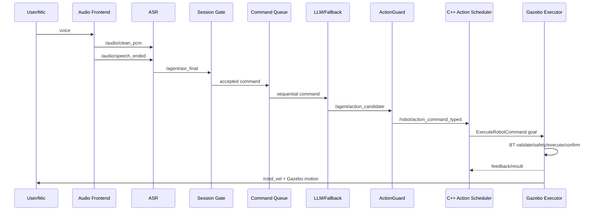

# 架构与模块说明

本文档描述当前项目的功能结构和模块边界。汇报时优先看
[FINAL_ARCHITECTURE_DIAGRAMS.md](FINAL_ARCHITECTURE_DIAGRAMS.md) 中的最终架构图与端到端数据流图；
更详细的技术取舍、代码位置和面试讲法见 [LEARNING_NOTES.md](LEARNING_NOTES.md)。

## 1. 总体目标

项目实现一个机器人智能语音交互与仿真控制系统：

```text
语音输入 → ASR → Agent 推理/解析 → 动作安全校验 → ROS 2 Action → Gazebo 仿真控制
```

当前验收对象是 Gazebo/TurtleBot3 仿真机器人。真实 UART/SPI 硬件控制保留为 mock/预留接口。

## 2. 数据流



## 3. ROS 包职责

### `embodied_agent_interfaces`

职责：

- 定义跨包共享的强类型接口。

核心文件：

- `msg/RobotCommand.msg`
- `msg/RobotCommandFeedback.msg`
- `msg/RobotCommandResult.msg`
- `action/ExecuteRobotCommand.action`

说明：

- `RobotCommand` 表达 move、turn、stop、set_mode、wave、set_led 等动作。
- `ExecuteRobotCommand` 用于表达可取消、带反馈、带结果的长动作。

### `embodied_agent_cpp`

职责：

- 承担和 ROS 2/C++ 工程化强相关的节点。
- 提供音频前端、动作安全网关、typed action bridge、硬件 mock/预留。

核心文件：

- `src/audio_frontend_node.cpp`
- `src/audio_processing.cpp`
- `src/action_guard_node.cpp`
- `include/embodied_agent_cpp/guarded_command_outbox.hpp`
- `src/action_scheduler.cpp`
- `src/typed_action_bridge_node.cpp`
- `src/hardware_controller_node.cpp`
- `src/action_validator.cpp`

说明：

- `audio_frontend_node` 处理音频能量、VAD、endpoint、clean PCM 发布。
- `action_guard_node` 是 LLM 输出到机器人执行之间的安全边界。
- `GuardedCommandOutbox` 短暂缓冲已校验但尚未与 scheduler 完成 DDS 匹配的命令；
  它有容量和 TTL，不使用 transient-local 回放可能已经过时的机器人动作。
- `ActionScheduler` 隐藏 FIFO、队列上限、优先取消、失败清队列和 command_id 关联。
- `typed_action_bridge_node` 把调度决策适配为 ROS 2 Action Client 调用，并把
  feedback/result 映射为强类型消息，同时向 `/diagnostics` 发布队列和执行状态。
- `RobotCommand.priority` 显式区分用户急停/取消与组合动作末尾的计划 STOP，避免按动作名或到达时机猜测抢占语义。

### `embodied_agent_middleware`

职责：

- 为 C++ 节点提供统一、可测试的 ROS 2 QoS 语义。
- 区分控制命令、生命周期事件、当前状态、传感器/音频流和 diagnostics。

核心文件：

- `include/embodied_agent_middleware/qos_profiles.hpp`
- `include/embodied_agent_middleware/component_health_registry.hpp`
- `src/system_readiness_node.cpp`
- `test/test_qos_profiles.cpp`

说明：

- command/event 使用 reliable + volatile；状态使用 reliable + transient-local。
- scan/PCM 使用 best-effort，消费跟不上时丢旧帧而不是累积控制延迟。
- 控制命令不使用 transient-local；启动发现窗口由有界 TTL outbox 处理，防止重放旧动作。
- Agent、音频前端、ActionGuard、Action bridge 和 simulation control 周期发布
  `ComponentHealth`；聚合器按 launch profile 生成 `SystemReadiness`，并用心跳超时识别已退出进程。

Python 的 `embodied_agent_core/ros_qos.py` 与 C++ 的
`embodied_agent_middleware/qos_profiles.hpp` 使用同一组名称和默认深度：

| 语义 | Reliability / Durability | 默认深度 | 典型数据 |
| --- | --- | ---: | --- |
| command | reliable / volatile | 50 | 动作候选、清记忆、声纹录入请求 |
| event | reliable / volatile | 50 | ASR final、队列、执行、VAD/KWS 事件、Action result |
| state | reliable / transient-local | 1 | Agent/session、当前声纹身份、组件健康 |
| sensor | best-effort / volatile | 5 | KWS score 等高频遥测 |
| audio | best-effort / volatile | 5 | clean PCM、TTS PCM |
| diagnostics | reliable / volatile | 10 | turn metrics、diagnostics |

这里没有强行配置 DDS deadline/liveliness lease：Gazebo、WSLg 音频和不同 RMW 对这些
策略的支持/默认值并不完全一致。项目用 `ComponentHealth` 心跳、队列丢弃计数和数据质量
探针检测故障，避免为了名义上的 QoS 完整性制造端点不兼容。

### `embodied_online_agent`

职责：

- 在线语音 Agent。
- 接入 Qwen/DashScope ASR、OpenAI-compatible LLM、Qwen TTS。

核心文件：

- `embodied_online_agent/online_agent_node.py`
- `embodied_online_agent/providers/`

说明：

- 在线模式用于验证云端 ASR/LLM/TTS 的端到端链路。
- mock 模式用于无密钥、无模型的自动测试。

### `embodied_voice_frontend`

职责：

- 为在线/离线 Agent 提供相同的 VAD、KWS 和声纹输入 Adapter。
- 隔离 openWakeWord、Silero ONNX、WebRTC VAD、Sherpa KWS/声纹等可选依赖。
- 让 offline 与 online 不需要为了复用语音前端而互相形成包依赖。

核心文件：

- `embodied_voice_frontend/silero_vad_sidecar.py`
- `embodied_voice_frontend/silero_vad_node.py`
- `embodied_voice_frontend/webrtc_vad_node.py`
- `embodied_voice_frontend/keyword_wake_node.py`
- `embodied_voice_frontend/speaker_identity_node.py`

说明：

- provider 模型均为可选依赖；mock/energy 路径不要求下载大型模型。
- 节点通过 `embodied_agent_core` 的 typed transport 发布 VAD/KWS/声纹事件。

### `embodied_agent_core`

职责：

- 作为 online/offline 的单向共享依赖，隐藏连续会话、NLU、执行、Lifecycle、记忆和 ROS I/O 复杂度。
- 保存共享提示词和命令归一化配置，具体 provider 包不再拥有公共业务资源。
- 不导入 `embodied_online_agent` 或 `embodied_offline_agent`，避免循环和反向代码依赖。

核心文件：

- `embodied_agent_core/agent_control_plane.py`
- `embodied_agent_core/agent_execution_runtime.py`
- `embodied_agent_core/agent_lifecycle_runtime.py`
- `embodied_agent_core/asr_endpoint_runtime.py`
- `embodied_agent_core/streaming_turn.py`
- `embodied_agent_core/user_context_runtime.py`
- `embodied_agent_core/agent_ros_io.py`
- `embodied_agent_core/continuous_voice.py`
- `embodied_agent_core/command_nlu.py`
- `config/command_normalization_zh.yaml`
- `prompts/system_prompt_zh.txt`

说明：

- `AgentControlPlane` 是在线/离线共用的领域控制面：统一参数映射、归一化、会话门控、
  补全、重试、优先控制、NLU 拆批、队列和 batch id；不依赖 `rclpy`。
- `AgentExecutionRuntime` 统一 busy 状态、连续队列 worker、started/finished 事件和异常
  隔离；单条失败不会终止长时间控制，任何执行路径都会复位 busy。
- `AsrEndpointRuntime` 统一 endpoint 去重、commit delay 和 timer 关闭；在线直接 commit
  WebSocket，离线只替换为 ASR 队列事件 callback。
- `StreamingTurnRuntime` 统一 tagged stream 增量解析、TTS 分句、确定性 fallback、语义安全
  拦截和模型输出缓存；provider 只注入首 token、文字增量、可合成句子与告警回调。
- 用户行为记忆只记录 `StreamingTurnResult.actions`，即真正通过动作选择策略的指令；模型
  曾生成但被安全策略拦截的动作不会污染用户画像。
- `UserContextRuntime` 是身份、画像和记忆命令的唯一拥有者；命令入队时创建不可变
  `UserContextSnapshot`，让同一 turn 的 prompt、偏好和 interaction 写入始终绑定同一用户，
  即使执行期间收到新的声纹识别结果也不会串写画像。
- `AgentRosIo` 是在线/离线共用的 ROS I/O Facade，统一 lifecycle publisher、subscription、
  typed 消息封装和音频/事件 QoS；`AgentTopicContract` 是所有 Agent topic 的单一权威来源。
- `RosAgentEventPublisher` 位于 Facade 内部，只负责控制面领域事件到 typed ROS 消息的
  Adapter；inactive 时停止健康心跳，避免 managed publisher 空转发布。
- `AgentTurnMetrics + metrics_transport.py` 统一在线/离线 turn 指标；ROS graph 不再传输
  指标 JSON，报告层才恢复字典结构。NaN 和三态 target status 明确区分“缺失”与真实 0/false。
- `agent_parameters.py` 是在线/离线节点参数的单一权威来源：公共控制面与 provider
  专属参数分组声明，启动时校验范围/枚举/跨字段约束，并生成只读参数快照。
- `agent_launch_contract.py` 只暴露部署时常用的控制参数；Gazebo/Nav2 上层 launch
  复用同一转发表，模型路径等仍由各自 YAML profile 管理。
- online/offline Agent 使用真正的 `LifecycleNode` 和 lifecycle publisher：configure 创建
  provider，activate 启动 ASR/队列线程，deactivate 先发布 STOP/STOPPED health 再停线程，
  cleanup 释放连接与模型对象。launch manager 按 `ActionGuard → Agent` 激活、逆序停用。
- `AgentLifecycleRuntime` 是 endpoint、execution、active/stopping 状态的唯一拥有者；两个节点
  只注入在线直接 ASR 或离线队列 ASR 的 start/stop hook，不再各自复制安全停机状态机。
- 独立 `ros2 run` 默认 `agent_lifecycle_autostart=true`；组合 launch 显式关闭内部自启动，
  由唯一 manager 管理，避免双重 transition 竞态。

配置覆盖顺序固定为：节点 schema 默认值 → provider YAML → launch 显式覆盖。YAML 只
保存在线或离线模型相关配置，不再复制队列、会话、记忆等公共默认值；参数不支持运行时
半更新，修改后应重启节点，让 provider、队列和会话对象始终对应同一份配置快照。

### `embodied_offline_agent`

职责：

- 离线语音 Agent。
- 预留 Sherpa-onnx ZipFormer ASR、llama.cpp、Sherpa-TTS 的真实模型路径。
- 复用 `embodied_agent_core` 的连续语音、命令归一化、补全、动作序列逻辑。
- 通过 `AgentControlPlane` 复用完整 ASR-final 控制决策，仅保留离线 provider、
  latency 和伪流式 TTS 差异。

核心文件：

- `embodied_offline_agent/offline_agent_node.py`
- `embodied_offline_agent/providers/sherpa_asr.py`
- `embodied_offline_agent/providers/llama_cpp.py`
- `embodied_offline_agent/providers/sherpa_tts.py`
- `embodied_offline_agent/double_buffer.py`
- `embodied_offline_agent/latency.py`

说明：

- 离线链路体现端侧部署能力。
- 当前训练流程不是主线交付，模型准备与量化作为后续增强。

### `embodied_simulation`

职责：

- Gazebo/TurtleBot3 仿真执行层。
- 将 RobotCommand/Action goal 转换为 `/cmd_vel`。
- 用 BehaviorTree.CPP 编排执行流程，用 pluginlib 切换执行后端。

核心文件：

- `src/simulation_control_node.cpp`
- `include/embodied_simulation/simulation_ros_io.hpp`
- `src/simulation_ros_io.cpp`
- `include/embodied_simulation/active_action_runtime.hpp`
- `src/active_action_runtime.cpp`
- `src/command_behavior_tree.cpp`
- `config/command_tree.xml`
- `src/robot_executor_plugins.cpp`
- `src/simulation_controller.cpp`

说明：

- `GazeboRobotExecutor` 驱动真实仿真。
- `MockRobotExecutor` 用于不启动 Gazebo 的自动测试。
- `SimulationControlNode` 只负责 Lifecycle 回调、订阅/Action server、定时器和 plugin 装配；
  `SimulationRosIo` 统一拥有 managed publisher、命名 QoS、ACK/BT 状态映射和去重；
  `ActiveActionRuntime` 统一定时动作与 Nav2 外部 result 的进度、取消、超时和 BT 终态映射。
- MOVE 支持 `linear_x + angular_z`，因此绕圈/画圆不需要新增接口字段。

## 4. 关键 topic 与 action

| 名称 | 方向 | 说明 |
| --- | --- | --- |
| `/audio/clean_pcm` | audio → ASR | 清理后的 PCM 音频 |
| `/audio/frontend_metrics` | audio → monitor | `AudioFrontendStatus`：音量、VAD、增强器和丢帧状态 |
| `/audio/vad_event` | VAD sidecar → probe | `VadEvent`：统一 Silero/WebRTC endpoint 事件 |
| `/audio/speech_started` | audio → Agent | VAD 检测到开始说话 |
| `/audio/speech_ended` | audio → Agent | VAD 检测到一句话结束 |
| `/agent/asr_partial` | ASR → monitor | ASR partial |
| `/agent/asr_final` | ASR → Agent/monitor | ASR final |
| `/agent/session_state` | Agent → monitor | awake/sleeping；reliable + transient-local，晚加入监控可获得当前状态 |
| `/agent/wake_event` | Agent → monitor | `WakeEvent`：wake/continue/rejected/sleep 与 provider |
| `/agent/wake_event_input` | KWS sidecar → Agent | `WakeEvent`：声学唤醒/休眠输入 |
| `/agent/kws_event` | KWS sidecar → monitor | `KwsEvent`：检测结果、关键词和分数 |
| `/agent/kws_score` | KWS sidecar → calibration | `KwsScore`：候选分数与当前阈值 |
| `/agent/speaker_identity` | speaker sidecar → Agent | `SpeakerIdentity`：身份、置信度和声学诊断 |
| `/agent/speaker_enroll_request` | Agent → speaker sidecar | `SpeakerEnrollRequest`：启动声纹样本采集 |
| `/agent/speaker_enroll_status` | speaker sidecar → monitor | `SpeakerEnrollStatus`：采集阶段与进度 |
| `/agent/recognition_feedback` | Agent → monitor | `RecognitionFeedback`：重试、过滤、补全、endpoint/commit 等识别状态 |
| `/agent/nlu_parse` | Agent → monitor | `NluParseEvent`：意图、强类型槽位、批次和动作序列 |
| `/agent/command_queue` | Agent → monitor | `CommandQueueEvent`：enqueue/rejected/expired/clear、队列深度与 batch context |
| `/agent/command_execution` | Agent → monitor | `CommandExecutionEvent`：started/finished、结果语义与 batch context |
| `/agent/action_candidate` | Agent → ActionGuard | `RobotCommand` 强类型候选 |
| `/robot/action_command_typed` | ActionGuard → bridge | 强类型 RobotCommand |
| `/robot/action_feedback` | bridge → monitor | `RobotCommandFeedback` |
| `/robot/action_result` | bridge → Agent | `RobotCommandResult` |
| `/robot/action_ack` | executor/hardware → monitor | `RobotActionAck`：后端接收或终态确认 |
| `/robot/simulation_state` | executor → monitor | `SimulationState`：模式、雷达有效性和速度状态 |
| `/robot/bt_status` | executor → monitor | `BehaviorTreeStatus`：BT 阶段与结果 |
| `/system/component_health` | components → readiness | `ComponentHealth`：starting/ready/degraded/error/stopped 心跳 |
| `/system/readiness` | readiness → scripts/UI | `SystemReadiness`：profile 必需组件、缺失项与 go/no-go 结论 |
| `/diagnostics` | C++ scheduler → monitor | active command、pending 深度、取消和累计计数 |
| `/cmd_vel` | executor → Gazebo | 机器人速度命令 |
| `robot/execute_command` | bridge → executor | ROS 2 Action |

## 5. 连续语音控制状态

核心状态：

- sleeping：未唤醒或已退出控制。
- awake：已唤醒，后续命令无需重复说“小智”。
- queued：命令已进入队列。
- thinking：Agent 正在解析/执行一条命令。
- retry_listening：识别失败或会话超时后等待重试。

特殊规则：

- `停下/急停/刹车/别动` 是 priority stop，会清空队列并抢占。
- `退出控制/休眠/先这样` 让 session 进入 sleeping。
- `嗯/啊/哦` 等 filler 不进入动作链路。
- 短时间重复命令会被 duplicate window 过滤。

## 6. 当前边界

已完成：

- 语音/文本到动作到 Gazebo 控制的端到端链路。
- 在线/离线 Agent 双入口。
- 自定义 msg/action 与 C++ 安全边界。
- 连续语音、多命令队列、急停抢占。
- Gazebo 仿真动作与 odom/cmd_vel 验收。

未作为当前完成项：

- 真实实体机器人硬件验收。
- 完整离线模型训练与 LoRA 指标复现。
- 复杂导航、建图、路径规划。
- 真实声学 KWS/AEC 默认接入。
