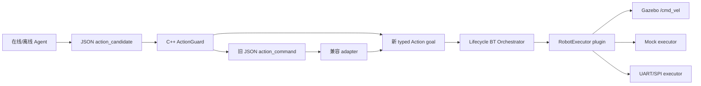

# 版本记录、同类项目对比与路线图

## 1. 版本迭代记录

| 阶段 | 代表提交 | 主要结果 |
|---|---|---|
| 在线原型 | `a7aa586` | ROS 2 在线 Agent、mock provider、结构化动作 |
| 冒烟修复 | `ce57588` | 修复 topic echo 验收误解，形成自动冒烟入口 |
| 实时路径 C++ 化 | `e80fd3a` | 音频、AEC/VAD、播放和动作安全下沉 C++ |
| 云模型接入 | `f19a742` | DashScope ASR/LLM/TTS 与低 token 接口测试 |
| 离线 Agent | `e93c7e9` | ZipFormer、llama.cpp、Sherpa-TTS、双缓冲 |
| 硬件控制 | `0a37345` | ActionGuard、UART/SPI、CRC、ACK、watchdog |
| 总体验收 | `c064f7e` | 分层测试、真实性能和完成度报告 |
| 仿真闭环 | `06bc00d` | TurtleBot3、LaserScan、Twist、PID 与 Gazebo |
| 聚焦语音动作 | `50263aa` | 目标收敛到语音 -> move/turn/stop -> 仿真 |
| 麦克风验收 | `4f83218` | 六阶段交互式验收器 |
| 停滞修复 | `301b74f` | launch 参数贯通、busy 时抑制重叠 ASR |
| 识别恢复 | `0469723` | 热词、别名、失败反馈和持续重试 |
| Action/Lifecycle 迁移 | 当前分支 | typed Action、可取消执行、Nav2 生命周期管理 |
| BT/plugin/component 工程化 | `11e9966` | BehaviorTree.CPP、pluginlib、组件化、diagnostics、namespace |
| 全链交付 | 当前 | 在线/离线/Gazebo/语音到 Gazebo release gates 与求职材料 |
| 发布前整修 | 当前 | 测试分区、diagnostics 深模块、中文设计注释、LICENSE 与贡献规范 |
| 文档与结构收敛 | 当前 | 七份重叠笔记合并为三份，完成模块依赖与入口审计 |
| rich simulation demo | 当前 | `arc` 弧线动作、组合动作顺序执行、mock demo 验收与企业化分支流程 |
| 连续语音控制 | 当前 | 一次唤醒多命令队列、退出控制安全 stop、stop 抢占与 online/offline mock 验收 |
| VAD endpoint seam | 当前 | speech_started/speech_ended topic、端点参数和 legacy silence 兼容 |
| Audio frontend metrics | 当前 | `/audio/frontend_metrics` 暴露 rms/peak/speech/丢帧，辅助真实麦克风调参 |
| WakeProvider seam | 当前 | TextWakeProvider、wake_event/session_state topic、wake_event_input 外部 KWS 注入入口，continuous-mock 覆盖外部 wake/sleep |
| KeywordWake sidecar | 当前 | mock_text 无模型验收、sherpa-onnx KeywordSpotter adapter 和 kws_event 诊断 topic |
| openWakeWord provider | 当前 | `keyword_wake` 新增 openwakeword optional adapter，复用 `/audio/clean_pcm -> /agent/wake_event_input` seam |
| openWakeWord runtime smoke | 当前 | `openwakeword-sidecar` 用 fake Model 验证 ROS 进程内音频输入、predict 调用和 wake event 输出 |
| LiveKit WakeWord provider | 当前 | `keyword_wake` 新增 livekit optional adapter 与 fake runtime smoke，为后续中文“小智”ONNX 训练模型预留入口 |
| KWS score diagnostics | 当前 | openWakeWord/LiveKit 发布 `/agent/kws_score`，monitor 展示 top score/threshold，方便真实模型阈值调参 |
| KWS score calibration | 当前 | `kws_score_calibration.py` 汇总 `/agent/kws_score`，输出推荐阈值、触发比例和误唤醒/漏唤醒提示 |
| Voice readiness check | 当前 | `voice_control_readiness_check.py` 汇总音频前端和 KWS 分数，给出连续语音演示 go/no-go 报告 |
| Provider preflight | 当前 | `voice_provider_preflight.py` 在启动 ROS 前检查可选 Silero/openWakeWord/LiveKit/sherpa 依赖与模型路径 |
| KWS provider 配置透传 | 当前 | `continuous_voice_control.sh` 支持 sherpa/openWakeWord/LiveKit 模型路径和阈值环境变量，并同步覆盖预检与 ROS launch |
| KWS 连续控制验收 | 当前 | continuous-kws-mock 验证 KWS sidecar 唤醒后直接进入 Agent 队列并执行动作 |
| AudioEnhancer seam | 当前 | NLMS AEC adapter、audio_enhancer/aec/ns/agc 参数与 WebRTC adapter 预留，`/audio/frontend_metrics` 暴露 requested/active 状态与 fallback 诊断 |
| 连续演示 monitor | 当前 | 终端持续打印 session/asr/queue/action/feedback/result，队列满时显示 queue-feedback，长动作期间展示 ROS Action 进度 |
| 连续演示 summary | 当前 | monitor 退出时汇总 wake/sleep/retry/timeout、ASR、ignored、normalized、queue enqueued/rejected/expired、execution、result 和最近窗口 audio profile 建议，`CONTINUOUS_MONITOR_AUDIO_SAMPLE_LIMIT` 可配置音频滑动窗口 |
| 连续脚本配置预览 | 当前 | `continuous_voice_control.sh` 支持 `CONTINUOUS_PRINT_CONFIG=true` 无麦克风 dry-run，并透传/打印 WAKE/AEC/NS/AGC/READINESS/SESSION_TIMEOUT/COMMAND_MAX_AGE 环境变量 |
| 连续启动 readiness | 当前 | 连续脚本 launch 后默认运行 voice_control_readiness_check.py，提示可以开始说“小智”，失败时 warning 但不中断，并输出 profile quick_apply |
| CommandExecutionTracker | 当前 | command_queue/command_execution topic 暴露队列长度和执行生命周期 |
| 连续队列容量透传 | 当前 | `CONTINUOUS_COMMAND_QUEUE_SIZE` 经脚本和 launch 覆盖 online/offline Agent 队列容量 |
| 真实麦克风 live-check | 当前 | `continuous-live-check` 订阅真实连续控制 topic，统计 ASR/action/result/session/cmd_vel 并给出 PASS/FAIL |
| Monitor 下一步建议 | 当前 | 退出 summary 增加 `[advice]`，针对无 ASR、ignored 高、queue_full、expired、动作失败和 VAD profile 给出现场操作建议 |
| 连续端点 ASR 验收 | 当前 | `continuous-endpoint` 用 `/audio/speech_ended` 驱动 mock ASR final，验证真实麦克风端点路径 busy 时仍入队 |
| 连续长会话 soak | 当前 | `continuous-soak` 模拟一次唤醒后持续输入多条动作命令，验证 busy 时不丢 ASR final、入队并按序完成 |
| 连续单动作串行等待 | 当前 | online/offline worker 发布单个普通动作时也等待 `/robot/action_result`，避免快速连续命令被后续 Action goal 抢占 |
| 连续队列满验收 | 当前 | `continuous-queue-full` 将队列容量设为 1，验证 queue_full rejected、queue_rejected feedback，以及满队列下急停清队列并发布 stop |
| 连续急停验收 | 当前 | continuous-mock 验证 priority stop 清队列、发布 stop、最终 cmd_vel 归零 |
| 连续命令 TTL | 当前 | `continuous_command_max_age_s` 默认 30 秒，普通旧命令过期跳过并发布 `expired` 事件，急停/停下永不过期；`continuous-ttl` 覆盖真实 ROS 链路 |
| 连续会话超时 | 当前 | `continuous-timeout` 验证 `voice_session_timeout_s` 到期后普通命令拒绝，重新唤醒后恢复执行 |
| 连续语音去噪 | 当前 | 会话层忽略短 filler，并对同一会话短窗口内重复 ASR final 去重；休眠/重唤醒会清空去重记忆，`CONTINUOUS_DUPLICATE_WINDOW_S` 可调窗口 |
| 可配置命令纠错 | 当前 | 默认 YAML 错词表、`command_normalization_path` 覆盖参数和离线 sherpa hotwords 扩充 |
| 音频前端校准 | 当前 | `audio_frontend_calibration.py` 基于 `/audio/frontend_metrics` 输出麦克风、VAD、AEC/NS/AGC、丢帧诊断和推荐阈值 |
| VAD 端点参数透传 | 当前 | `continuous_voice_control.sh` 支持 SPEECH_START_THRESHOLD/SPEECH_END_SILENCE_S/MIN_UTTERANCE_MS/MAX_UTTERANCE_S，并经 launch 覆盖 AudioFrontend |
| Silero VAD 配置透传 | 当前 | `continuous_voice_control.sh` 支持 SILERO_VAD_MODEL_PATH/SILERO_VAD_USE_ONNX/SILERO_VAD_THRESHOLD，并同步覆盖 preflight 与 sidecar launch |
| 命令纠错配置透传 | 当前 | `continuous_voice_control.sh` 支持 COMMAND_NORMALIZATION_PATH/COMMAND_NORMALIZATION_FUZZY_THRESHOLD/开关，并经 launch 覆盖 online/offline Agent |
| 连续语音现场 preset | 当前 | `VOICE_CONTROL_PROFILE=normal|quiet|noisy_room` 批量设置 VAD、队列、TTL 与纠错阈值，显式环境变量可覆盖 |
| 音频校准推荐 profile | 当前 | `audio_frontend_calibration.py` 基于 `/audio/frontend_metrics` 输出 recommended VOICE_CONTROL_PROFILE 与 quick apply 命令 |

## 2. 当前结论

项目已达到“可演示、可测试、可继续接真实机器人”的工程原型：在线/离线语音、动作
安全、Gazebo、UART/SPI interface 均有实现和分层测试。它还不是生产系统，不能把少量
样本延迟、未执行的 LoRA 或未接实体 MCU 写成已完成成果。

最有辨识度的能力是：同一个 ROS 2 安全动作 seam 同时连接在线语音、全离线 CPU 模型、
Gazebo 物理仿真和硬件传输。这条纵向闭环应成为项目对外叙事中心。

## 3. 仿真与语言智能专项对标

GitHub 星数采样于 2026-07-02，会随时间变化；功能依据各项目官方 README。严格限定为
“仿真是主要运行环境、自然语言或大模型参与决策、能够复现实验”后，没有一个上万星项目
完整覆盖本项目路线。高星集中在通用仿真基础设施，最接近的语言 Agent 项目多为数百到
一千余星，因此应分两组学习。

### 高星仿真基础设施

| 项目 | 星数约 | 值得学习 | 不应照搬 |
|---|---:|---|---|
| [Isaac Lab](https://github.com/isaac-sim/IsaacLab) | 7.6k | GPU 并行环境、统一传感器/任务配置、CI、教程和 Show & Tell 社区 | 依赖 NVIDIA/Isaac，重点是机器人学习，不是语音或 ROS Agent |
| [ManiSkill](https://github.com/mani-skill/ManiSkill) | 3.1k | GPU 并行仿真、标准任务、demonstration 和 benchmark | 偏机械臂策略学习，与轻量 WSL/Gazebo 移动机器人不同 |
| [Habitat-Lab](https://github.com/facebookresearch/habitat-lab) | 3.0k | instruction following、Sense-Plan-Act、标准指标、人机协同和 ROS-X-Habitat | 官方已提示停止主动维护；体系较重，不宜迁移整个技术栈 |
| [RoboCasa](https://github.com/robocasa/robocasa) | 1.5k | 365 个 LLM 辅助设计任务、2500+ 场景、演示数据、模型 leaderboard | 侧重厨房操作和训练数据，不解决流式语音交互 |
| [InternUtopia](https://github.com/InternRobotics/InternUtopia) | 1.3k | LLM 驱动 NPC、社会交互、任务生成、导航/操作 benchmark | 依赖 Isaac Sim 和 GPU，资产规模远超当前项目需要 |

### 与本项目路线最接近

| 项目 | 星数约 | 直接启发 | 本项目可形成的差异 |
|---|---:|---|---|
| [ROS-LLM](https://github.com/Auromix/ROS-LLM) | 806 | 自然语言到 ROS 运动/导航、可扩展 robot function、Turtlesim 快速演示 | 本项目已有在线/离线语音、C++ Guard、Gazebo 物理位移和更严格验收 |
| [RAI](https://github.com/RobotecAI/rai) | 532 | ROS 2 agentic framework、语音、仿真、benchmark 和多模态工具 | 本项目更轻量，可聚焦“可测的实时语音安全控制”而非通用多 Agent |
| [Embodied Agent Interface](https://github.com/embodied-agent-interface/embodied-agent-interface) | 295 | 将 LLM 决策拆成目标理解、子目标分解、动作排序、状态转移，并定位 hallucination/affordance/planning 错误 | 可把同样的细粒度评测扩展到 ASR、唤醒、动作 Guard 和仿真执行层 |
| [RoboChain](https://github.com/NoneJou072/robochain) | 131 | ROS 2 + LLM 仿真交互的直接参考 | 本项目测试、离线链路和安全执行更完整，但缺少任务级规划展示 |

真正值得借鉴的不是更换 Gazebo，而是把当前单条链路提升为一个小而独特的
**Spoken Embodied Agent Benchmark**：同一条语音指令逐层记录 ASR、目标理解、动作生成、
安全仲裁、执行 ACK 和仿真任务成功率。现有项目通常评 LLM 规划或仿真策略，很少把真实
流式语音错误与机器人安全执行放在同一个可复现 benchmark 中，这是本项目更有意义的
创新位置。

建议围绕四个实验场景扩展，而不是增加复杂硬件：

1. **语音扰动鲁棒性**：干净语音、噪声、同音词、口音和多次重试，报告每层错误来源。
2. **闭环任务修正**：仿真返回受阻/拒绝/超时后，LLM 基于 ACK 和 LaserScan 重新规划。
3. **安全反事实评测**：对危险、越界、幻觉动作比较“模型输出”和“Guard 最终执行”。
4. **语言生成场景**：用模板或 LLM 自动产生指令、障碍布局和验收谓词，批量运行 Gazebo。

共同的工程经验仍然成立：README 首屏展示可见结果；一条命令启动最小场景；任务、模型
和指标使用稳定 interface；提供视频、可下载结果、CI、release 和贡献教程。

## 4. 本项目主要不足

### P0：别人很难在十分钟内相信它

- 没有 README 首屏 GIF/视频，语音、终端六阶段和 Gazebo 位移无法一眼看见。
- 安装仍依赖 WSL、ROS、模型下载和本地编译，没有 Docker/devcontainer 或缓存 release。
- 缺少 GitHub Actions、正式根目录 LICENSE、CONTRIBUTING、issue/PR 模板和版本 release。
- 没有公开的 benchmark 原始日志和可重复硬件规格。

### P1：扩展成本仍偏高

- 在线/离线节点重复一轮对话编排，新增 provider 需要理解两个大节点。
- 动作协议是 JSON 字符串，缺少正式 ROS msg/action 定义、schema 版本与生成文档。
- 配置散布在 YAML、launch 参数、环境变量和脚本默认值，缺少启动前校验。
- 集成测试在 `scripts/` 中，CI 可发现性不如标准 `tests/integration/`。

### P2：缺少社区可复用资产

- 机器人指令数据只有种子规模，没有公开评测集、噪声集与排行榜。
- 只展示 TurtleBot3，尚未证明 executor interface 可以被第二种机器人复用。
- 没有插件教程，例如“30 分钟增加一个动作/provider/机器人”。
- 中英文文档、架构图、演示场景和故障排查素材不足。

## 5. 高星改进路线

### 第一个里程碑：让陌生人 10 分钟跑通（最高优先级）

1. 录制 30–60 秒 GIF：说“向前走一秒” -> ASR 文本 -> 动作 JSON -> Gazebo 移动。
2. 提供 `docker compose up demo` 或 devcontainer，缓存 ROS 依赖；mock demo 不下载模型。
3. GitHub Actions 自动跑 ROS 2 build/test 和仓库约束；本地 gate 跑 headless mock/simulation smoke。
4. 补 Apache-2.0 LICENSE、CONTRIBUTING、release notes、issue 模板和架构图。
5. 发布 `v0.1.0`，README 只保留一个主 CTA：Run the voice-to-Gazebo demo。

验收指标：全新 Ubuntu 机器按 README 操作，10 分钟内得到 PASS；CI 始终可见；演示 GIF
首屏加载后不读正文也能理解项目。

### 第二个里程碑：把亮点变成可比较数据

1. 建立 100–500 条公开中文机器人命令评测集，包含同音词、口音、噪声和拒识样本。
2. 报告在线/离线冷热启动 P50/P95、RTF、内存、CPU、动作准确率、误唤醒/漏唤醒率。
3. 接入 sherpa-onnx open-vocabulary KWS，替换不断增加文本别名的策略。
4. 保存机器可读 JSON/CSV 结果，在 CI 或 release 中生成对比表。

验收指标：每个性能声明都能由一个命令重跑；README 的数字链接到原始结果和硬件环境。

### 第三个里程碑：形成可扩展生态

1. 提取 `TurnCoordinator`，让在线/离线只提供 provider adapter。
2. 将字符串 JSON 升级为自定义 ROS 2 interface，并保留外部 JSON gateway。
3. 写三篇插件教程：新增模型 provider、新增动作、新增机器人 executor。
4. 接入第二种机器人或机械臂，证明 interface 不是只为 TurtleBot3 定制。
5. 可选增加 MCP gateway，与小智类设备或外部 Agent 生态互通。

验收指标：贡献者无需修改核心节点即可新增一个 provider 和 executor；至少有一个外部复现
或贡献 PR。

## 6. 不建议优先做的事情

- 在没有真实评测前继续堆 LoRA 宣传数字。
- 在基础 demo 不稳定时增加复杂导航、视觉和多 Agent。
- 为每个模型复制一个 ROS 节点。
- 使用模糊字符串匹配无限扩充短唤醒词；短词应由声学 KWS 解决。
- 把模型、编译产物或 llama.cpp 源码提交进主仓库。

## 7. Nav2 + BehaviorTree.CPP 规范化开发安排

目标不是扩展复杂导航，而是采用 Nav2 已验证的 ROS 2/C++ 工程模式规范现有
“语音 -> LLM 动作 -> 安全执行 -> Gazebo”主链。开发分支为
`refactor/nav2-bt-architecture`；冻结版本由分支和标签
`backup/pre-nav2-bt-refactor-20260702`、`pre-nav2-bt-refactor-20260702` 保存。

### 迁移原则

- **跑通优先**：新旧链路并存，通过 launch 参数选择；新链完全验收后才删除旧路径。
- **兼容迁移**：保留 JSON topic adapter，逐步将内部 seam 换成强类型 msg/action。
- **每轮可回滚**：每个 loop 独立提交，以 51 项基线测试和对应新增测试为合入条件。
- **采用模式而非复制规模**：学习 Nav2 lifecycle、action、pluginlib、BT 和诊断，不引入
  当前用不到的地图、规划器和复杂导航功能。

### Loop 0：冻结与预检

- 冻结当前提交、分支和标签，保存 51 项测试基线。
- 确认 ROS 2 Jazzy 已安装 Navigation2 1.3.x、BehaviorTree.CPP 4.9.x。
- 画出旧 topic seam 与新 action seam 的兼容迁移图。
- 验收：工作区干净，旧 `acceptance_test.sh mock` 原样通过。

兼容迁移期间的数据流：

### Loop 1：强类型 ROS 2 interface

- 新建 `embodied_agent_interfaces` 包。
- 定义动作 goal、feedback、result 以及拒绝/执行状态；保留 command id 和时间戳。
- 增加 JSON topic -> typed interface adapter，在线/离线 Agent 暂时无需修改。
- 验收：错误字段被 adapter 拒绝，合法 move/turn/stop 与旧链结果一致。

完成状态：已完成。新增 `RobotCommand.msg`、`ExecuteRobotCommand.action`、C++
`RobotCommandAdapter` 和双发布冒烟测试；原有 JSON 执行路径保持默认，测试基线由 51 项
增加到 56 项。

### Loop 2：可取消 ROS 2 Action 执行

- C++ 仿真执行器提供 Action server，支持反馈、取消、超时和抢占。
- 兼容 adapter 将旧 `/robot/action_command` 转发为 Action goal。
- watchdog、急停、LaserScan 安全优先级保持不变。
- 验收：执行中取消立即输出零速；超时与障碍均返回明确 result。

完成状态：已完成。`SimulationController` 暴露 `/robot/execute_command` Action server，
新增纯 C++ `ActionExecution` 状态机和 `typed_action_bridge`；成功、进度、主动取消、目标
抢占、雷达阻塞、硬超时及最终停车均通过自动验收。launch 参数 `use_typed_actions` 可在
不删除旧路径的情况下切换执行链。补充验收后 typed Action 已成为仿真 launch 默认路径，
真实 Gazebo 位移和离线语音→LLM→Action terminal result 均已通过；旧链仍有独立回归测试。

### Loop 3：Lifecycle

- 将 Guard 和 executor 改造成 lifecycle nodes。
- `configure` 加载参数/插件，`activate` 才发布和接收动作，`deactivate` 强制停车。
- 采用 Nav2 lifecycle manager 或轻量兼容管理器统一启动顺序。
- 验收：未激活不执行；deactivate/cleanup 无残留速度和线程。

完成状态：已完成。ActionGuard 与 SimulationControl 已改为 C++ LifecycleNode；configure
负责创建 ROS interface，active 状态才转发/执行动作，deactivate 会终止活动 Action 并在
publisher 停用前发布零速，cleanup 回收 timer、Action server、subscription 和 publisher。
主 launch 由 `nav2_lifecycle_manager` 默认自动激活，也支持关闭 autostart 后手工转换；独立
集成测试覆盖未配置/未激活门控、激活运动、执行中停用和 cleanup 状态恢复。

### Loop 4：BehaviorTree.CPP 编排

- XML 描述 `Validate -> CheckSafety -> Execute -> ConfirmResult`。
- 实现异步 C++ TreeNodes，支持 halt/cancel，blackboard 传递 typed command。
- 增加拒绝、障碍、超时和恢复分支；通过日志观察状态转移。
- 验收：正常、拒绝、取消、障碍四条树路径均有 GTest/集成测试。

完成状态：已完成。新增 `CommandBehaviorTree` 深模块和外部 XML，使用 ReactiveSequence
实现 `ValidateCommand -> CheckSafety -> ExecuteCommand -> ConfirmResult`；blackboard 传递
typed command、安全状态、ActionExecution 状态和失败原因。树支持 RUNNING、halt/cancel、
雷达阻断、硬超时与新命令恢复，并通过 `/robot/bt_status` 暴露阶段变化。纯 C++ GTest 与
ROS Action 集成测试覆盖正常、拒绝、取消、障碍、超时和恢复；`use_behavior_tree` 可回退
到旧执行路径。

### Loop 5：pluginlib executor

- 定义小型 `RobotExecutor` interface。
- 实现 Gazebo、mock 两个 adapter，证明 seam 真实存在；UART/SPI 随后接入同一 interface。
- launch/YAML 选择插件，不再在节点中硬编码 backend 分支。
- 验收：不修改 BT/Guard 即可切换 Gazebo 和 mock。

完成状态：已完成。新增小型 `RobotExecutor` interface，并注册
`GazeboRobotExecutor`、`MockRobotExecutor` 两个 pluginlib adapter。Lifecycle configure
按 `executor_plugin` 参数加载实例，Action/BT 只依赖统一 interface；ACK 会报告实际 backend。
插件单测通过 pluginlib 真实发现和实例化两个 adapter，同一 typed MOVE 在两者上均执行并
停车；独立 ROS 冒烟在无 Gazebo、无 LaserScan 环境中完成 candidate→Guard→Action→BT→mock
全链，证明切换 backend 不需要修改 Guard 或 BT。

### Loop 6：ROS 2 工程完善

- 组件化节点、MultiThreadedExecutor/callback group、QoS 和参数校验。
- 增加 diagnostics、结构化日志、命名空间和 launch 分层。
- 统一 CMake、package export、clang-format/ament lint 和测试目录。
- 验收：组合/独立进程两种启动方式结果一致，无线程退出和 DDS 残留问题。

完成状态：已完成。`SimulationControlNode` 注册为 ROS 2 component，独立 executable 通过
factory 复用同一实现并使用双线程 executor；launch 可在独立/组合模式间切换。新增参数
交叉校验、显式 QoS、标准 diagnostics、独立 callback group 和线程安全状态快照。执行层
全部改用相对名称，并通过 `namespace:=robot1` 验证 typed Action、BT、`cmd_vel` 与诊断
隔离。`voice_turtlebot3.launch.py` 复用执行子 launch，消除重复节点声明。新增 cppcheck、
CMake/XML lint、组件化和命名空间冒烟；当前基线为 98 项测试、0 failure。

### Loop 7：全链交付

- 重跑 mock、online、offline、Gazebo 和真实麦克风验收。
- 对比重构前后的延迟、CPU、代码结构和失败可观测性。
- 更新架构图、接口说明、插件教程、简历项目描述和面试问题笔记。
- 验收：旧功能无回退，新 Action/BT/Lifecycle/pluginlib 路径成为默认路径。

完成状态：已完成自动化部分。2026-07-02 重跑 mock（98 tests）、低 token 在线、真实离线
模型、Gazebo 双链以及在线/离线语音→Gazebo，均通过；typed Action/BT 路径保持默认。在线
语音验收原先只检查位移、会在 Action result 为空时误报 PASS，本轮将门槛提升为必须收到
typed Action success。统一验收 CLI
新增真正覆盖所有自动 gate 的 `all`，并为 offline/online 真人麦克风提供显式交互入口。
更新了实测延迟、CPU decode、物理位移、原始模型与 fallback 分离成绩、executor 插件教程、
简历描述和面试问题。由于自动执行无法替用户说话，真人麦克风仍保留为最终人工验收项。

### 重构前后对比

| 维度 | 冻结版本 `80778a4` | 当前结果 |
|---|---|---|
| C++ `.cpp/.hpp` 文件 | 20 | 38，新增深模块而非复制主链 |
| ROS 自定义 interface | 0 | `RobotCommand.msg` + `ExecuteRobotCommand.action` |
| C++ GTest 文件 | 基线的一部分 | 10 个，覆盖 BT、Action、插件、配置与控制 |
| 自动测试记录 | 51 项 | 130 colcon + 2 repository tests，0 failure |
| 执行结构 | JSON topic 直达控制器 | Guard→typed Action→BT→plugin executor |
| 节点生命周期 | 普通节点 | Lifecycle configure/activate/deactivate/cleanup |
| 部署 | 独立进程 | 独立进程或 component container，同一实现 |
| 失败观测 | ACK/日志 | Action result、BT stage、diagnostics、ACK、odom |
| 后端切换 | 节点内分支 | pluginlib 参数选择 Gazebo/mock，可扩展 |

从冻结版本到 Loop 6 共 8 个小提交，65 个文件变化、3726 行新增、141 行删除。行数增长主要
来自 interface、BT/plugin/lifecycle 测试和兼容迁移层；后续应优先删除稳定后的旧 JSON
执行路径，而不是继续增加平行抽象。

### Loop 8：发布前代码整修

- 将 11 个 ROS 集成探针从 `scripts/` 迁至 `tests/integration/`，新增仓库结构回归测试；
  `scripts/` 只保留可运行命令和进程 runner。
- 删除无引用、已被标准 launch 与验收 CLI 覆盖的 `run_voice_simulation.sh`；把识别失败
  重试 smoke 纳入每次 mock gate。
- 从最大控制节点提取 `executor_diagnostics` 深模块，以纯 C++ GTest 固定 OK/WARN/ERROR
  优先级和字段契约，降低多线程诊断逻辑的维护成本。
- 在 AEC/VAD、动作可信 seam、Action/BT 状态、executor 插件、双缓冲和流式协议处增加
  中文设计注释；注释只解释约束和原因，不复述语句。
- 新增 Apache-2.0 根许可证、贡献指南与测试目录说明，README 回到运行、验收和导航职责。
- 新增基于 ROS tooling 官方 action 的 Jazzy CI，将无密钥的仓库约束、colcon build/test
  放到 GitHub；模型、在线 API 和 Gazebo 仍由本地分层 gate 验证。
