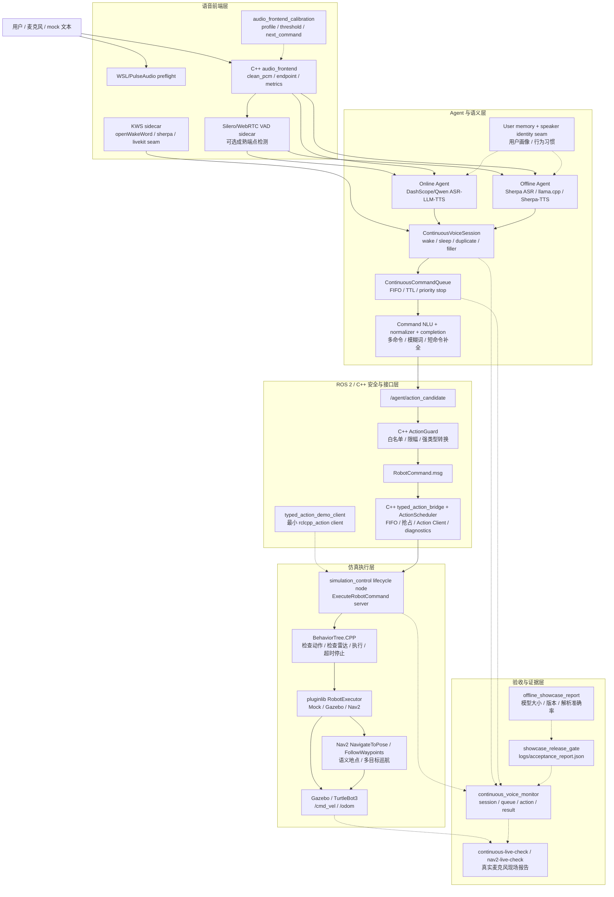
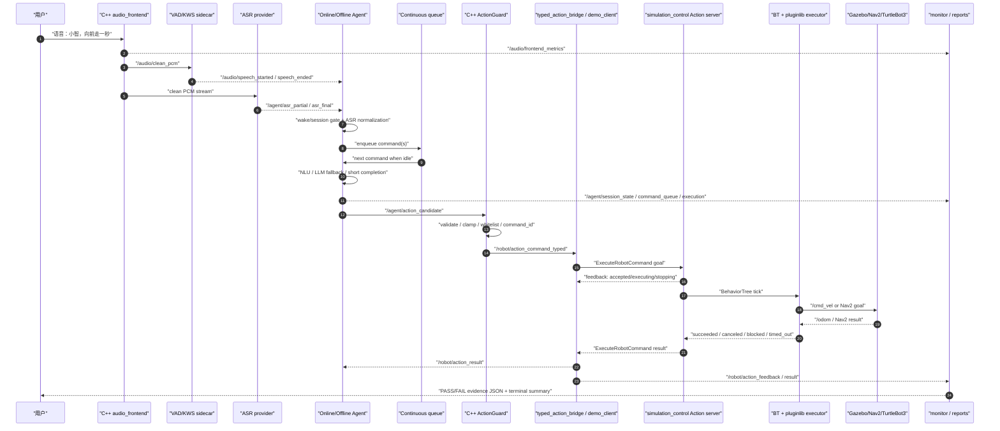

# 最终架构图与端到端数据流图

这份文档是项目汇报和面试走读的“总图入口”。README 保留快速跑通说明，
`LEARNING_NOTES.md` 解释技术细节；本文件只回答两个问题：

- 系统由哪些模块组成，在线/离线、ROS 2/C++、Gazebo/Nav2 分别在哪里？
- 一条真实语音命令从麦克风进入，到仿真机器人执行，再到日志/报告留证，经过哪些接口？

## 1. 最终系统架构图

读图重点：

- Agent 不直接发 `/cmd_vel`，只产生结构化动作候选。
- C++ ActionGuard 是 LLM/自然语言输出到机器人执行之间的安全边界。
- 长动作统一走 `ExecuteRobotCommand.action`；C++ `ActionScheduler` 保证单 active goal、FIFO、抢占、超时和 result 关联。
- Gazebo、Mock、Nav2 都是 executor 插件，Agent 和 ActionGuard 不需要知道底层执行后端。
- 真实麦克风稳定性由 VAD provider、profile 校准、readiness、monitor 和 live report 共同闭环。

## 2. 端到端数据流图

这张图适合按代码走读：

| 阶段 | 关键文件 | 关键函数/类 |
| --- | --- | --- |
| 音频与端点 | `src/embodied_agent_cpp/src/audio_frontend_node.cpp` | `AudioFrontendNode` |
| 成熟 VAD sidecar | `src/embodied_online_agent/embodied_online_agent/silero_vad_sidecar.py`、`webrtc_vad_node.py` | `StreamingVadEndpoint`、`WebRtcVadProvider` |
| 在线/离线 Agent | `online_agent_node.py`、`offline_agent_node.py` | `_on_asr_final()`、`_commit_asr_endpoint()`、`_run_turn()` |
| 连续语音队列 | `src/embodied_online_agent/embodied_online_agent/continuous_voice.py` | `ContinuousVoiceSession`、`ContinuousCommandQueue` |
| 动作解析 | `command_nlu.py`、`command_fallback.py`、`command_completion.py` | `CommandNLU.parse()`、`parse_fallback_actions()` |
| C++ 安全边界 | `src/embodied_agent_cpp/src/action_guard_node.cpp`、`action_validator.cpp` | `on_candidate()`、`ActionValidator::validate()` |
| C++ 动作调度 | `src/embodied_agent_cpp/src/action_scheduler.cpp` | `ActionScheduler::enqueue()`、`complete()` |
| ROS 2 Action client | `typed_action_bridge_node.cpp`、`typed_action_demo_client.cpp` | `apply_scheduler_events()`、`feedback_callback`、`result_callback`、`TypedActionDemoClient::run()` |
| ROS 2 Action server | `src/embodied_simulation/src/simulation_control_node.cpp` | `handle_goal()`、`update_active_action()`、`finish_active_action()` |
| BT/pluginlib 执行 | `command_behavior_tree.cpp`、`robot_executor_plugins.cpp` | `CommandBehaviorTree::tick()`、`GazeboRobotExecutor`、`Nav2RobotExecutor` |
| 验收留证 | `scripts/showcase_release_gate.py`、`continuous_live_check.py`、`generate_offline_showcase_report.py` | release gate、live report、offline report |

## 3. 汇报时的 3 句总结

1. 这个项目的主线不是“语音识别 demo”，而是把语音、Agent、强类型动作、安全校验、ROS 2 Action、Gazebo/Nav2 执行串成完整工程链路。
2. 机器人控制不信任 LLM 直接输出，所有动作都要经过 C++ ActionGuard、typed msg/action、BehaviorTree 和 executor 后端。
3. 在线/离线、mock/Gazebo/Nav2、真实麦克风/文本注入都走同一套核心接口，因此可以分层测试、分层演示、分层排障。
