# 语音输入到仿真执行：代码走读地图

这份文档用于“对着代码讲技术细节”。它不替代
[FINAL_ARCHITECTURE_DIAGRAMS.md](FINAL_ARCHITECTURE_DIAGRAMS.md)，而是把一条命令从真实/模拟语音进入系统，
到 Gazebo/Nav2 中产生运动的主要文件、函数、ROS 接口和技术点串起来。

适合的讲解方式：

1. 先用架构图解释系统为什么分层。
2. 再按本文从上到下打开代码。
3. 最后用验收脚本证明每一层都有可观测输出。

## 1. 总体调用链

```mermaid
flowchart LR
  User["用户语音 / mock 文本"]
  Audio["audio_frontend_node.cpp<br/>clean_pcm + endpoint"]
  ASR["ASR provider<br/>online Qwen / offline Sherpa"]
  Session["ContinuousVoiceSession<br/>wake / duplicate / filler / timeout"]
  Queue["ContinuousCommandQueue<br/>FIFO / TTL / priority stop"]
  NLU["CommandNLU + fallback + completion<br/>多命令 / 模糊词 / 短命令补全"]
  Candidate["/agent/action_candidate"]
  Guard["C++ ActionGuard<br/>validate / clamp / typed msg"]
  Bridge["ActionScheduler + typed_action_bridge<br/>FIFO / cancel / ExecuteRobotCommand client"]
  Server["simulation_control_node.cpp<br/>ExecuteRobotCommand server"]
  BT["BehaviorTree + pluginlib executor"]
  Sim["Gazebo / Nav2 / TurtleBot3"]
  Logs["monitor / acceptance report"]

  User --> Audio --> ASR --> Session --> Queue --> NLU --> Candidate
  Candidate --> Guard --> Bridge --> Server --> BT --> Sim
  Session -.-> Logs
  Queue -.-> Logs
  Guard -.-> Logs
  Server -.-> Logs
  Sim -.-> Logs
```



核心思想：

- Agent 只产生命令意图，不直接控制 `/cmd_vel`。
- ActionGuard 是自然语言/LLM 输出进入机器人执行层前的安全边界。
- 长动作统一走 ROS 2 Action，保证反馈、取消、超时、结果可观测。
- Gazebo、Nav2、mock executor 共享同一套上游接口，方便分层验收。

## 2. 语音输入与端点检测

| 内容 | 位置 |
| --- | --- |
| 关键文件 | `src/embodied_agent_cpp/src/audio_frontend_node.cpp` |
| 关键类/函数 | `AudioFrontendNode`、音频帧处理回调、endpoint publisher |
| 主要接口 | `/audio/clean_pcm`、`/audio/speech_started`、`/audio/speech_ended`、`/audio/frontend_metrics` |
| 技术点 | C++ ROS 2 node、音频 RMS/peak 统计、energy VAD、endpoint、WSL/PulseAudio 适配 |

设计说明：

- 真实麦克风链路容易受 WSL、PulseAudio、输入增益影响，所以音频层必须输出可观测指标。
- `speech_started/speech_ended` 只表达端点事件，不负责理解语义；语义判断放到 Agent 会话层。
- 成熟 VAD 作为 provider/sidecar seam 接入，energy VAD 保留为可部署 fallback。

讲解重点：

- 为什么不能只看 ASR final：如果音频层没有指标，现场失败时无法判断是“没录到声音”还是“ASR 没识别”。
- 为什么要有 `asr_commit_delay_ms`：端点结束后稍等几百毫秒，减少“左转九十度”被截成“左转”的尾部漏识别。

## 3. ASR final 进入 Agent

| 内容 | 在线链路 | 离线链路 |
| --- | --- | --- |
| 关键文件 | `src/embodied_online_agent/embodied_online_agent/online_agent_node.py` | `src/embodied_offline_agent/embodied_offline_agent/offline_agent_node.py` |
| 关键函数 | `_on_asr_final()`、`_commit_asr_endpoint()`、`_run_turn()` | `_on_asr_final()`、`_commit_asr_endpoint()`、`_run_turn()` |
| 主要接口 | `/agent/asr_final`、`/agent/action_candidate`、`/agent/session_state` | `/agent/asr_final`、`/agent/action_candidate`、离线 metrics |
| 技术点 | 在线 Qwen/DashScope provider、流式响应、TTS/feedback | Sherpa ASR、llama.cpp provider、Sherpa-TTS/SummerTTS seam |

设计说明：

- 在线/离线 Agent 尽量复用会话、队列、NLU、动作候选协议，差异集中在 provider。
- ASR final 不直接进入 LLM，而是先经过连续语音会话层，避免 filler、重复 final、未唤醒文本误触发。
- 离线链路要额外输出模型版本、latency、tokens/s 等证据，避免“工程接口有了但指标不可验证”。

## 4. 连续语音会话与命令队列

| 内容 | 位置 |
| --- | --- |
| 关键文件 | `continuous_voice.py`、`ros_event_transport.py`、`ros_qos.py`、`embodied_agent_interfaces/msg/Command*Event.msg` |
| 关键类/函数 | `ContinuousVoiceSession`、`ContinuousCommandQueue`、`accept()`、`put()`、`get()` |
| 主要接口 | `/agent/session_state`、typed `/agent/command_queue`、typed `/agent/command_execution` |
| 技术点 | 文本唤醒、重复过滤、FIFO、TTL、急停抢占、强类型事件、reliable/transient-local QoS |

设计说明：

- “小智”唤醒后进入 session，后续多条命令不需要每句重复唤醒。
- 普通命令按 FIFO 入队；执行中收到的新命令等待前一个 Action result。
- `停下/急停` 是 priority stop：清空队列、抢占当前动作、立即发布 stop。
- 每条命令带 `command_id/request_id/batch_id`，避免旧 result 误唤醒下一条命令。
- 队列与执行事件不再通过 `String + JSON` 传播；消息常量约束事件类型，`CommandContext`
  统一携带 batch/NLU 上下文，monitor 和测试不再各自猜字段。

讲解重点：

- 这层解决的是“真实语音持续输入时系统看起来卡住/乱序”的工程问题。
- 它让“向右转，然后向前走一秒”和“动作执行过程中继续说下一条命令”都能进入同一个队列模型。

## 5. NLU、多命令和短命令补全

| 内容 | 位置 |
| --- | --- |
| 关键文件 | `src/embodied_online_agent/embodied_online_agent/command_nlu.py`、`command_fallback.py`、`command_completion.py` |
| 关键函数 | `CommandNLU.parse()`、`parse_fallback_actions()`、短命令补全函数 |
| 输入 | ASR final，例如“向右转，然后向前走一秒” |
| 输出 | 动作序列，例如 `turn -> move` |
| 技术点 | 轻量本地 NLU、多命令识别、低置信度 fallback、ASR 错词归一、slot 补全 |

设计说明：

- 当前 NLU 是面向机器人固定命令域的轻量方案，优点是部署简单、可测试、可解释。
- 高置信度直接输出动作序列；低置信度回退到 fallback parser 或 LLM。
- “左转/前进”这类缺 slot 的短命令会补全成“左转九十度/前进一秒”，并输出 recognition feedback。

边界说明：

- 它不是通用自然语言理解模型；复杂自然语言仍需要更多真实 ASR 样本和评估集。
- 后续可以用 fastText、sklearn、CRF 或在线 function calling 替代部分规则。

## 6. 动作候选协议与 C++ ActionGuard

| 内容 | 位置 |
| --- | --- |
| 动作候选发布 | `online_agent_node.py`、`offline_agent_node.py` |
| 安全校验 | `src/embodied_agent_cpp/src/action_guard_node.cpp` |
| 领域动作→ROS msg | `src/embodied_online_agent/embodied_online_agent/ros_action_transport.py` |
| 校验器 | `src/embodied_agent_cpp/src/action_validator.cpp` |
| 主要接口 | `/agent/action_candidate` → `/robot/action_command_typed`，拒绝时 `/robot/action_rejected` |
| 技术点 | C++ lifecycle node、白名单、限幅、typed msg、安全边界 |

设计说明：

- LLM/NLU 输出永远不被直接信任。
- ActionGuard 做动作类型白名单、速度/角速度/时长限幅、参数默认值和拒绝原因输出。
- Agent candidate、guarded command、队列/执行事件、Action feedback/result 均使用自定义 msg；
  JSON 只用于人类可读日志、模型文件和离线报告，不再作为机器人控制或命令生命周期接口。

讲解重点：

- 这是项目里最能体现“机器人安全工程”的一层。
- 即使上游 ASR/LLM 误识别，也要保证非法动作不会进入底层 executor。

## 7. ROS 2 Action bridge 与 demo client

| 内容 | 位置 |
| --- | --- |
| bridge 文件 | `src/embodied_agent_cpp/src/typed_action_bridge_node.cpp` |
| 调度核心 | `src/embodied_agent_cpp/include/embodied_agent_cpp/action_scheduler.hpp`、`src/action_scheduler.cpp` |
| demo client 文件 | `src/embodied_agent_cpp/src/typed_action_demo_client.cpp` |
| 客户端终态契约 | `src/embodied_agent_cpp/include/embodied_agent_cpp/typed_action_client_contract.hpp` |
| 结构化审计 | `scripts/audit_cpp_action_reports.py` |
| action 定义 | `src/embodied_agent_interfaces/action/ExecuteRobotCommand.action` |
| msg 定义 | `src/embodied_agent_interfaces/msg/RobotCommand.msg` |
| feedback/result msg | `RobotCommandFeedback.msg`、`RobotCommandResult.msg` |
| 技术点 | `rclcpp_action` client、goal/feedback/result、可取消长动作 |

设计说明：

- Python sequencer 为组合动作批量分配 command_id 并发布；C++ `ActionScheduler` 决定何时真正发送下一条 goal，避免两层同时调度。
- bridge 把 `/robot/action_command_typed` 送入 C++ FIFO，再把 `DISPATCH/CANCEL/RESULT` 决策适配为 `ExecuteRobotCommand` Action Client 调用。
- `RobotCommand.priority=true` 只用于急停、退出会话和取消导航；计划 STOP 仍按 FIFO 执行。
- 取消超过 `cancel_timeout_s` 会产生 `STATUS_TIMED_OUT/cancel_result_timeout`，不会让队列永久卡住；运行状态发布到 `/diagnostics`。
- demo client 用于面试和调试：不启动 Agent，也可以直接证明 action server 能执行动作。
- 长动作不用 service，是因为 service 不适合表达持续执行、反馈和取消。
- `complete()` 统一生成 `CPP_ACTION_REPORT`，`mark_client_timeout()` 明确标记客户端
  等待超时；服务端 `STATUS_TIMED_OUT` 则保留为独立的 `timed_out` 业务终态。

推荐现场讲法：

```bash
bash scripts/acceptance_test.sh cpp-action-client
```

然后打开 demo client 代码说明 `build_command()`、`run()` 中的
`SendGoalOptions`、feedback/result callback、定时 cancel，以及 `complete()`；
最后展示 `logs/cpp_action_lifecycle_report.json` 中的成功/取消/超时证据。

## 8. 仿真执行：Action server、BehaviorTree、pluginlib

| 内容 | 位置 |
| --- | --- |
| Action server | `src/embodied_simulation/src/simulation_control_node.cpp` |
| 行为树 | `src/embodied_simulation/src/command_behavior_tree.cpp` |
| executor 插件 | `src/embodied_simulation/src/robot_executor_plugins.cpp` |
| 主要接口 | `ExecuteRobotCommand`、`/cmd_vel`、`/odom`、Nav2 action |
| 技术点 | Lifecycle、ROS 2 Action server、BehaviorTree.CPP、pluginlib、Gazebo/Nav2 后端 |

设计说明：

- `simulation_control_node` 负责接收 goal、发布 feedback/result、管理超时和停止。
- BehaviorTree 编排动作检查、雷达安全检查、执行、超时停止。
- pluginlib 让 mock、Gazebo、Nav2 后端可以替换，上游不需要改。

讲解重点：

- `move/turn/arc/stop` 走 Gazebo `/cmd_vel`。
- `navigate_to/follow_waypoints/cancel_navigation` 走 Nav2 action bridge。
- 任一 executor 失败都要返回 result，monitor 和验收报告才能判断失败原因。

## 9. 日志、监控和验收证据

| 内容 | 位置 |
| --- | --- |
| 连续语音 monitor | `scripts/continuous_voice_monitor.py` |
| live check | `scripts/continuous_live_check.py` |
| release gate | `scripts/showcase_release_gate.py` |
| 离线报告 | `scripts/generate_offline_showcase_report.py`、`scripts/audit_offline_showcase_evidence.py` |
| 主要输出 | `logs/acceptance_report.json`、`logs/demo_acceptance_report.json`、offline/nav2/live-check report |

设计说明：

- 自动测试不能替代真实麦克风、Gazebo 图形、Nav2 重型链路，所以报告里区分 `evidence_kind`。
- `ci_compatible/mock_ros/local_runtime/cpp_ros` 等证据类型帮助面试时如实说明哪些是自动证据、哪些是人工现场证据。
- live-check 用于真实麦克风连续演示：统计 ASR final、action candidate、action result、cmd_vel、session state。

## 10. 推荐代码走读顺序

15 分钟汇报时，不建议从音频实现细节开始。更顺的顺序是：

1. `src/embodied_agent_interfaces/msg/RobotCommand.msg`
2. `src/embodied_agent_interfaces/action/ExecuteRobotCommand.action`
3. `src/embodied_agent_cpp/src/action_guard_node.cpp`
4. `src/embodied_online_agent/embodied_online_agent/continuous_voice.py`
5. `src/embodied_online_agent/embodied_online_agent/command_nlu.py`
6. `src/embodied_agent_cpp/src/typed_action_bridge_node.cpp`
7. `src/embodied_simulation/src/simulation_control_node.cpp`
8. `src/embodied_simulation/src/robot_executor_plugins.cpp`
9. `scripts/continuous_voice_monitor.py`
10. `scripts/showcase_release_gate.py`

这样讲的好处是先建立“强类型动作接口和安全边界”，再解释语音和模型如何接入，最后用仿真和报告证明链路闭环。

## 11. 目前需要如实说明的边界

- 真实语音稳定性仍依赖麦克风环境；成熟 VAD/KWS/WebRTC 是后续增强重点。
- 离线 LoRA/Q8/tokens/s 需要 benchmark 报告支撑，不能只靠项目叙述。
- SummerTTS 已完成服务化接入，但当前默认低延迟链路仍以 Sherpa-TTS/缓存策略为主。
- Nav2 已有目标点导航和巡航入口，但 SLAM 建图、复杂地图管理不是当前主线。
- 用户记忆/声纹是 seam + mock/可选 provider，真实声纹识别和隐私策略仍需继续完善。
