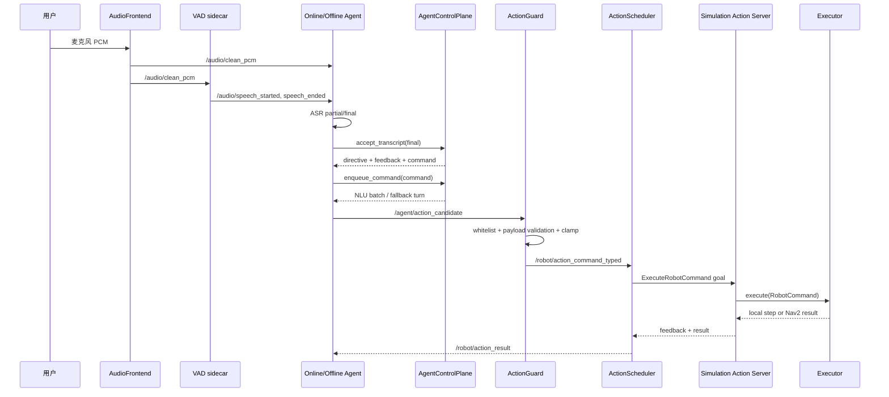

# 00. 系统全景与源码地图

## 先给结论

这个项目不是“语音模型直接控制机器人”，而是一个分层的命令事务系统。非确定的语音与模型输出先被转换成强类型候选命令，再经过 C++ 安全边界、单执行槽调度器、ROS 2 Action 生命周期和可替换 executor，最终才产生 `/cmd_vel` 或 Nav2 goal。

最重要的设计思想有三个：

1. 不可信推理层和确定性执行层分开。
2. 每一份并发状态只有一个主要拥有者。
3. 每个长动作必须有 ID、反馈、终态、取消和超时。

## 一条命令的完整数据流



注意两条分支：

- 高置信度固定域命令走本地 NLU，通常不需要 LLM。
- 普通问答或 NLU 未接受的文本进入 LLM；最终动作仍要经过 deterministic override、语义阻断和 ActionGuard。

## 包级依赖和职责

| 包 | 核心职责 | 不应该负责 |
| --- | --- | --- |
| `embodied_agent_interfaces` | msg/srv/action 唯一契约 | 业务决策 |
| `embodied_agent_middleware` | QoS 语义、组件健康、系统 readiness | Agent 或机器人行为 |
| `embodied_agent_core` | 会话、队列、NLU、动作序列、Lifecycle 业务编排、记忆 | 具体云端/离线 provider |
| `embodied_agent_bringup` | Launch 参数映射、节点装配和启动顺序 | 领域规则 |
| `embodied_voice_frontend` | WebRTC/Silero VAD、KWS、声纹 sidecar | 声卡采集和机器人执行 |
| `embodied_agent_cpp` | PortAudio/AEC、ActionGuard、scheduler bridge、TTS service、硬件 Adapter | 自然语言理解 |
| `embodied_online_agent` | Qwen ASR/LLM/TTS provider 适配 | 重复实现共享状态机 |
| `embodied_offline_agent` | Sherpa/llama.cpp/TTS provider 适配与伪流式管线 | 重复实现共享状态机 |
| `embodied_simulation` | Action server、BT、pluginlib executor、Gazebo/Nav2 控制 | 解析自然语言 |

依赖方向保持“接口在下，装配在上”。`embodied_agent_core` 不依赖 online/offline/simulation；这使共享逻辑可以脱离 ROS graph 单测。

## 状态所有权地图

| 状态 | 主要拥有者 | 为什么要唯一 |
| --- | --- | --- |
| 是否已唤醒、会话是否超时、重复命令 | `ContinuousVoiceSession` | 避免 online/offline 对同一句话做不同判定 |
| 待执行自然语言命令 | `ContinuousCommandQueue` | 统一容量、TTL、FIFO 和清空语义 |
| Agent 是否 busy、worker 生命周期 | `AgentExecutionRuntime` | 防止直接 turn 与队列 worker 并发执行 |
| endpoint timer 与 commit 代次 | `AsrEndpointRuntime` | 防止重复 endpoint 和停机后 timer 访问 provider |
| Python 动作批次等待 | `SequentialActionPublisher` | 只负责按 command ID 等终态，不与 C++ 重复调度 |
| 当前机器人 goal 和 C++ FIFO | `ActionScheduler` | 保证同一时刻只有一个 Action goal |
| 仿真长动作进度/取消/超时 | `ActiveActionRuntime` | 本地定时动作与 Nav2 外部动作共用终态语义 |
| 控制模式和速度状态 | `SimulationController` | 加速度、雷达安全和 PID 必须基于同一连续状态 |
| 当前用户身份和画像快照 | `UserContextRuntime` | 防止长 turn 中身份变化导致跨用户读写 |

## 三条安全边界

### 语义安全边界

位置：[streaming_turn.py](../../src/embodied_agent_core/embodied_agent_core/streaming_turn.py)

`StreamingTurnRuntime._select_actions()` 的优先级是：

```text
确定性 parser 有结果 -> 使用确定性动作
危险/疑问/否定语义 -> 阻断模型动作
模型有完整合法 action -> 使用模型动作
否则 -> 无动作
```

它防止“不要前进”因为包含“前进”而被弱化执行，也防止损坏的半个 `<action>` 标签形成动作。

### 命令安全边界

位置：[action_validator.cpp](../../src/embodied_agent_cpp/src/action_validator.cpp)

`ActionValidator` 再做动作白名单、字段互斥、有限数检查、速度/时长限幅、地点白名单和 priority 约束。强类型消息只能保证字段结构，不能保证业务值安全，所以这里仍必须验证。

### 运行时安全边界

位置：[simulation_controller.cpp](../../src/embodied_simulation/src/simulation_controller.cpp)

即使命令已经合法，机器人运行时仍可能遇到近障、雷达失联、取消或执行超时。控制器和 `ActiveActionRuntime` 负责在动态环境中停止，并把原因传播为 Action 终态。

## 为什么不是一个大节点

一个大节点看似少了 ROS 通信，但会带来四个问题：

1. 声卡、云 API、LLM、Nav2 任一依赖失败都会拖垮整个进程。
2. 无法替换 online/offline、Energy/Silero/WebRTC、Gazebo/Nav2。
3. 并发状态散落，停机、取消和迟到回调难以收敛。
4. 测试必须拉起完整系统，难以给纯逻辑做毫秒级单测。

当前拆分的代价是接口和 Launch 更复杂，所以项目又用 typed interfaces、统一 QoS、bringup contract 和 readiness 把复杂度收回来。

## 关键源码入口

- 音频线程：[audio_frontend_node.cpp](../../src/embodied_agent_cpp/src/audio_frontend_node.cpp)
- Agent 接线：[agent_ros_io.py](../../src/embodied_agent_core/embodied_agent_core/agent_ros_io.py)
- 控制面：[agent_control_plane.py](../../src/embodied_agent_core/embodied_agent_core/agent_control_plane.py)
- 并发执行：[agent_execution_runtime.py](../../src/embodied_agent_core/embodied_agent_core/agent_execution_runtime.py)
- 动作安全：[action_guard_node.cpp](../../src/embodied_agent_cpp/src/action_guard_node.cpp)
- C++ 调度：[action_scheduler.cpp](../../src/embodied_agent_cpp/src/action_scheduler.cpp)
- Action server：[simulation_control_node.cpp](../../src/embodied_simulation/src/simulation_control_node.cpp)
- 控制器：[simulation_controller.cpp](../../src/embodied_simulation/src/simulation_controller.cpp)
- Nav2 bridge：[nav2_robot_executor.cpp](../../src/embodied_simulation/src/nav2_robot_executor.cpp)

## 自测问答

### 问：项目中最核心的闭环是什么？

答：不是 ASR 或 LLM 单个模型，而是 `candidate -> guard -> scheduled Action -> feedback/result -> command_id 关联`。它把非确定输入转换成可验证、可取消、可超时的机器人事务。上游根据 `/robot/action_result` 才知道动作是否真正到达终态。

### 问：为什么说每份状态要有唯一拥有者？

答：并发系统最危险的是多个层同时推进同一状态。例如 Python 和 C++ 都决定下一动作何时发送，会造成重复派发；本项目让 Python 一次发布整批，C++ `ActionScheduler` 独占 FIFO 和单执行槽，Python 只按 ID 等结果。

### 问：这个系统最值得面试展开的部分是什么？

答：动作安全闭环、连续语音状态机、ROS 2 Action 取消与超时、Nav2 语义地点转换、Lifecycle 安全停机、QoS 语义和可替换 provider/executor。模型接入是入口，不是全部技术含量。
