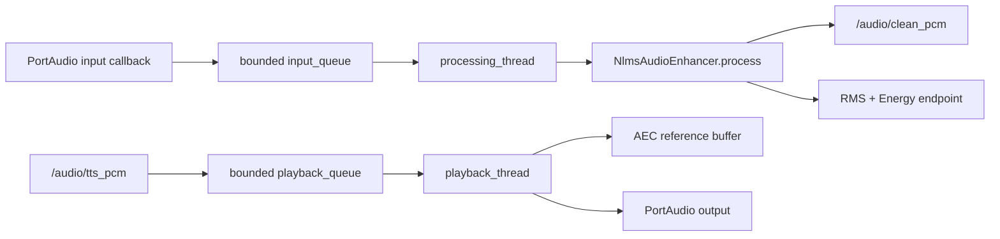

# 02. 音频采集、AEC、VAD 与 KWS

## 先给结论

语音前端由三类职责组成：C++ `audio_frontend` 负责声卡 I/O、TTS 播放参考和 NLMS 回声消除；Energy/WebRTC/Silero 负责判断语音端点；KWS sidecar 负责把声学唤醒统一成 `WakeEvent`。这三类算法不能都叫“降噪”。

当前源码的准确事实是：

- 已实现：PortAudio 采集/播放、NLMS AEC、Energy VAD、WebRTC VAD Adapter、Silero ONNX/JIT VAD、端点滞回、KWS provider seam。
- 可选实现：openWakeWord 自带的 Speex noise suppression，只在该 provider 参数开启时生效。
- 未实现：C++ 通用噪声抑制和自动增益。相关参数会告警，metrics 中 `noise_suppression_active=false`、`auto_gain_active=false`。

## 音频线程模型

核心文件：[audio_frontend_node.cpp](../../src/embodied_agent_cpp/src/audio_frontend_node.cpp)



### 为什么 PortAudio callback 只搬数据

`input_callback()` 只做三件事：检查状态、复制一帧 PCM、放入有界队列。模型推理、日志、ROS 发布和复杂 DSP 都不进入实时回调。原因是声卡 callback 有严格时限，阻塞会造成 underrun/overrun。

队列达到 `kMaximumInputFrames` 时丢最旧帧并增加 `dropped_input_frames_`。对实时语音来说，处理“现在”的音频比补做旧音频更重要。

### 为什么单独有 playback thread

TTS PCM 从 `/audio/tts_pcm` 进入播放队列，`playback_loop()` 先把即将播放的 samples 交给 `audio_enhancer_->add_reference()`，再写声卡。AEC 因此知道扬声器正在播放什么，可以从麦克风信号中估计回声。

## NLMS AEC 逐步解释

核心实现：[audio_processing.cpp](../../src/embodied_agent_cpp/src/audio_processing.cpp)

麦克风采样可以近似写成：

```text
d(n) = s(n) + echo(n) + noise(n)
```

其中 `d(n)` 是麦克风输入，`s(n)` 是用户语音。算法从扬声器参考 `x(n)` 的最近 `taps` 个样本预测回声：

```text
y(n) = w(n)^T x_history(n)
e(n) = d(n) - y(n)
```

源码中的对应关系：

- `history_`：参考音频滑动窗口。
- `weights_`：自适应滤波器系数。
- `predicted`：预测回声 `y(n)`。
- `desired`：麦克风输入 `d(n)`。
- `error`：输出 `e(n)`。

NLMS 使用参考能量归一化步长：

```text
w(n+1) = w(n) + step * e(n) * x(n) / (epsilon + ||x(n)||^2)
```

归一化的意义是参考音量变大时自动减小有效更新，降低 LMS 对输入幅度的敏感性。源码用 `1e-6` 防止除零，并把输出 clamp 到 int16 范围。

### 采样率和延迟

麦克风默认 16 kHz，TTS 参考默认 24 kHz。`resample_reference()` 用线性插值把参考转换到麦克风采样率。第一次参考前插入 `aec_delay_ms` 对应的零样本，用于近似扬声器到麦克风路径延迟。

这是一种轻量工程实现，局限包括：

- 固定延迟难覆盖设备动态延迟。
- 线性 AEC 难处理扬声器失真和房间强非线性。
- 没有 double-talk detector，用户和 TTS 同时说话时自适应可能受影响。
- 没有实现 WebRTC Audio Processing Module 的 NS/AGC/高级 AEC。

因此应描述为“实现了 NLMS 自适应回声消除及可观测接口”，不能说“完成成熟工业级降噪”。

## Energy VAD 和端点

`compute_audio_frame_metrics()` 先计算归一化 RMS：

```text
rms = sqrt(sum((sample / 32768)^2) / N)
speech = rms >= vad_rms_threshold
```

默认阈值为 `0.018`。RMS 高于阈值只说明能量较大，键盘、碰麦和风噪也可能触发，因此 Energy VAD 是易部署 fallback，不是最鲁棒方案。

`SpeechEndpointDetector` 把逐帧 `speech` 转换成 utterance：

1. 第一帧 speech 发布 `speech_started`。
2. 后续连续静音达到 `speech_end_silence_s` 发布 `speech_ended`。
3. 总语音不足 `min_utterance` 时不提交。
4. 超过 `max_utterance` 强制结束，防止永不提交。

## Silero/WebRTC sidecar

核心文件：

- [silero_vad_sidecar.py](../../src/embodied_voice_frontend/embodied_voice_frontend/silero_vad_sidecar.py)
- [silero_vad_node.py](../../src/embodied_voice_frontend/embodied_voice_frontend/silero_vad_node.py)
- [webrtc_vad_node.py](../../src/embodied_voice_frontend/embodied_voice_frontend/webrtc_vad_node.py)

选择外部 VAD 时，Launch 把 `audio_frontend.endpoint_events_enabled` 设为 false，避免 C++ Energy VAD 和 sidecar 同时发布 start/end。

### `StreamingVadEndpoint` 状态机

它先把任意大小的 PCM chunk 聚合成固定帧，再执行：

```text
idle
  -> 连续 speech_start_ms 超阈值
  -> in_utterance，发布 speech_started
  -> 概率低于 end threshold 累计 silence
  -> 达到 speech_end_silence_s，发布 speech_ended
```

Silero 默认起点阈值 `0.5`，结束阈值 `0.35`。开始高阈值、结束低阈值形成滞回，避免概率在单一阈值附近抖动造成反复断句。

`speech_start_s = max(speech_start_ms, min_utterance_ms)` 的意义是：只有确认达到最短语音长度后才发布 start。这样一旦下游看见 `speech_started`，就保证后面有配对的 `speech_ended`，不会因“太短”留下悬挂状态。

### WebRTC 与 Silero 的取舍

| 方案 | 输出 | 优点 | 缺点 |
| --- | --- | --- | --- |
| Energy | RMS bool | 无额外依赖、可解释 | 易受非语音噪声触发 |
| WebRTC VAD | speech bool | 轻量、CPU 低、成熟 | 只支持指定采样率和 10/20/30 ms 帧，无概率 |
| Silero VAD | 0 到 1 概率 | 噪声环境通常更稳，可做滞回 | 需要 ONNX Runtime/模型或 PyTorch，部署更重 |

WebRTC 的 bool 被映射成 `1.0/0.0`，从而复用同一端点状态机。

## KWS 唤醒词

核心文件：[keyword_wake.py](../../src/embodied_voice_frontend/embodied_voice_frontend/keyword_wake.py)

所有 detector 都实现两个窄接口：

```python
detect_text(text) -> KeywordWakeMatch | None
detect_audio(pcm16) -> KeywordWakeMatch | None
```

当前 Adapter：

- `mock_text`：用于测试 `/agent/kws_text_input` 链路。
- `sherpa`：持续向 KeywordSpotter stream 喂 PCM。
- `openwakeword`：读取模型分数并做阈值判断。
- `livekit`：自定义 ONNX 唤醒词模型接口。

`KeywordWakeBridge` 再加 cooldown。检测到一次后，在 `cooldown_s` 内拒绝重复 match，避免同一个唤醒词跨多个 PCM chunk 重复激活会话。

节点最终发布：

- `/agent/wake_event_input`：Agent 真正消费的统一强类型事件。
- `/agent/kws_event`：检测结果观测。
- `/agent/kws_score`：模型各关键词分数，用于校准阈值。

## 故障推演

### 现象：说话没有 ASR final

按层排查：

1. `/audio/frontend_metrics` 的 RMS/peak 是否变化。
2. `/audio/clean_pcm` 是否有消息，dropped frame 是否增长。
3. `/audio/vad_event` 是否有 start/end。
4. 是否同时启动了两个 endpoint provider。
5. Agent 是否 active，是否收到 `/audio/speech_ended`。
6. `AsrEndpointRuntime` 是否因 busy/duplicate 拒绝 commit。

### 现象：TTS 播放后 ASR 把机器人自己的话识别成命令

检查 speaker 是否开启、`/audio/tts_pcm` 是否进入 playback、AEC reference rate/delay 是否匹配。NLMS 需要多个相关样本学习，首次短播报可能抑制不足；还应结合 KWS、会话门控和物理麦克风布局，而不是只依赖 AEC。

## 自测问答

### 问：项目怎么做降噪？

答：严格说，当前 C++ 主链实现的是 NLMS AEC，用扬声器参考估计并减去回声；通用噪声抑制和 AGC 尚未实现，参数开启会告警。WebRTC/Silero 是 VAD，作用是判断人声和端点，不应冒充降噪。openWakeWord 可选开启它内部的 Speex noise suppression，但只服务该 KWS provider。

### 问：为什么 VAD 要做开始确认和结束滞回？

答：开始确认过滤短噪声，结束滞回避免概率在阈值附近抖动。高起点阈值、低结束阈值再配合 trailing silence，能得到更稳定的 utterance 边界。

### 问：为什么 audio QoS 用 best effort？

答：音频是实时流，旧帧迟到比少量丢帧更有害。小深度 best effort 避免 DDS 反压把延迟不断累积，代价是下游算法必须容忍缺帧。
