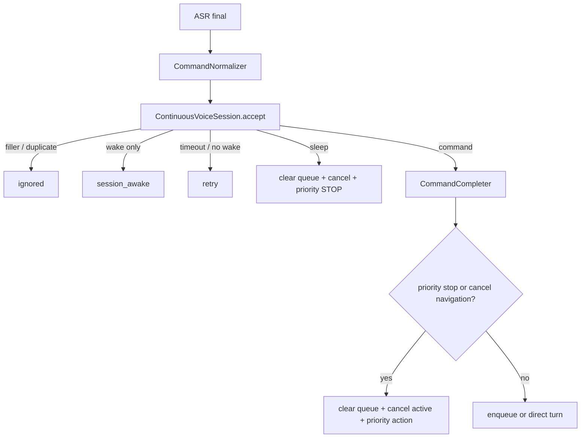

# 03. ASR 端点、连续会话与命令队列

## 先给结论

ASR final 不是动作。它先经过 partial 修复、命令归一化、唤醒会话、语气词与重复过滤、短命令补全，再决定入 FIFO、直接执行、休眠或优先抢占。这个控制面在线和离线只有一份实现。

## 从 PCM 到 final

在线 Agent 直接把 PCM 推给 WebSocket ASR provider；离线 Agent 把 `("audio", bytes)` 放进有界 `_asr_events`，由同一 worker 串行调用 Sherpa stream，因为 provider 注释明确要求所有方法在一个线程运行。

离线队列满时丢最旧音频帧，但 `commit` 是控制事件，应尽量保留。这个选择仍遵循实时流原则：旧 PCM 可以丢，utterance 边界不能随意丢。

### Sherpa 流式 ASR

[sherpa_asr.py](../../src/embodied_offline_agent/embodied_offline_agent/providers/sherpa_asr.py) 的流程：

1. int16 PCM 归一化到 float32 `[-1, 1]`。
2. `stream.accept_waveform()`。
3. `while recognizer.is_ready(): decode_stream()`。
4. 文本变化时发布 partial。
5. endpoint commit 时 `input_finished()`，解码剩余帧，发布 final。
6. 创建新 stream，清空 `_last_partial`。

provider 关闭了自身 endpoint detection，因为句子边界由统一 VAD/endpoint 层拥有。

## `AsrEndpointRuntime` 为什么存在

核心文件：[asr_endpoint_runtime.py](../../src/embodied_agent_core/embodied_agent_core/asr_endpoint_runtime.py)

音频前端可能同时保留 legacy `/audio/silence_timeout` 和 `/audio/speech_ended`。即使 launch 通常避免重复，运行时仍要防御两个近邻事件造成双 commit。

`request(source)` 的规则：

1. `blocked()` 为真时拒绝，例如非连续模式下 Agent 正忙。
2. 已关闭时拒绝。
3. 与上次请求间隔小于 `duplicate_window_s` 时拒绝并上报。
4. 记录当前 `_generation`，按 `asr_commit_delay_ms` 启动 timer。
5. timer 触发时再次检查 generation 和 blocked。
6. 先发布 commit 观测，再调用 provider commit。

### generation 解决什么竞态

Lifecycle deactivate 时，旧 timer 可能已经创建但尚未触发。`cancel_pending()` 递增 generation 并取消已知 timer。即使 timer 与取消并发、恰好进入回调，它看到 generation 不匹配也不会访问已经停用的 provider。

延迟提交的目的不是“让系统慢一点”，而是给声卡/ASR 尾部缓冲留出时间，降低“左转九十度”只提交成“左转”的概率。

## partial 修复 final

[transcript_stabilizer.py](../../src/embodied_agent_core/embodied_agent_core/transcript_stabilizer.py) 保存短时间内最近 partial。final 到来时，如果 final 丢失了 partial 中的安全槽位信息，可在限定年龄内恢复并发布 feedback。每个 `speech_started` 都先清旧 partial，避免跨句拼接。

Lifecycle 重新激活时，Sherpa provider `reset()` 新建 stream，也是为了不把停用前半句话拼到新会话。

## `accept_transcript()` 的决策顺序

核心文件：[agent_control_plane.py](../../src/embodied_agent_core/embodied_agent_core/agent_control_plane.py)



### 归一化

`CommandNormalizer` 先做显式 alias，再在限定短语窗口上做 fuzzy match。它不是对全文任意纠错，而是只修常见命令短语，并通过 `looks_command_like` 限制误改。可选 RapidFuzz，不可用时退回 `difflib`。

### 会话

`ContinuousVoiceSession` 复用 `TextWakeProvider/WakeWordGate`：

- 第一次“小智，前进”得到 WAKE + command。
- 会话活跃期“左转”得到 CONTINUE + command。
- 只说“小智”得到 `session_awake`，不进动作链。
- “退出控制”清会话、清队列并 STOP。
- 会话超时后普通命令得到 retry。

短休眠词“退出/结束”只做整句匹配，防止“退出自动模式”被误判成休眠。

### filler 与重复 final

“嗯、啊、哦”等整句语气词在会话层过滤。普通命令在 `duplicate_window_s` 内按去标点小写文本去重，但急停不参与去重，因为用户连续喊两次“停下”也应该两次尝试抢占。

### 短命令补全

`CommandCompleter` 只补安全、确定的缺省槽位，如“左转”补成默认 90 度语义、“前进”补默认时长，并发布 recognition feedback。不能确定方向的“转九十度”不会猜，而是由 NLU 给出 retry prompt。

## 连续命令入队

`AgentControlPlane.enqueue_command()` 先调用 `CommandNLU.parse()`。

### NLU 接受

一条“右转，然后前进一秒”可能拆成两个 `ParsedCommand`。控制面生成一个 batch ID，每个队列项带：

```text
batch_id, batch_index, batch_size,
source_text, nlu_intent, nlu_confidence,
preparsed_actions, provider private context
```

公开 ROS 事件只发布稳定 batch metadata；`preparsed_actions`、latency、user snapshot 是进程内私有上下文。

### NLU 明确缺槽位

如有灯光意图但没有颜色、转向角度但没有方向，返回 `retry`，不入队，也不交给 LLM 猜。

### NLU 未接受且不是明确缺槽位

原文本入队，worker 后续执行 LLM turn。这样固定控制域优先确定性路径，聊天和复杂表达仍有模型 fallback。

## FIFO、容量和 TTL

[continuous_voice.py](../../src/embodied_agent_core/embodied_agent_core/continuous_voice.py) 中的 `ContinuousCommandQueue` 包装有界 `queue.Queue`：

- 普通命令 `put_nowait`，满时返回 `queue_full`，不静默覆盖。
- `get()` 发现命令年龄超过 `max_age_s` 时丢弃并发布 `expired/stale_command`。
- priority stop 可以先清队列再入队，但主控制面当前对急停采用更直接的“清队列 + 立即发布 priority action”。

TTL 的原因是：用户说得很快或动作执行很久时，半分钟前的“继续前进”可能已不符合当前意图。

## `AgentExecutionRuntime` 的并发规则

核心文件：[agent_execution_runtime.py](../../src/embodied_agent_core/embodied_agent_core/agent_execution_runtime.py)

它统一拥有 `_busy`、连续 worker 和非连续 background turn：

- `try_begin_turn()` 原子取得 busy。
- worker 在出队后等待同一个 busy 槽。
- 每个执行项先发 started，成功/取消/异常都发 finished。
- `finally` 必须复位 busy 并 `task_done()`。
- 普通异常只使当前项失败，不杀死长期 worker。
- `stop()` 设置 event 并 join 所有受管线程。

因此 online/offline 节点不会各自忘记某条异常路径的 busy 复位。

## 急停为何绕过 FIFO

收到“停下/急停”或“取消导航”时：

1. `accept_transcript()` 清自然语言队列。
2. `SequentialActionPublisher.cancel()` 递增 generation，唤醒正在等结果的 Python turn。
3. 发布 `priority=true` 的 STOP/CANCEL candidate。
4. ActionGuard 只允许这两类命令带 priority。
5. C++ scheduler 清 pending，取消 active，等 active 终态后派发 priority goal。

这里不是“把 stop 插到队头”这么简单，而是从语义队列、Python 批次等待和 C++ Action goal 三层同时收敛。

## 自测问答

### 问：为什么 ASR final 不能直接进 LLM？

答：真实 ASR 会有重复 final、语气词、尾部截断、未唤醒文本和并发 overlap。控制面先把这些输入稳定化，并让固定域命令走确定性 NLU，才能减少误动作和延迟。

### 问：连续模式和非连续模式有何区别？

答：连续模式启动长期 queue worker，执行中仍可接收并排队下一条命令，单动作也等待 Action result 后再消费下一项。非连续模式一次只允许一个 background turn，busy 时抑制重叠 ASR final。

### 问：为什么需要 command TTL？

答：FIFO 只保证顺序，不保证意图仍新鲜。长动作期间积压的旧命令可能在上下文变化后变危险，所以出队时检查年龄并显式发布 expired 证据。

### 问：一次急停最终如何停止正在运动的机器人？

答：控制面清队列并发布 priority STOP；C++ scheduler 请求取消当前 ExecuteRobotCommand goal；SimulationControl 看到 cancel 后由 ActiveActionRuntime 产生 canceled 终态，executor `stop()` 并发布零速度；随后 scheduler 派发 STOP goal再次确认停止。
