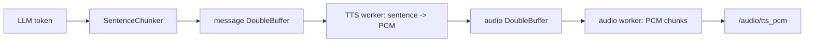

# 04. NLU、LLM 协议与 TTS 流水线

## 先给结论

项目采用“确定性优先，模型补充”的混合推理：本地 NLU 处理固定控制域并直接生成动作；LLM 处理聊天或复杂表达，但动作必须来自完整协议，并可能被确定性 parser 覆盖或被语义策略阻断。TTS 与 LLM token 流并行，在线用 provider 流式合成，离线用短句合成和双缓冲实现伪流式。

## 本地 NLU 为什么有价值

固定机器人命令的动作空间小、风险高。直接让 LLM 处理“前进一秒”会增加网络/推理延迟、输出格式风险和不可复现性。本地 NLU 的优势是：

- 延迟低，无模型服务也能工作。
- 规则和槽位可解释，可针对安全边界单测。
- 相同输入产生相同动作，便于验收。
- 高置信固定命令不消耗 LLM token。

它的边界是领域有限，不能冒充通用语义理解。

## `CommandNLU.parse()` 分层过程

核心文件：[command_nlu.py](../../src/embodied_agent_core/embodied_agent_core/command_nlu.py)

### 1. 文本清洗和危险语义预检

去除标点、空格和“然后/接着/再”等连接词。疑问、否定、高速越权和“一边旋转一边高速”等不安全组合不会被普通动作 parser 静默弱化。

### 2. 动作锚点切分

`_find_anchors()` 在没有标点的句子中寻找“右转、前进、灯、导航”等锚点。因此“右转向前走一秒”也能拆成候选片段，而不是只依赖字符串 split。

### 3. 字符 n-gram 原型分类

`CharacterNgramIntentModel` 把短句转换成字符二元组集合/频率向量，再计算输入和每个 intent 原型向量的 cosine similarity：

```text
similarity(a, b) = dot(a, b) / (||a|| * ||b||)
```

例如“向右转一下”和“右转九十度”共享“右转”等 n-gram。它比精确关键词更容忍轻微表达差异，又比神经网络轻量。原型也可从 JSON 加载，训练脚本本质是在维护版本化意图样本。

### 4. 确定性槽位提取

槽位包括：

- 数字：阿拉伯数字、中文数字、十/百、小数和“半”。
- 时长：秒，限制到 0.1 到 10 秒。
- 速度：米每秒或快/慢词，限制到 0.05 到 0.5 m/s。
- 距离：米，换算 `duration = distance / speed`。
- 角度：度，换算角速度和时长。
- 地点：中文短语映射到稳定 place key。
- waypoints 和 loops：巡航目标序列。

如果显式慢速长距离导致总时长超过单个 `RobotCommand` 的 10 秒上限，NLU 把它拆成多个顺序 move，而不是提速或截断用户意图。

### 5. 置信度与 retry

只有超过 `command_nlu_min_confidence` 且能构造合法动作的片段才进入 `NluResult.commands`。明确知道缺哪个槽位时返回具体 retry prompt；不确定是否控制命令时交给 LLM fallback。

## deterministic fallback 与 NLU 的关系

[command_fallback.py](../../src/embodied_agent_core/embodied_agent_core/command_fallback.py) 是更直接的规则 parser。它有两个作用：

1. 在 LLM turn 完成时，对明确固定命令拥有最终优先级。
2. 在 NLU 未预解析的路径上提供可预测动作。

`should_block_model_actions()` 会拦截疑问、否定、高速和危险组合。例如“你能不能前进”是能力询问，不应执行；“不要前进”不能因为模型错误输出 move 而执行。

## LLM tagged protocol

核心文件：[protocol.py](../../src/embodied_agent_core/embodied_agent_core/protocol.py)

模型输出被约束为：

```xml
<speech>好的，我现在前进。</speech>
<action>{"name":"move","arguments":{"linear_x":0.2,"duration_s":1.0}}</action>
```

### 增量解析为什么分 speech 和 action

`TaggedStreamParser` 有 `outside/speech/action` 三个状态：

- speech 内容可以增量暴露给 TTS，降低首音频延迟。
- action 必须等 `</action>` 完整到达，再做 `json.loads()`。
- 参数必须是 object，动作必须有字符串 name。
- 流结束时仍有残缺 tag，记录 `incomplete tagged response`。

这样半个 token 流绝不会形成半条机器人命令。

### 协议损坏怎么处理

`StreamingTurnRuntime.finish()` 在没有可说文本时给出固定格式错误提示；只要有 protocol error，就不把原始损坏文本保存成模型协议历史，也不从残缺 action 猜动作。

动作选择优先级是：

```python
deterministic = parse_fallback_actions(user_text)
if deterministic:
    return deterministic
if should_block_model_actions(user_text):
    return []
if model_actions:
    return model_actions
return []
```

注意这里仍不是最终安全边界。模型动作后面还要经过用户偏好变换、typed conversion 和 C++ ActionGuard。

## 在线与离线 LLM Adapter

### 在线

online provider 通过 OpenAI-compatible stream 或 Qwen API 逐 token 返回。`online_agent_node._run_turn()` 同时启动 TTS thread：LLM 产生可说短句后放入 `text_queue`，TTS 从 generator 消费，响应生成和合成并行。

### 离线 llama.cpp

[llama_cpp.py](../../src/embodied_offline_agent/embodied_offline_agent/providers/llama_cpp.py) 使用 OpenAI Python 客户端连接本地 `llama-server`：

- `stream=True` 和 `include_usage=True`。
- 记录首 token、总耗时、completion tokens、decode tokens/s。
- 只有尚未向上游吐 token 时才允许重试。
- 一旦已经输出部分文本再失败，不自动重试，避免两次回复拼接。
- warmup 可预热模型 kernel 和稳定 system prompt 前缀的 KV cache。

`ConversationMemory.prompt_messages()` 固定 `system -> history -> current user` 顺序，并优先保存模型原始合法协议文本，尽量延长 llama.cpp slot 的公共前缀。

## TTS 切句

`SentenceChunker` 遇到中文标点或达到 `max_chars` 就产生一个短句。切得越短，第一句越快开始合成，但 TTS 调用次数更多、韵律更碎；切得越长，语音自然但首音频更慢。因此它是延迟和自然度之间的参数化折中。

## 离线伪流式 TTS

核心文件：[pseudo_streaming_tts.py](../../src/embodied_offline_agent/embodied_offline_agent/pseudo_streaming_tts.py)

Sherpa VITS 和 SummerTTS 当前都按整句返回 PCM。项目没有把它宣传为原生流式，而是做两级流水线：



`DoubleBuffer` 容量固定为 2。消息和音频 worker 解耦后，LLM 可以继续生成下一句，TTS 合成当前句，音频线程发布上一句的小块。

当前 `PseudoStreamingTtsPipeline` 为两个 buffer 都配置 `drop_oldest=False`，满时阻塞并在超时后报错，优先保证语音顺序和完整性。`DoubleBuffer` 本身支持 drop-oldest，但该管线没有启用；面试时不要把类注释中的可选策略说成当前运行配置。

指标包括 text chunks、synth calls、audio chunks、总合成耗时、首文本到首音频、buffer dropped 和 high watermark。

## SummerTTS 三种路径

| 路径 | 实现 | 特点 |
| --- | --- | --- |
| Sherpa VITS | `SherpaVitsTts` | 默认稳定离线句级 TTS |
| Summer CLI | `SummerTts` | 每句启动外部进程并读 WAV，易接入但启动/加载开销大 |
| Summer ROS | `SummerTtsRosClient` + C++ service | 模型常驻、短句 LRU 缓存、每句一次 Service 请求 |

C++ service 的缓存 key 包含 text、speaker ID 和 length scale，避免相同文字在不同音色/语速下错误复用。只缓存 codepoint 数不超过阈值的短反馈，防止长句挤占内存。

## 动作与说话的并发关系

`StreamingTurnRuntime.finish()` 选出动作后，Agent 发布动作，再等待 TTS worker 排空。连续模式下动作发布器会等待 Action result，确保 command worker 不会在前一动作未完成时取下一条。

这不表示语音播放一定要等动作完成。在线 TTS thread 在 LLM 生成阶段就可开始说，动作则在协议解析完成后发布，两条数据流并行但受同一个 Agent turn 生命周期管理。

## 自测问答

### 问：为什么有 NLU 还需要 LLM？

答：NLU 适合固定控制域，提供低延迟和确定性；LLM 处理聊天、解释和未覆盖表达。二者不是二选一，而是确定性路径优先、模型路径补充。

### 问：为什么动作标签不能像 speech 一样增量消费？

答：动作 JSON 在闭标签前可能字段不完整或后续被修改。只有完整闭标签、JSON 解码成功、结构合法后才能形成候选动作，否则会把网络中断变成机器人误动作。

### 问：伪流式和真流式 TTS 的区别？

答：真流式模型在一条合成请求内逐步产生音频；本项目是先按短句完成一次整句合成，再把 PCM 分块发布。它降低整段回复等待时间，但单个短句仍要等完整合成。

### 问：模型输出动作准确率如何证明？

答：必须用独立评估集和真实 provider 报告。deterministic fallback 的工程出口成功不能等同于模型严格协议准确率，当前 README 也把两者分别报告。
